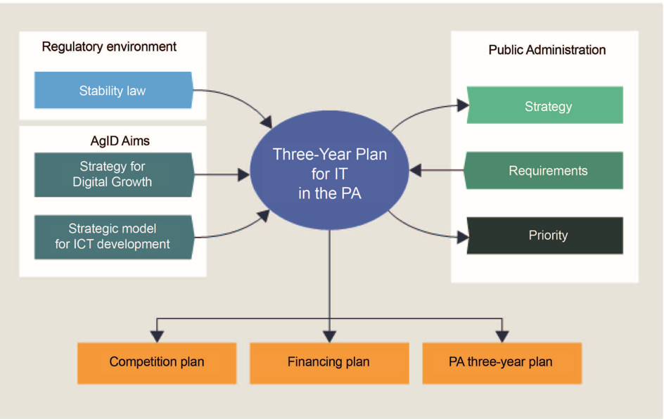
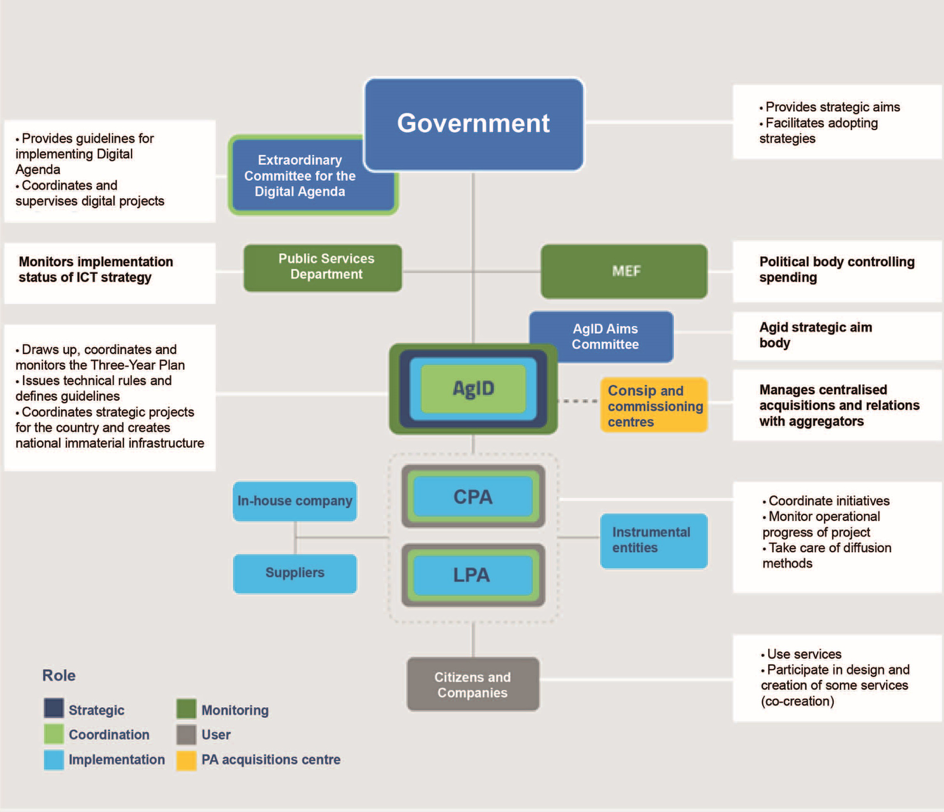

.. container:: wy-alert wy-alert-warning

   **This document was translated by a machine.**

   We want to make our country more efficient. We believe humans and machines should complement each other. Artificial Intelligence is the technology that will enable such symbiosis. This document has been translated using a mix of state-of-the-art machine translation and human-driven AI. The raw machine translation output has been edited by an automated system trained on millions of professionally corrected sentences. Finally, a human went through the document to make sure that no information had been lost.

   This means leaving behind some stylistic improvements and potential errors. However, this AI-augmented approach to translation allowed us to prepare this English version at a fraction of the cost and time of the legacy translation process (this translation was made in a few days including the human review; we didn’t publish it right away because we had to convert it to reStructuredText in order to share it on GitHub and we had a ton of things to do before that!).

   If you want to contribute with feedback and changes to the Three Year Plan for ICT in the Public Administration, visit the `Github repository <https://github.com/italia/pianotriennale-ict-doc-en>`_.

Three-Year Plan for ICT in Public Administration
================================================

Introduction
------------

The development and revival of a smart, sustainable and supportive
economy for Europe, with a view to achieving high levels of employment,
productivity and social cohesion, is closely linked to its digital
growth. Since 2010, the Europe 2020 Strategy has set ambitious targets
for employment, innovation, education, social integration and climate /
energy and identified, within a "single European digital market", the
goals for developing the digital culture and economy in Europe, leaving
all Member States the task of defining their national priorities and
strategies.

Innovation policies have traditionally been conceived to digitise
existing processes, whereas digital represents a lever for economic and
social transformation, putting citizens and businesses at the centre of
action, making digital innovation a public investment for a structural
reform of the Country.

On the basis of indications provided by the European Digital Agenda,
Italy has defined its own national strategy drawn up together with the
Ministries and in collaboration with the Conference of Regions and
Autonomous Provinces. In 2015, the Council of Ministers approved two
strategic programs for the country: the `*National Broadband
Plan* <http://bandaultralarga.italia.it/piano-bul/strategia/>`__ and the
`*Strategy for Digital Growth
2014-2020* <http://www.agid.gov.it/sites/default/files/documenti_indirizzo/strategia_crescita_digitale_ver_def_21062016.pdf>`__\  [1]_.

Implementation of the Italian Digital Agenda requires the coordination
of multiple actions by public administration, businesses and civil
society, and requires integrated management of the various sources of
national and Community funding (at central and regional level).

For this purpose, the Italian Digital Agency has the task of drafting
the Three-Year Plan for IT in the Public Administration [2]_.

The Plan presented below has been constructed in accordance with what is
stated in the Digital Growth Strategy, including actions, definition of
financial needs and the indicators represented therein, with the aim of
targeting public sector ICT investments according to government
guidelines and in line with European goals and programs. The Plan
proposes that the Public Administration contribute to the development
and growth of the country's economy by providing them with information
on some tools that will facilitate the streamlining of bureaucratic
procedures, greater transparency in administrative processes, greater
efficiency in the provision of public services and, not least, the
rationalisation of IT spending.

These are all factors contributing to the creation of equal standards,
conditions and opportunities for the first recipients of digital
transformation in the country, i.e. all citizens and businesses.

Context
-------

The three-year plan is built on the basis of a Strategic Model
for the evolution of the Public Administration Information System [3]_
(illustrated in Chapter 2 "Strategic Model for the Evolution of the
Public Administration Information System") and addresses the competition
plan, funding plan and three-year plans of individual PAs.

   Figure 1 - Input and Output of the Three-Year Plan

The Plan proposes a systematic, distributed and shared model of
management and use of the most innovative digital technologies,
characterised by an agile and evolutionary management style, based on
clear *governance* of the various levels of public administration. The
synergy and balance between the three directives (innovative
technologies, agile management style and clear and effective model of
*governance*) ensures the country's system more effectively uses the
benefits of new technologies and provides citizens with an advantage in
terms of ease of access and improvement of existing digital services.

The plan must address a complex reality with highly diversified levels
of operational capacity and skill delegation, characterised by a high
degree of fragmentation [4]_:

-  32,000 public employees in ICT, of which approximately 18,000 in
   Central Public Administrations (CPA) and 14,000 in Local Public
   Administrations (LPA), plus some 6,000 local in-house company
   employees and more than 4,000 central in-house company employees;

-  Estimates of approximately EUR 5.7 billion of external ICT spending;

-  Estimates about 11,000 Public administrations data centres;

-  About 160,000 databases in the AgID Public Administration database
   catalogue and over 200,000 applications using these data as reported
   by the census on 13,822 Administrations; the accuracy of these data
   is not as important as the dimensions that underline the complexity
   of the problem;

-  Over 25,000 websites.

Approach to the drafting of the Three-Year Plan
-----------------------------------------------

The drafting of the Three-Year Plan has involved local and central
public administrations, also through a process of data and information
gathering both for sharing the chosen approach and the main contents of
the Strategic Model and for conducting a first reconnaissance on ICT
initiatives and ICT. Involving:

-  The Central Public Administrations, in particular the Ministries
   including all supervised entities

-  Tax Agencies

-  Social Security Institutions

-  The Regions

-  Metropolitan cities of Italy

-  ANCI

   Other key stakeholders were also involved in the process, such as:

-  The Commissioner for spending review

-  Ministry of Economy and Finance

-  The Department of Public Function

-  Sogei

-  Consip

-  Agency for Territorial Cohesion

-  Conferenza Unificata;

-  Assinform and Confindustria

Initially, data collection and analysis also involved the central
administration (CPA), especially given the significance of its ICT
spending [5]_.

The survey provided a clearer picture with regard to:

-  The main features of ICT spending for the year 2016 and comparison
   with 2013-2015 average spending;

-  The mapping of the main projects underway or in the start-up phase;

-  Possible saving targets.

During the survey, central administrations also provided their ICT
programming in order to highlight how they intend to pursue the
following objectives:

-  Implementation of the projects envisaged by the Digital Growth Plan;

-  Implementation of the provisions of AgID Circular 24 June 2016, no. 2
   which, in a transitional fashion, anticipated the provisions related
   to the implementation of the three-year Plan in reference to the
   Strategic Model for the evolution of the Public Administration
   Information System;

-  | Implementation of specific regulatory provisions for the
     implementation of one or more reference ecosystems.
   | The information collected was therefore useful for:

-  Highlighting the ICT needs which, although emerging from individual
   ecosystems (see Chapter 6 "Ecosystems"), are of general concern to
   the entire Public Administration;

-  Identifying solutions already implemented, being implemented or
   planned which are to be considered strategic for the entire Public
   Administration;

-  Verifying with the ministries that the Model is shared and
   consistent.

The same direction was also initiated with the regional administrations
and metropolitan cities. However, at this stage, attention has been
focused on key CPAs, strategic for:

-  Relevance of spending;

-  Implementation of synergies and centralisation measures with a view
   to optimising total spending;

-  Ownership of the main national IT systems.

The complexity in defining and calibrating the contents of the
Three-Year Plan and the continuous technological evolution lead to
management that contains the forecast for the two years following the
presentation, in a continuous flow logic. This Plan should therefore be
seen as a dynamic tool, whose implementation depends on content update
and transparent exchange of information with the public administrations
already involved, as well as to the others by progressive enlargement.

The implementation of the three-year Plan provides for a gradual
involvement of Public Administrations:

-  2017 is the year of construction through consolidation of the digital
   transformation strategy and the completion of sharing with Public
   Administrations;

-  2018 is the year of consolidation of the Plan, which will also be
   managed through online tools that will allow Public Administrations
   to provide their data with simplicity. They will allow the three-year
   plans of the administrations to be managed dynamically;

-  2019 is the year of completion of the activities of the first
   three-year cycle of the process, which can therefore be further
   refined for the next three years.

The players in the digital transformation process of the PA
-----------------------------------------------------------

The players in the digital transformation process of PA are:

-  The Government, which provides the strategic directions of the
   digital transformation of Public Administration and, through
   regulatory instruments, facilitates its adoption;

-  The Department of Public Function, which is the political body that
   supervises, including on AgID's operations;

-  The Ministry of the Economy and Finance (MEF), which is the body
   responsible for controlling spending and respecting savings targets;

-  The Commissioner for the Implementation of the Digital Agenda that is
   an `extraordinary
   body <http://presidenza.governo.it/AmministrazioneTrasparente/DisposizioniGenerali/AttiGenerali/DpcmOrganismiCollegiali/DPCM_20160916_CommStraord_AgendaDigitale.pdf>`__\  [6]_
   placed in the Presidency of the Council of Ministers with the aim of
   dictating the guidelines and putting in place the actions considered
   appropriate and priority for the implementation of the Digital
   Agenda. The Commissioner, in order to play his role as coordinator
   and supervisor of digital projects and to stimulate the development
   of agile procedures and technological skills within the PA, uses a
   contingent of staff assigned directly to him, with specific
   professional qualifications in the areas of activity pertaining to
   the functions (Team for Digital Transformation), as well as all
   public entities, even in corporate form, operating in the field of
   information technology and communication technologies. He may also
   exercise his power of replacement in the event of failure to
   implement the Digital Agenda. The Commissioner has a two-year mandate
   and will his term will end on 16 September 2018;

-  The AgID Direction Committee, which is AgID's strategic direction
   body that deliberates on the Strategic Model, identifying its
   priorities on the basis of financial resources and monitoring its
   implementation;

-  AgID, which transforms strategic goals into projects, coordinates
   programming, the implementation of national platforms and catalysts
   for change, manages the relationship between actors, issues technical
   rules and, where appropriate, manages supervision. AgID also
   transforms the Digital Administration Code (CAD) [7]_ into
   implementing processes, rules and projects that are integrated into
   the Plan and monitors implementation of projects by administrations;

-  The Regional Administrations and the Autonomous Provinces that
   contribute to updating the implementation and adjusting the
   programming of the Three-Year Plan for IT in the PA. Through the
   technical structures and political representation of the Conference
   of Regions and Autonomous Provinces and specifically with the
   coordination action exercised by the Special Digital Agenda
   Commission;

-  The administrations, all those that coordinate the initiatives
   indicated in the plan and govern the individual projects. By
   identifying the Body Responsible for the transition to the digital
   operating mode, they ensure the harmonisation of their strategy with
   the principles and guidelines of the Strategic Model and the
   implementation of their planning and development of their
   initiatives;

-  In-house companies, involved in the development of individual
   government projects and in the development and management of enabling
   platforms, also provide assistance and advice services;

-  Instrumental organisations, which are involved in the implementation
   of the Italian Digital Agenda;

-  **Consip** and the **commissioning centres** that run competitions
   and award contracts for central and local administrations. They
   operate on the basis of a three-year plan to aggregate needs and
   consequent acquisition of goods and services.

Figure 2 highlights the relationships between these players and sums up
their functions with respect to the definition and implementation of the
Plan:

   Figure 2 - The players in the digital transformation process of the PA

Document structure
------------------

The document is structured as follows:

-  Part One - Reference Framework:

   -  Chapter 2 shows the *strategic evolution model of the public
      administration information system*, or the medium / long term
      vision to which the Public Administration must strive to make the
      best use of the benefits of a proper, targeted and aware use of
      digital technologies.

-  Part Two - Components of the Strategic Evolution Model

   of the PA's information system:

   -  Chapters 3 to 10 present the components of the Strategic Model,
      adopting the following structure:

   -  *Current scenario* - summarises some useful elements to describe
      the current situation with respect to the topics covered in this
      chapter;

   -  *Strategic goals* - outlines the objectives pursued in accordance
      with the strategic requirements identified by the regulatory
      framework and the indications given in *Strategy for Digital
      Growth 2014-2020*;

   -  *Lines of action* - presents some principles and guidelines for
      the implementation of the Plan and identifies the lines of action
      necessary to attain the goals set.

-  Part Three - Direction Notes:

   -  Chapter 11 contains elements related to the rationalisation goals
      of PA's ICT spending;

   -  Chapter 12 summarises the actions that the Public Administrations
      will have to implement;

   -  Chapter 13 sets out principles, suggestions and arrangements that
      all public administrations must adopt for the implementation of
      digital projects.

Joint reading of the *first* and *third part* will provide sufficient
guidance to develop a general idea of ​​the Strategic Model and the
actions that Public Administrations must undertake.

Reading the *second part* is useful to gain a deeper understanding of
the activities envisaged.

The document also contains the following annexes:

-  Annex 1 extends the reference framework of the three-year Plan;

-  Annex 2 summarises the Tools and Resources for the Implementation of
   the Plan;

-  Annex 3 presents a Synoptic Framework for ICT spending in CPA;

-  Annex 4 proposes a Synoptic Framework of CPA projects with respect to
   the Model;

-  Annex 5 presents the open dataset basket.

.. rubric:: Notes

.. [1]
   Strategy for Digital Growth 2014-2020
   `*www.agid.gov.it/sites/default/files/documenti\_indirizzo/strategia\_crescita\_digitale\_ver\_def\_21062016.pdf* <http://www.agid.gov.it/sites/default/files/documenti_indirizzo/strategia_crescita_digitale_ver_def_21062016.pdf>`__

.. [2]
   See AgID Statute, Decree of the President of the Council of Ministers
   8th January 2014 -
   `*http://www.agid.gov.it/notizie/2014/02/14/pubblicato-gazzetta-ufficiale-lo-statuto-dellagid* <http://www.agid.gov.it/notizie/2014/02/14/pubblicato-gazzetta-ufficiale-lo-statuto-dellagid>`__

   Law no. 208 of 28th December 2016 (2016 Stability Law) also provides
   for the Agency for Digital Italy (AgID) to prepare - on behalf of the
   Presidency of the Council of Ministers - the three-year Plan
   (hereinafter referred to as the Plan) guiding the digital
   transformation of Public Administration.

.. [3]
   Approved by the AgID Address Committee on 04/02/2016.

.. [4]
   Source data from AgID, 2016.

.. [5]
   The survey results, carried out by AgID in April-October 2016, are
   shown in Annex 3 "Synoptic Framework of ICT Expenditure in Central
   Public Administrations".

.. [6]
   Prime Ministerial Decree 16th September 2016
   `*http://presidenza.governo.it/AmministrazioneTrasparente/DisposizioniGenerali/AttiGenerali/DpcmOrganismiCollegiali/DPCM\_20160916\_CommStraord\_AgendaDigitale.pdf* <http://presidenza.governo.it/AmministrazioneTrasparente/DisposizioniGenerali/AttiGenerali/DpcmOrganismiCollegiali/DPCM_20160916_CommStraord_AgendaDigitale.pdf>`__

.. [7]
   Legislative Decree of 7th March 2005, no. 82 et seq.
