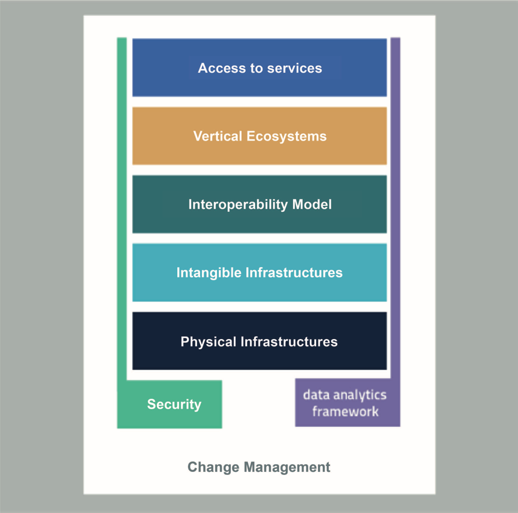
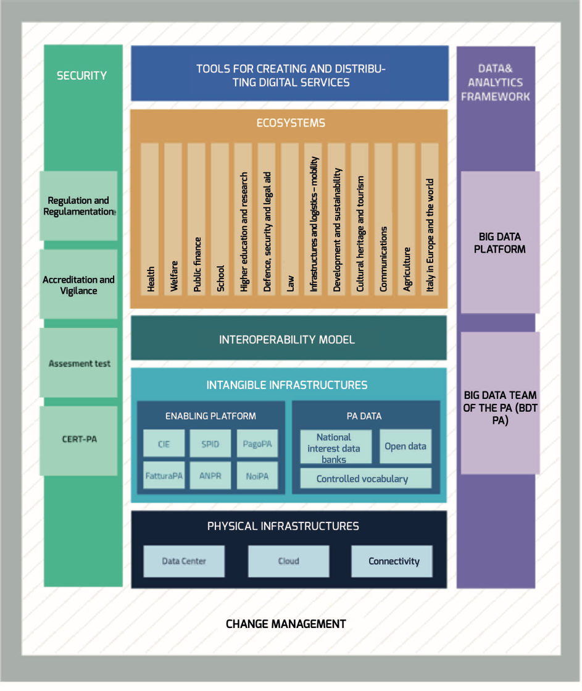

.. container:: wy-alert wy-alert-warning

   **This document was translated by a machine.**

   We want to make our country more efficient. We believe humans and machines should complement each other. Artificial Intelligence is the technology that will enable such symbiosis.
   This document has been translated using a mix of state-of-the-art machine translation and human-driven AI. The raw machine translation output has been edited by an automated system trained on millions of professionally corrected sentences. Finally, a human went through the document to make sure that no information had been lost.

   This means leaving behind some stylistic improvements and potential errors. However, this AI-augmented approach to translation allowed us to prepare this English version at a fraction of the cost and time of the legacy translation process.
   
   Visit the `Github repository <https://github.com/italia/pianotriennale-ict-doc-en>`_ dedicated to contribute with feedback and changes to the Three Year Plan for the Digital Transformation of the Public Administration.

Strategic evolution model of the information system of the public administration
=================================================================================

The Strategic evolution model of the public administration information
system (Hereinafter referred to as "Strategic Model") [8]_ constitutes
the framework for incorporating and making operational the projects,
platforms and programs described in *the document Strategy for Digital
Growth 2014-2020* which sets out the strategic requirements to be met,
namely:

-  Facilitating the coordination of all digital transformation
   operations and the start of a centralisation of programming and
   public spending on the subject;

-  Considering the principle of "digital by definition" (*digital
   first*) as a priority, designing and implementing services for
   citizens, starting with the use of digital technologies;

-  Facilitating the modernisation of the Public Administration starting
   from the processes, overcoming the logic of the technical rules and
   rigid guidelines issued by law. They must be dynamic and modern and
   point to the centrality of the experience and needs of the users;

-  Adopting an architectural approach based on the separation of *back
   end* and *front end*, with open logic and public standards that
   guarantee other players, both public and private, accessibility to
   and maximum interoperability with data and services;

-  Promoting solutions to stimulate cost reduction and improve the
   quality of services, including remuneration mechanisms that can also
   encourage vendors to pursue ever more innovative forms of
   composition, delivery and use of services.

The Digital Growth Strategy highlights the need for a radical redesign
of the strategy for designing, managing and delivering public utilities
in the network, which includes, inter alia, the adoption of multi-level
architectures (*multi-layer architecture*) and the principles that have
determined the affirmation of the business model of the so-called *API
economy*.

The Strategic Model was therefore designed to overcome the "silos"
approach historically adopted by the Public Administration and to
facilitate the implementation of a true Public Administration
Information System (hereinafter "PA Information System") that:

-  Considers the needs of citizens and businesses as a starting point
   for the identification and implementation of modern and innovative
   digital services (*Front office* services);

-  Uniforms and rationalises the infrastructures and IT services used by
   the Public Administration (*Back office* services);

-  Favours the creation of a new market for those private companies that
   will be able to operate in an agile manner in a context no longer
   based on large monolithic and isolated projects but on value-added
   services. These services will have to (i) comply with the guidelines
   of the Three-Year Plan, (ii) be always available on mobile devices
   (the first mobile approach), and (iii) be built with secure,
   scalable, highly reliable, application-based (API) and clearly
   defined architecture;

-  Emphasise existing Public Administration resources in order to
   safeguard the investments already made, including by encouraging and
   creating conditions for reuse of existing software and existing
   interfaces;

-  Not dispose of experience gained in the country's previous
   digitisation projects with the aim of modelling success stories
   (*best practice*) and not repeat mistakes made in the past;

-  Improve security thanks to a multilevel architecture that ensures
   separation between back end and front end and allows access to
   back-ends only in a controlled manner and through standard APIs;

-  Promote the implementation of new services according to the
   subsidiarity principle (e.g. through API interactions), reducing
   implementation times and economic commitments for administrations
   both in development and in the process upgrading;

-  Facilitate control over expenditure on digital technology for the
   public administration by integrating mechanisms for measuring the
   progress of planned activities (e.g. through shared project
   management systems);

-  Enable data-driven policies for planning future activities, based on
   optimising spending and investment.

Map of the Strategic Model
--------------------------

The Strategic Model can be schematically represented by the graphic map
illustrated in Figure 3.

   Figure 3 - Map of the Strategic Evolution Model of the PA Information System

It is important to point out that Map is to be understood as the
representation of macro areas that aggregate the homogeneous elements
that are the subject of the Plan and not as strata of a stack
architectural model ().

Referring to the Map:

-  The **Tools for the generation and diffusion of digital services**
   (i) define common rules for the design of interfaces, services and
   content, improving navigation and making it consistent with the
   experience of citizens and businesses, (ii) facilitate the design,
   implementation and dissemination of digital services, (iii) define
   guidelines and development kits, (iv) provide for the creation of a
   community of developers, designers, and anyone who wants to exchange
   information, collaborate and participate;

-  the **Ecosystems** are the policy sectors or areas where public
   administration takes action: from health to agriculture, from school
   to cultural heritage, and so on. Each ecosystem can include several
   domains, involving public bodies and organisations, starting from the
   ministries of reference, but it can also include private individuals
   working in the same area of ​​interest and, for various reasons,
   carrying out important functions within the ecosystem itself. For
   example, the "Public Finance" ecosystem includes the Revenue Agency,
   the Regions, the Financial Police and, on the other hand, private
   entities, accountants, CAFs, fiscal practitioners, and so on.
   Ecosystems involve stakeholders interacting to achieve common goals
   through (i) sharing needs and operational modes, (ii) sharing
   different skills, (iii) planning and implementing ICT projects;

-  The **Interoperability model** defines the mechanisms that facilitate
   and ensure correct interaction between the players in the system
   (citizens, businesses and public administrations), promoting
   transparent sharing of data, information, platforms and services. The
   Interoperability Model is therefore composed of elements such as
   guidelines, technological standards and interoperability profiles
   that each Public Administration will have to follow in order to
   ensure the interoperability of its systems with those of other
   parties for the overall implementation of the PA Information System;

-  The **Intangible infrastructures** and the ***Data & Analytics
   Framework* (DAF)** of the PA encourage the centralisation and
   rationalisation of process and data management systems, reducing the
   fragmentation of operations.

   In particular, Intangible Infrastructures facilitate, standardise and
   rationalise the creation of ICT services and consist of *Enabling
   platforms* and *PA Data*:

   -  The *Enabling platforms* cover all such infrastructure services
          (e.g. Identification Service, Payment Service, ANPR) that on
          the one hand facilitate and reduce costs for the creation of
          new services; on the other, standardise the tools used by end
          users during their interaction with the Public Administration.
          They also cover all those generic application solutions that
          can be shared by public administrations (e.g. salary
          management system);

   -  With regard to *the PA* Data the following can be distinguished:
          the databases of national interest, the *open data*, and
          controlled vocabulary. The latter is a *repository* that does
          not yet exist but is considered necessary to create and / or
          maintain all those fundamental resources for the full
          enhancement of the public information assets of the Public
          Administration.

    The *Data & Analytics Framework* Is a centralised environment that
    acquires and make more usable public data of interest and has the
    objective of (i) making easier and less onerous the interoperability
    of public data between PAs and the distribution and standardisation
    of *open data* and (ii) allowing the study of the underlying
    phenomena of public data. In addition, the *Framework* allows the
    development of *data applications*, software applications that
    perform more or less complex operations, from simple *data
    retrieval* to techniques of *machine learning*, and puts the
    analyses generated at the disposal of an end user or another
    application;

-  The **Physical infrastructures** aim to increase security, reduce the
   cost of technological infrastructure and improve the quality of
   public administration software services through rationalisation of
   *Data centers*, the systematic adoption of the *cloud* pardigm and
   the development of connectivity, with particular reference to the
   Internet network in public places and in the offices of the Public
   Administration;

-  **Security** includes (i) activities to regulate cyber security in
   the PA for the Assessment *test* and (ii) CERT-PA as an operational
   tool to support the adoption of the correct levels of security in the
   Public Administration. All other aspects that help secure and make
   information systems reliable, such as accreditation and supervision,
   as well as directional activities and confidentiality-related
   instrumentation are also identified.

-  The **Management of change** is a component designed to meet the
   needs of coordinating, managing and monitoring functional activities
   for the Plan's development. It is crosswise to other components and
   aggregates all lines of action, governance and support to PA involved
   in the implementation of the Plan.

Figure 4 detail as just explained.

The purpose of the map is to:

-  Consolidate the long-term vision for the evolution of PA's
   information systems;

-  Represent in a coherent and concise manner all ongoing initiatives on
   the digital innovation of the Italian PA;

-  Provide a framework for identifying and steering new strategic
   actions;

-  Enable the definition of a detailed operational plan;

-  Identify the subjects involved in the implementation of the strategy
   and their responsibility;

-  Allow multi-level continuous monitoring of the target implementation
   status.

The components of the map will be described in more detail in Part Two
of the Plan.

   Figure 4 - PA Information System's Strategic Evolution Model Detail Map

.. rubric:: Notes

.. [8]
   Deliberated by the AgID Address Committee on 04/02/2016
