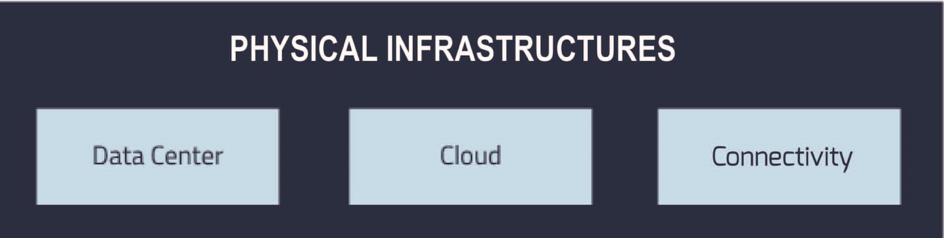

Physical Infrastructure 
========================

National physical Infrastructures are mainly the hardware *assets*
necessary for the implementation of the Plan: communication networks,
*data centres*, the PA *cloud*, *disaster recovery* and *business
continuity* systems and monitoring and security equipment. The Plan will
develop along three main directions:

-  The reorganisation of the public administration data centres through
   rationalisation work, both to reduce management costs and adapt and
   increase the quality of services offered to public administrations,
   including in terms of business continuity, *disaster recovery* and
   energy efficiency;

-  The implementation of the PA *cloud*, enabling virtualisation of the
   fleet of all public administrations, with significant maintenance and
   cost management benefits. Cloud services will be offered in *IaaS*
   (*Infrastructure as a Service*) *PaaS* (*Platform as a Service*) and
   *SaaS* (*Software as a Service*) modes;

-  The rationalisation of public administration connectivity costs and
   the increase in the spread of connectivity in public places for the
   benefit of citizens.

Physical Infrastructures are therefore divided into three macro groups,
as illustrated in Figure 5 below:

-  Data centre, where the activities and infrastructures identified for
   the rationalisation of the Public Data Processing Centres (CEDs)
   fall;

-  *Cloud*, which contains activities and initiatives aimed at
   performing virtual-physical migration of public administration data
   centres, benefiting the services that will be offered by the PA
   *cloud*;

-  Connectivity to the activities and infrastructures useful to (i)
   increase and rationalise costs for the Internet connection by the
   Public Administrations and (ii) its dissemination to public places
   and public administration offices.

Below, in paragraph 3.1 the relevant specifications to *data centres*
and *clouds* will be presented and in paragraph 3.2 those relating to
connectivity.

   Figure 5 - Components of Physical Infrastructures

Data centres and *cloud*
------------------------

The current situation
~~~~~~~~~~~~~~~~~~~~~~

As established by
`*the* <http://www.gazzettaufficiale.it/atto/serie_generale/caricaDettaglioAtto/originario?atto.dataPubblicazioneGazzetta=2012-12-18&atto.codiceRedazionale=12A13277>`__
law `*December 17, 2012, n.
221* <http://www.gazzettaufficiale.it/atto/serie_generale/caricaDettaglioAtto/originario?atto.dataPubblicazioneGazzetta=2012-12-18&atto.codiceRedazionale=12A13277>`__\  [9]_,
AgID has the task of carrying out a census of data *centres* of the PA
in order to propose a rationalisation plan, i.e. rules aimed at
consolidating the digital infrastructures of PAs, in order to achieve
greater levels of efficiency, security and SPID in delivering services
to citizens and businesses.

In the period 1 June 2013 - 31 July 2013 AgID performed `*a* *first
census* <http://www.agid.gov.it/agenda-digitale/infrastrutture-architetture/razionalizzazione-del-patrimonio-ict-pa/censimento-data>`__\  [10]_
on 990 *data centres* of the PA, noting a strong fragmentation of
resources and frequent situations of technological inadequacy [11]_.

The subsequent reconnaissance by AgID in 2016 indicated that, in the ICT
spending of public central administration (CPA), expenditure *on data
centres* was greatest, amounting to about 39% of the total [12]_. It
highlights the importance of rationalising physical infrastructure, even
from an economic point of view.

With regard to the virtualisation of the fleet, the Public
Administration used the *cloud* in an extremely fragmented way, limited
to the adoption of very few solutions.

Given the high fragmentation and disparity of the PA's information
systems, it is necessary to define an evolutionary pathway to accompany
PAs towards the efficient and flexible use of ICT technologies in order
to guarantee high management economies in favour of greater reactivity
in the provision of Services tailored to the needs of citizens and
businesses.

This route involves two activities:

-  Rationalisation of the PA *data centres* and consolidation of the
   less efficient *data centres* in selected centres;

-  Study and definition of the evolutionary strategic model *of PA
   cloud* to be implemented following the rationalisation described in
   the previous paragraph.

Strategic objectives
~~~~~~~~~~~~~~~~~~~~

-  Increase the quality of services offered in terms of security,
   resiliency, energy efficiency and business continuity.

-  Create a PA *cloud* environment, homogeneous from the contractual and
   technological point of view, by retraining internal resources
   existing in PAs or by resorting to resources of qualified external
   parties.

-  Cost savings resulting from consolidating data centres and migrating
   services to *cloud*.

Lines of action
~~~~~~~~~~~~~~~

The rationalisation plan for the ICT resources of the PA envisages that
AgID:

-  Deals with identifying a set of PA's existing physical infrastructure
   that will be elected as National Strategic Poles (PSN)*;*

-  Define the path of PAs towards the *cloud* model, also through the
   resources made available by the National Strategic Poles and the
   resources made available through *SPC-Cloud*\  [13]_;

-  Define a qualification process for PSNs;

-  Define rules and procedures for qualifying other *Cloud Service
   Providers (CSP)*.

The **national strategic** poles will have to meet the technical,
economic, and organisational excellence requirements indicated by AgID,
which will define a specific qualification procedure.

AgID will indicate CSP qualification rules and procedures and evolution
of the *cloud* model dedicated to PA, starting with *cloud* architecture
implemented with the Consip competition [14]_ and the subsequent
extensions defined by the `*Technical Management
Committee* <https://www.cloudspc.it/CDT.html>`__\  [15]_.

| **All Public administrations owners** of physical infrastructure will
  have to participate in a census carried out by AgID (see action point
  **PA Cultural Heritage Census)**.
| Based on the responses obtained, these physical infrastructures, if
  not qualified as PSNs, will be divided into two categories,
  safeguarding past investments made by PAs:

-  *Group A - Data Centres* of quality that have not been elected to the
   National Strategic Pole, or where structural or organisational
   shortcomings are considered minor. As outlined below, these
   facilities will continue to operate but no investment for expansion
   or evolution can be made. However, they will need to ensure
   continuity of services and disaster recovery, up to full migration,
   using the services available under the SPC Framework Agreement
   *Cloud* Lot 1 or made available by the *National strategic* poles.

-  *Group B -* Data centre that *do not guarantee* minimum requirements
   of reliability and security from an infrastructure and / or
   organisational point of view, or do not guarantee the continuity of
   services. These infrastructures will need to be quickly consolidated
   into one of the national strategic poles or towards the *cloud*
   through the services available under the SPC Framework Agreement
   *Cloud* Lot 1.

For administrations that do not present a migration plan, AgID and
CERT-PA, in collaboration with the Digital Transformation Team, will
conduct sample safety analysis activities such as: *Penetration test* or
*Vulnerability assessment*, according to the "*Continuous monitoring*"
action (See paragraph 8.3).

AGID will set out an operational plan that will contain recommendations
on:

-  Identification of poles to be elected to national;

-  Regulatory action to define the mechanisms for accession, operation,
   and breakdown of the costs of national strategic poles across the
   national territory;

-  Defining a plan for migrating to PA *cloud* and the consolidation of
   data centres;

-  The insertion of national strategic poles between the "`Critical
   infrastructures <https://www.sicurezzanazionale.gov.it/sisr.nsf/sicurezza-in-formazione/tenace-e-la-protezione-delle-infrastrutture-critiche.html>`__"
   relevant for national security.

National Strategic Poles can also carry out document retention functions
in accordance with CAD, while remaining able to create additional
conservation (public or private) poles.

Public Administrations, as reported in the `*Circular AgID 24 June 2016,
n.
2* <http://www.agid.gov.it/sites/default/files/documentazione/circolare_piano_triennale_24.6.2016._def.pdf>`__\  [16]_,
cannot bear the costs associated with the constitution of new *data
centres or the evolution of existing non-elected data centres to
national strategic poles.*

Public Administrations will be able to proceed - with prior approval of
AgID [17]_ - to the adaptation of their data centres exclusively to:

-  Avoid problems of interruption of public service;

-  Anticipate decommissioning processes of their data centres to migrate
   to PA *cloud*;

-  Consolidate their services on data centres of other PAs in order to
   obtain cost savings.

In addition, in order to support the objectives set out in the various
phases, AgID will provide useful guidelines for system implementation,
native *cloud* application development and migrating to legacy systems
*cloud*.

To pursue the rationalisation of PA resources, actions have been
identified to help achieve strategic goals.

On this note, please note that DL 18 October 2012, n.179 converted into
Law 221/2012, and specifically
`*Art.33-f* <http://www.gazzettaufficiale.it/atto/serie_generale/caricaArticolo?art.progressivo=0&art.idArticolo=33&art.versione=1&art.codiceRedazionale=12A13277&art.dataPubblicazioneGazzetta=2012-12-18&art.idGruppo=10&art.idSottoArticolo1=10&art.idSottoArticolo=7&art.flagTipoArticolo=0#art>`__\  [18]_,
assigns to AgID the task of consolidating and streamlining the country's
digital sites and infrastructures.

AgID will launch a strategic study to define the characteristics of the
cloud environment for the PA and also with innovative tools such as
pre-commercial procurement (PCP) [19]_ it will put out to tender [20]_
the creation of a set of tools and models to optimise the transparent
use of available resources, regardless of supplier (PSN or *Cloud*
Market Provider).

+---------------+--------------------------------------------------------------------------------------------------------------------------------------------------------------------------------------------------------------------------------------------------------------+
| Subject       | Implementation of the indications provided in `*the Circle AgID 2/2016* <http://www.agid.gov.it/sites/default/files/documentazione/circolare_piano_triennale_24.6.2016._def.pdf>`__                                                                          |
+---------------+--------------------------------------------------------------------------------------------------------------------------------------------------------------------------------------------------------------------------------------------------------------+
| Time Frames   | In progress                                                                                                                                                                                                                                                  |
+---------------+--------------------------------------------------------------------------------------------------------------------------------------------------------------------------------------------------------------------------------------------------------------+
| Players       | PA                                                                                                                                                                                                                                                           |
+---------------+--------------------------------------------------------------------------------------------------------------------------------------------------------------------------------------------------------------------------------------------------------------+
| Description   | During the implementation period of the Plan, PA will not be able to make any expense or investment in the data centre, according to the indications and exceptions indicated in Circular 2 of June 24, 2016 of the AgID.                                    |
|               |                                                                                                                                                                                                                                                              |
|               | PAs, who have not already done so, carry out the projects for consolidating and virtualising their data centres or migrating to SPC *Cloud.* In the event of non-use of the SPC - *Cloud* Lot 1 prepared by Consip, they will provide the reasons to AgID.   |
+---------------+--------------------------------------------------------------------------------------------------------------------------------------------------------------------------------------------------------------------------------------------------------------+
| Result        | ---                                                                                                                                                                                                                                                          |
+---------------+--------------------------------------------------------------------------------------------------------------------------------------------------------------------------------------------------------------------------------------------------------------+

+---------------+---------------------------------------------------------------------------------------------------------------------------------------------------------------------------------------------------------------------------+
| Subject       | ICT Cultural Heritage Census                                                                                                                                                                                              |
+---------------+---------------------------------------------------------------------------------------------------------------------------------------------------------------------------------------------------------------------------+
| Time Frames   | From June 2017 to December 2018                                                                                                                                                                                           |
+---------------+---------------------------------------------------------------------------------------------------------------------------------------------------------------------------------------------------------------------------+
| Players       | AgID, PA                                                                                                                                                                                                                  |
+---------------+---------------------------------------------------------------------------------------------------------------------------------------------------------------------------------------------------------------------------+
| Description   | Census of ICT assets in operation at the Public Administration, also to identify Public Administrations that are in possession of physical infrastructures that can aspire to play the role of National Strategic Pole.   |
+---------------+---------------------------------------------------------------------------------------------------------------------------------------------------------------------------------------------------------------------------+
| Result        | Census Report (release date first release: December 2017 - further releases every 6 months).                                                                                                                              |
+---------------+---------------------------------------------------------------------------------------------------------------------------------------------------------------------------------------------------------------------------+

+---------------+---------------------------------------------------------------------------------------------------------------------------------------------------------------------------------------------------------------------------------------------------------------+
| Subject       | Qualifying SaaS Solutions available on SPC *Cloud* and procurement procedures                                                                                                                                                                                 |
+---------------+---------------------------------------------------------------------------------------------------------------------------------------------------------------------------------------------------------------------------------------------------------------+
| Time Frames   | By March 2018                                                                                                                                                                                                                                                 |
+---------------+---------------------------------------------------------------------------------------------------------------------------------------------------------------------------------------------------------------------------------------------------------------+
| Players       | AgID, Consip                                                                                                                                                                                                                                                  |
+---------------+---------------------------------------------------------------------------------------------------------------------------------------------------------------------------------------------------------------------------------------------------------------+
| Description   | Finding the minimum qualification requirements for a SaaS solution for the PA deliverable on the SPC *Cloud*. Definition of an AgID Operating Circular with useful operating guidelines for suppliers and PAs to qualify as their SaaS application context.   |
|               |                                                                                                                                                                                                                                                               |
|               | Definition by AgID and Consip of the procurement procedure of SaaS services usable within the framework of the SPC *Cloud*.                                                                                                                                   |
|               |                                                                                                                                                                                                                                                               |
|               | AgID specifies the technical and organisational requirements of the MarketPlace platform od SaaS services of the SPC *Cloud* environment of the PA.                                                                                                           |
|               |                                                                                                                                                                                                                                                               |
|               | In the event that it is not possible to arrange through framework Agreements or Conventions, a tender will be held in compliance with the procurement code.                                                                                                   |
+---------------+---------------------------------------------------------------------------------------------------------------------------------------------------------------------------------------------------------------------------------------------------------------+
| Result        | Circular AgID "Criteria for qualifying SaaS services for the *Cloud* of the PA" (*Release date: June 2017*)                                                                                                                                                   |
|               |                                                                                                                                                                                                                                                               |
|               | Provisions for SaaS Services Procurement for *Cloud* of the PA (*Release date: June 2017*)                                                                                                                                                                    |
|               |                                                                                                                                                                                                                                                               |
|               | Technical specification for the implementation of a MarketPlace for SaaS services for the *Cloud* of the PA (*Release date: September 2017*)                                                                                                                  |
|               |                                                                                                                                                                                                                                                               |
|               | Purchase agreement with Consip (*Release date: by March 2018*)                                                                                                                                                                                                |
+---------------+---------------------------------------------------------------------------------------------------------------------------------------------------------------------------------------------------------------------------------------------------------------+

+---------------+-------------------------------------------------------------------------------------------------------------------------------------------------------------------------------------------------------------------------------------------------------------------------------------------------------+
| Subject       | Qualifying *Cloud* Service Provider for PA                                                                                                                                                                                                                                                            |
+---------------+-------------------------------------------------------------------------------------------------------------------------------------------------------------------------------------------------------------------------------------------------------------------------------------------------------+
| Time Frames   | By December 2017                                                                                                                                                                                                                                                                                      |
+---------------+-------------------------------------------------------------------------------------------------------------------------------------------------------------------------------------------------------------------------------------------------------------------------------------------------------+
| Players       | AgID, Consip                                                                                                                                                                                                                                                                                          |
+---------------+-------------------------------------------------------------------------------------------------------------------------------------------------------------------------------------------------------------------------------------------------------------------------------------------------------+
| Description   | AgID will define the rules and procedures for qualifying public *Cloud Providers* to enable Consip to enable new CSPs. CSPs already on MEPA or framework agreements or agreements will submit a qualification application within 3 months of the date of publication of the qualification criteria.   |
+---------------+-------------------------------------------------------------------------------------------------------------------------------------------------------------------------------------------------------------------------------------------------------------------------------------------------------+
| Result        | Circular AgID "Criteria for qualifying for public *Cloud Service Provider* for the PA " *(Release date: October 2017)*                                                                                                                                                                                |
|               |                                                                                                                                                                                                                                                                                                       |
|               | Consip provides access to electronic market instruments / conventions / framework agreements only to *Cloud Service Providers* qualified by AgID *(Release date: October 2017)*                                                                                                                       |
+---------------+-------------------------------------------------------------------------------------------------------------------------------------------------------------------------------------------------------------------------------------------------------------------------------------------------------+

+---------------+----------------------------------------------------------------------------------------------------------------------------------------------------------------------------------------------------------------------------------------------------------------------------------------------------------------------------------------------------------------------------------------------------------------------------------------------------------------------------+
| Subject       | Evolution of the *Cloud* of the PA                                                                                                                                                                                                                                                                                                                                                                                                                                         |
+---------------+----------------------------------------------------------------------------------------------------------------------------------------------------------------------------------------------------------------------------------------------------------------------------------------------------------------------------------------------------------------------------------------------------------------------------------------------------------------------------+
| Time Frames   | By June 2018                                                                                                                                                                                                                                                                                                                                                                                                                                                               |
+---------------+----------------------------------------------------------------------------------------------------------------------------------------------------------------------------------------------------------------------------------------------------------------------------------------------------------------------------------------------------------------------------------------------------------------------------------------------------------------------------+
| Players       | AgID                                                                                                                                                                                                                                                                                                                                                                                                                                                                       |
+---------------+----------------------------------------------------------------------------------------------------------------------------------------------------------------------------------------------------------------------------------------------------------------------------------------------------------------------------------------------------------------------------------------------------------------------------------------------------------------------------+
| Description   | AgID will launch a strategic study to define the technical and organisational requirements for the definition of a *cloud* environment devoted to the PA that will also include the definition of a platform for *Cloud* brokering of the PA, in order to simplify the acquisition and monitoring of ICT resources made available in the *Cloud* environment of the PA even with the possible implementation of prototypes through the *Pre-Commercial Procurement PCP*.   |
+---------------+----------------------------------------------------------------------------------------------------------------------------------------------------------------------------------------------------------------------------------------------------------------------------------------------------------------------------------------------------------------------------------------------------------------------------------------------------------------------------+
| Result        | Strategic study for the definition of multi-supplier *cloud* environment for PA *(Release date: by June 2018)*                                                                                                                                                                                                                                                                                                                                                             |
|               |                                                                                                                                                                                                                                                                                                                                                                                                                                                                            |
|               | Possible Technical Specifications for the Implementation of a *Cloud* brokering system of the PA *(Release date: to be defined)*                                                                                                                                                                                                                                                                                                                                           |
|               |                                                                                                                                                                                                                                                                                                                                                                                                                                                                            |
|               | Acquisition via Consip (release date: to be defined)                                                                                                                                                                                                                                                                                                                                                                                                                       |
+---------------+----------------------------------------------------------------------------------------------------------------------------------------------------------------------------------------------------------------------------------------------------------------------------------------------------------------------------------------------------------------------------------------------------------------------------------------------------------------------------+

+---------------+----------------------------------------------------------------------------------------------------------------------------------------------------------------------------------------------------------------------------------------------------------------------------------------------------------------------------------------------------------------------------------------------------------+
| Subject       | Functional actions to rationalise the PA's data centres                                                                                                                                                                                                                                                                                                                                                  |
+---------------+----------------------------------------------------------------------------------------------------------------------------------------------------------------------------------------------------------------------------------------------------------------------------------------------------------------------------------------------------------------------------------------------------------+
| Time Frames   | From May 2017 to December 2018                                                                                                                                                                                                                                                                                                                                                                           |
+---------------+----------------------------------------------------------------------------------------------------------------------------------------------------------------------------------------------------------------------------------------------------------------------------------------------------------------------------------------------------------------------------------------------------------+
| Players       | AgID, Government.                                                                                                                                                                                                                                                                                                                                                                                        |
+---------------+----------------------------------------------------------------------------------------------------------------------------------------------------------------------------------------------------------------------------------------------------------------------------------------------------------------------------------------------------------------------------------------------------------+
| Description   | AgID defines the requirements necessary for the qualification of a PA to "National Strategic Pole" by issuing a special newsletter.                                                                                                                                                                                                                                                                      |
|               |                                                                                                                                                                                                                                                                                                                                                                                                          |
|               | AgID also verifies the criteria for obtaining and maintaining qualification at the National Strategic Pole.                                                                                                                                                                                                                                                                                              |
|               |                                                                                                                                                                                                                                                                                                                                                                                                          |
|               | AgID identifies the first 3 Pilot National Strategic Poles (national and/or local).                                                                                                                                                                                                                                                                                                                      |
|               |                                                                                                                                                                                                                                                                                                                                                                                                          |
|               | The government will formalise the list of national strategic poles.                                                                                                                                                                                                                                                                                                                                      |
|               |                                                                                                                                                                                                                                                                                                                                                                                                          |
|               | AgID will regulate the technical relationship and the service and economic model with the national strategic poles by defining an Accession Protocol that will also identify the possible regulatory adjustment path [21]_, technical and organisational, which PAs will have to adhere to regulate their qualification and make available to the other PAs the ICT resources and the spaces they own.   |
+---------------+----------------------------------------------------------------------------------------------------------------------------------------------------------------------------------------------------------------------------------------------------------------------------------------------------------------------------------------------------------------------------------------------------------+
| Result        | AgID circular for qualifying for a PA National Strategic Pole *(Release date: September 2017)*                                                                                                                                                                                                                                                                                                           |
|               |                                                                                                                                                                                                                                                                                                                                                                                                          |
|               | Results AgID assessment on candidates for National Strategic Pole *(May 2018)*                                                                                                                                                                                                                                                                                                                           |
|               |                                                                                                                                                                                                                                                                                                                                                                                                          |
|               | Official List of National Strategic Poles *(Release date: June 2018)*                                                                                                                                                                                                                                                                                                                                    |
|               |                                                                                                                                                                                                                                                                                                                                                                                                          |
|               | National strategic AgID-Pole Scheme *(Release date: July 2018)*                                                                                                                                                                                                                                                                                                                                          |
|               |                                                                                                                                                                                                                                                                                                                                                                                                          |
|               | Conventions (*By December 2018*)                                                                                                                                                                                                                                                                                                                                                                         |
|               |                                                                                                                                                                                                                                                                                                                                                                                                          |
|               | Guidelines for developing and maintaining applications for *cloud* of PA *(Release date: December 2017)*                                                                                                                                                                                                                                                                                                 |
|               |                                                                                                                                                                                                                                                                                                                                                                                                          |
|               | Guidelines for Migrating Legacy Applications to the Environment of *cloud* of PA *(Release date: June 2018)*                                                                                                                                                                                                                                                                                             |
+---------------+----------------------------------------------------------------------------------------------------------------------------------------------------------------------------------------------------------------------------------------------------------------------------------------------------------------------------------------------------------------------------------------------------------+

+---------------+---------------------------------------------------------------------------------------------------------------------------------------------------------------------------------------------------------------------------------------------------------------------------------+
| Subject       | Plans to rationalise the ICT patrimony of the PA                                                                                                                                                                                                                                |
+---------------+---------------------------------------------------------------------------------------------------------------------------------------------------------------------------------------------------------------------------------------------------------------------------------+
| Time Frames   | from January 2018 to April 2018                                                                                                                                                                                                                                                 |
+---------------+---------------------------------------------------------------------------------------------------------------------------------------------------------------------------------------------------------------------------------------------------------------------------------+
| Players       | AgID, PA                                                                                                                                                                                                                                                                        |
+---------------+---------------------------------------------------------------------------------------------------------------------------------------------------------------------------------------------------------------------------------------------------------------------------------+
| Description   | Following the census provided by the "PA ICT Cultural Heritage Census", AgID defines guidelines for the rationalisation of the ICT asset of Public Administrations, in conjunction with the Three-Year Plan implementation strategies set out in the other levels of the Map.   |
|               |                                                                                                                                                                                                                                                                                 |
|               | The PA executes the indications defining its own rationalisation plans that, upon request, must be provided to AgID. Rationalisation actions are checked by AgID through the annual census of PA ICT assets.                                                                    |
+---------------+---------------------------------------------------------------------------------------------------------------------------------------------------------------------------------------------------------------------------------------------------------------------------------+
| Result        | Guidelines for the rationalisation of the ICT assets of Public Administrations *(First release date: January 2018)*                                                                                                                                                             |
|               |                                                                                                                                                                                                                                                                                 |
|               | ICT assets rationalisation Plan for PA *(From February 2018 to April 2018)*                                                                                                                                                                                                     |
+---------------+---------------------------------------------------------------------------------------------------------------------------------------------------------------------------------------------------------------------------------------------------------------------------------+

+---------------+-----------------------------------------------------------------------------------------------------------------------------------------------------+
| Subject       | Establishment of National Strategic Poles                                                                                                           |
+---------------+-----------------------------------------------------------------------------------------------------------------------------------------------------+
| Time Frames   | From July 2018                                                                                                                                      |
+---------------+-----------------------------------------------------------------------------------------------------------------------------------------------------+
| Players       | PA                                                                                                                                                  |
+---------------+-----------------------------------------------------------------------------------------------------------------------------------------------------+
| Description   | The administrations identified as National Strategic Pole adapt their *data centre* within the times specified in their ICT rationalisation Plan.   |
|               |                                                                                                                                                     |
|               | AgID ensures the control and monitoring of the actions carried out by the PAs.                                                                      |
+---------------+-----------------------------------------------------------------------------------------------------------------------------------------------------+
| Result        | ---                                                                                                                                                 |
+---------------+-----------------------------------------------------------------------------------------------------------------------------------------------------+

+---------------+-----------------------------------------------------------------------------------------------------------------------------------------------------------------------------------------------------------------------------------------------------------------+
| Subject       | Group A: *Data centre* adaptation                                                                                                                                                                                                                               |
+---------------+-----------------------------------------------------------------------------------------------------------------------------------------------------------------------------------------------------------------------------------------------------------------+
| Time Frames   | From April 2018                                                                                                                                                                                                                                                 |
+---------------+-----------------------------------------------------------------------------------------------------------------------------------------------------------------------------------------------------------------------------------------------------------------+
| Players       | PA                                                                                                                                                                                                                                                              |
+---------------+-----------------------------------------------------------------------------------------------------------------------------------------------------------------------------------------------------------------------------------------------------------------+
| Description   | Administrations belonging to Group A will have to consolidate existing application systems within existing *data centres* and use the *cloud* of PA through the SPC-Cloud *competition to* ensure the continuity of critical services or *disaster recovery.*   |
|               |                                                                                                                                                                                                                                                                 |
|               | AgID ensures the control and monitoring of the actions carried out by the PAs.                                                                                                                                                                                  |
+---------------+-----------------------------------------------------------------------------------------------------------------------------------------------------------------------------------------------------------------------------------------------------------------+
| Result        | ---                                                                                                                                                                                                                                                             |
+---------------+-----------------------------------------------------------------------------------------------------------------------------------------------------------------------------------------------------------------------------------------------------------------+

+---------------+--------------------------------------------------------------------------------------------------------------------------------------------------------------------------------------------------------------------------------------------------+
| Subject       | Group B: Migration of *Data centres*                                                                                                                                                                                                             |
+---------------+--------------------------------------------------------------------------------------------------------------------------------------------------------------------------------------------------------------------------------------------------+
| Time Frames   | From February 2018                                                                                                                                                                                                                               |
+---------------+--------------------------------------------------------------------------------------------------------------------------------------------------------------------------------------------------------------------------------------------------+
| Players       | PA                                                                                                                                                                                                                                               |
+---------------+--------------------------------------------------------------------------------------------------------------------------------------------------------------------------------------------------------------------------------------------------+
| Description   | Administrations belonging to Group B will have to consolidate existing application systems with existing *data centres* to migrate to one of the national strategic poles or migrate to the *Cloud* of PA through the *SPC-Cloud* competition.   |
|               |                                                                                                                                                                                                                                                  |
|               | AgID ensures the control and monitoring of the actions carried out by the PAs.                                                                                                                                                                   |
+---------------+--------------------------------------------------------------------------------------------------------------------------------------------------------------------------------------------------------------------------------------------------+
| Result        | ---                                                                                                                                                                                                                                              |
+---------------+--------------------------------------------------------------------------------------------------------------------------------------------------------------------------------------------------------------------------------------------------+

Connectivity
------------

In principle, public administrations must initiate processes for
adapting their connectivity in order to provide all the services related
to both internal administrative processes and public services addressed
to citizens. They are equipped with a network connection infrastructure
that can respond to at least the following general principles:

-  Sufficient bandwidth to meet the requirements of internal and
   outsourced IT services;

-  Service levels adequate to ensure the operation of the applications
   used;

-  Bandwidth capacity scalability even for Wi-Fi bandwidth delivery for
   public use;

-  Security levels complying with international standards;

-  High reliability network configurations in case of Critical
   Infrastructures.

The administrations define the exact parameters and the level of network
reliability according to the specific application context, the use of
their applications, and the levels of service they offer. They also set
up their own services to support IPv6 protocol.

The PA's Internet connectivity must be aimed at:

-  Ensuring access to the Internet to **all PA employees,** irrespective
   of the role or assignments assigned, and without time or time limits.
   The Internet today must be considered to be an indispensable and
   effective work tool to carry out any kind of activity: from finding
   phone numbers, identifying people and relationships between these
   people, references to a competition or norms, technical
   documentation, productivity tool (translations, times in the world,
   etc.), emergency services, or news of any kind.

-  Provide access not only to the tools and applications used by the PA
   but, after analysing the organisational needs in relation to the
   objectives to be achieved, **to all the content and tools that the
   Internet makes available**, including file and content sharing tools,
   social networks, as well as sites such as forums, chat, or other
   communication tools.

PAs that use firewalls or other types of application filters must then
configure them to allow internet access to all employees, and limit
filtering to directly dangerous sites and content (malware, viruses,
*phishing*), or which are Illegal, or clearly unsuitable for a
workplace. File sharing, social networking, chat or other sites should
not be filtered in principle, for what they are but only and exclusively
depending on the type of content that is normally exchanged.

If the PA has clear and documented security requirements beyond the
standard (confidential material, critical services, and national
security), it is recommended to use tight filters that block the use of
commonly used tools **alone and exclusively** to those employees and
systems that have access to this type of information, as well as strong
security policies that instruct employees about how to locate and treat
confidential information about the dangers of *phishing*, the use of USB
keys, etc. and in the face of the configuration of logging and auditing
tools to keep the network secure.

The action lines in Chapter 8, dedicated to security, will provide clear
and detailed guidance.

The current situation 
~~~~~~~~~~~~~~~~~~~~~~

The availability of connectivity in Public Administrations is very
diverse. Typically, public administrations - especially the local ones -
have an under-dimensional situation that does not meet the criteria
defined by the Public Connectivity System (SPC).

Strategic objectives
~~~~~~~~~~~~~~~~~~~~

-  Increase Internet connectivity by the Public Administration in
   conjunction with the National Broadband Plan and the rationalisation
   strategy of the ICT resources of the PA in the previous chapter.

-  Rationalise costs for connectivity (data / voice) through the use of
   SPC competitions.

-  Standardise and increase the diffusion of wireless connectivity in
   public places and Public Administration offices accessible to the
   public, also in order to facilitate access to services by citizens
   through the use of public *Wi-Fi* networks.

Lines of action
~~~~~~~~~~~~~~~

Depending on the PA ICT resources rationalisation plan, two distinct
paths are to be mentioned, in conjunction with the National Broadband
Plan:

-  As far as the peripheral structures are concerned, i.e. all PAs that
   will not be a national strategic pole, connectivity will be
   guaranteed by the availability of the Consip SPC-Connectivity
   Contract (SPC-Conn) [22]_;

-  For national strategic poles, in view of the potential bandwidth
   requirements and transmission characteristics that are not always
   apparent in the availability of SPC Contracts, the different levels
   of connectivity will be the subject of a specific competition.

By 2017, Public Administrations will adjust their connection capacity to
ensure the full deployment of strategic services and platforms, by
adopting alternately:

-  Connectivity solutions based on the accession to the SPC Framework
   Agreements, except where the bandwidth requirements and the
   transmission characteristics required are not potentially satisfying
   in these contractual areas;

-  The services made available, on the basis of the subsidiarity
   principle, in its territory of reference by the Region or by another
   local public entity that has already established territorial
   connection structures complying with the requirements of AgID and
   interconnected with the SPC network.

In any case, in the choice of connectivity services, PAs should
prioritise supplies where the transport service is based on *dual-stack*
(IPv4 and IPv6).

+---------------+--------------------------------------------------------------------------------------------------------------------------------------------------------------------------------------------------------------------------------------------------+
| Subject       | Publication and adaptation to the Guidelines for the Implementation of public *Wi-Fi* networks                                                                                                                                                   |
+---------------+--------------------------------------------------------------------------------------------------------------------------------------------------------------------------------------------------------------------------------------------------+
| Time Frames   | From January 2018                                                                                                                                                                                                                                |
+---------------+--------------------------------------------------------------------------------------------------------------------------------------------------------------------------------------------------------------------------------------------------+
| Players       | AgID, all PAs that manage public *Wi-Fi* networks                                                                                                                                                                                                |
+---------------+--------------------------------------------------------------------------------------------------------------------------------------------------------------------------------------------------------------------------------------------------+
| Description   | AgID will publish guidelines for the use of *Wi-Fi* that public administrations make accessible to citizens in offices and public places, drafted also on the basis of the major experiences of public *Wi-Fi* already in existence in the PA.   |
|               |                                                                                                                                                                                                                                                  |
|               | The administrations define and implement the Adaptation Plan to the guidelines issued by AgID for the *Wi-Fi* which facilitate access to the Internet network from public offices and public places.                                             |
+---------------+--------------------------------------------------------------------------------------------------------------------------------------------------------------------------------------------------------------------------------------------------+
| Result        | Guidelines for the implementation of public *Wi-Fi* networks (*Release date: December 2017*)                                                                                                                                                     |
|               |                                                                                                                                                                                                                                                  |
|               | Adaptation to Guidelines (*From January 2018*)                                                                                                                                                                                                   |
+---------------+--------------------------------------------------------------------------------------------------------------------------------------------------------------------------------------------------------------------------------------------------+

+---------------+---------------------------------------------------------------------------------------------------------------------------------------------------------------------------------------------+
| Subject       | Support for using the SPC Connectivity Agreement                                                                                                                                            |
+---------------+---------------------------------------------------------------------------------------------------------------------------------------------------------------------------------------------+
| Time Frames   | Continuous support service from September 2017                                                                                                                                              |
+---------------+---------------------------------------------------------------------------------------------------------------------------------------------------------------------------------------------+
| Players       | AgID, Consip                                                                                                                                                                                |
+---------------+---------------------------------------------------------------------------------------------------------------------------------------------------------------------------------------------+
| Description   | AgID, with the help of Consip, will provide operational guidance to enhance the use of this supply channel, depending on the characteristics of the needs of the various administrations.   |
+---------------+---------------------------------------------------------------------------------------------------------------------------------------------------------------------------------------------+
| Result        | ---                                                                                                                                                                                         |
+---------------+---------------------------------------------------------------------------------------------------------------------------------------------------------------------------------------------+

.. rubric:: Notes

.. [9]
   Law of 17th December 2012, no. 221 conversion, with modifications, of
   the Decree-Law of 18th October 2012, no. 179, contains further urgent
   measures for the country's growth (Official Gazette no. 294 of 18th
   December 2012, s.o. no. 208)
   `*http://www.gazzettaufficiale.it/atto/serie\_generale/caricaDettaglioAtto/originario?atto.dataPubblicazioneGazzetta=2012-12-18&atto.codiceRedazionale=12A13277* <http://www.gazzettaufficiale.it/atto/serie_generale/caricaDettaglioAtto/originario?atto.dataPubblicazioneGazzetta=2012-12-18&atto.codiceRedazionale=12A13277>`__

.. [10]
   `*http://www.agid.gov.it/agenda-digitale/infrastrutture-architetture/razionalizzazione-del-patrimonio-ict-pa/censimento-data* <http://www.agid.gov.it/agenda-digitale/infrastrutture-architetture/razionalizzazione-del-patrimonio-ict-pa/censimento-data>`__

.. [11]
   20% of the infrastructures considered had no *disaster recovery* or
   *business continuity* mechanisms, 12% of the infrastructures of the
   CPA and 50% of the LPA infrastructures considered had access controls
   considered insufficient, 94% of the *data centre* for CPAs and 84%
   for LPAs were implemented and used by a single administration, with
   duplication of costs and resources.

.. [12]
   For more details, see Annex 3 - Synoptic Framework for ICT
   Expenditure in Central Public Administrations.

.. [13]
   Cf. Annex 2 - Tools and Resources for the Implementation of the Plan.

.. [14]
   SPC *CLOUD* Lot 1 - cf. Annex 2.

.. [15]
   `*https://www.\ *cloud*\ spc.it/CDT.html* <https://www.cloudspc.it/CDT.html>`__

.. [16]
   `*http://www.agid.gov.it/notizie/2016/06/24/spesa-ict-2016-indicazioni-lacquisto-beni-servizi-pa* <http://www.agid.gov.it/notizie/2016/06/24/spesa-ict-2016-indicazioni-lacquisto-beni-servizi-pa>`__

.. [17]
   The processes will be specified as a result of the action line,
   "Guidelines on the rationalisation strategy of data centres to be
   included in the Triennial Plans of PA 2017-2019".

.. [18]
   `*http://www.gazzettaufficiale.it/atto/serie\_generale/caricaArticolo?art.progressivo=0&art.idArticolo=33&art.versione=1&art.codiceRedazionale=12A13277&art.dataPubblicazioneGazzetta=2012-12-18&art.idGruppo=10&art.idSottoArticolo1=10&art.idSottoArticolo=7&art.flagTipoArticolo=0#art* <http://www.gazzettaufficiale.it/atto/serie_generale/caricaArticolo?art.progressivo=0&art.idArticolo=33&art.versione=1&art.codiceRedazionale=12A13277&art.dataPubblicazioneGazzetta=2012-12-18&art.idGruppo=10&art.idSottoArticolo1=10&art.idSottoArticolo=7&art.flagTipoArticolo=0#art>`__

.. [19]
   For further information on pre-sales contracts, see Annex 2 - Tools
   and resources for the implementation of the Plan

.. [20]
   Action Line "Definition of technical specifications for the
   realisation of a *Cloud Brokering system* " and "Functional Actions
   to Rationalise the Data Centres of the PA".

.. [21]
   The regulatory diligence should include both the use of in-house
   companies and indications for limiting/blocking bilateral agreements
   between administrations for brokering services.

.. [22]
   Cf. Annex 2 - Tools and Resources for the Implementation of the Plan.

