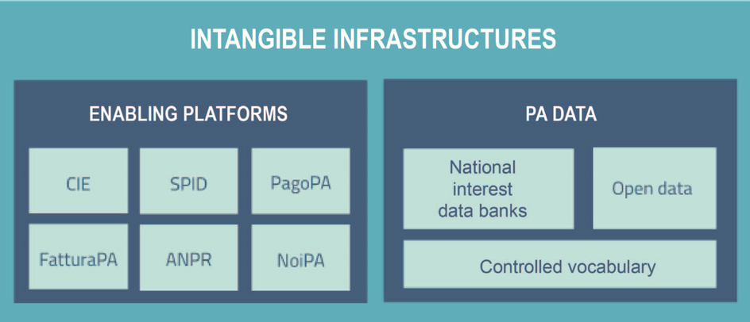

.. container:: wy-alert wy-alert-warning

   **This document was translated by a machine.**

   We want to make our country more efficient. We believe humans and machines should complement each other. Artificial Intelligence is the technology that will enable such symbiosis. This document has been translated using a mix of state-of-the-art machine translation and human-driven AI. The raw machine translation output has been edited by an automated system trained on millions of professionally corrected sentences. Finally, a human went through the document to make sure that no information had been lost.

   This means leaving behind some stylistic improvements and potential errors. However, this AI-augmented approach to translation allowed us to prepare this English version at a fraction of the cost and time of the legacy translation process (this translation was made in a few days including the human review; we didn’t publish it right away because we had to convert it to reStructuredText in order to share it on GitHub and we had a ton of things to do before that!).

   If you want to contribute with feedback and changes to the Three Year Plan for ICT in the Public Administration, visit the `Github repository <https://github.com/italia/pianotriennale-ict-doc-en>`_.
   
   If there are significant differences between the italian and the english version of the Three Year Plan, we remind you that only the italian version approved every year by the Italian Government has legal value.

Intangible Infrastructure 
==========================

Data from public administrations, together with the mechanisms and
platforms created to provide services to citizens, are one of the major
digital assets of the PA.

This chapter is devoted to these intangible infrastructures and develops
along two lines:

-  The rationalisation and enhancement of the information assets of the
   Public Administration by overcoming the "silo logic", still too often
   adopted today and legacy of administrative processes and
   organisational choices made in the past;

-  The common factor of software components that are useful to all
   Public Administrations and which can be considered both accelerators
   of the digitisation process and tools for the homogenisation of the
   services offered.

Intangible Infrastructures are subdivided into two macro groups, as
shown in Figure 6:

-  PA data, i.e. activities related to databases of national interest,
   open data and controlled vocabularies;

-  The Enabling Platforms, that is, platforms shared at
   national level by PAs.

   Figure 6 - Components of intangible infrastructures

Public Administration Data 
---------------------------

Enhancing of public information assets is a strategic goal for Public
Administration. To exploit the potential of the immense wealth of data
collected and managed by the PA, it is necessary to implement a paradigm
shift in their management that allows to overcome "silo logic" in favour
of a systemic vision. Data must be understood as a common good, shared
free of charge between public administrations for institutional
purposes [23]_ and usable by civil society, unless the reasons for not
doing so are documented and properly reasoned [24]_.

To implement this paradigm, the Plan identifies three areas:

-  **Databases of national interest**, or reliable databases,
   homogeneous by type and content, relevant to the performance of
   institutional functions of public administrations and for analysis
   purposes. They constitute the backbone of public information assets,
   to be made available to all PAs, facilitating the exchange of data
   and avoiding asking for the same information more often from citizens
   or enterprises (*once only principle*\  [25]_);

-  ***Open date***, or "open type data". They involve a process designed
   to make Public Administration data freely usable, re-usable and
   redistributable by anyone and for any purpose, including commercial,
   provided they are not subject to particular restrictions (e.g. state
   secret, statistical confidentiality, Privacy restrictions defined by
   the Privacy Policy);

-  **Controlled vocabularies and data models**, which are a common and
   shared way of organizing recurring codes and nomenclatures in a
   regulated and standardized manner (controlled vocabularies) and a
   comprehensive and rigorous conceptualization within a given domain
   (ontology or shared data model).

Enhancing public assets requires careful guidance that draws on the
processes of standardisation, generation, retention and reuse of data.
This upgrade will bring benefits in terms of greater administrative
efficiency, re-use of data for the benefit of the citizen (thus avoiding
re-supplying data already held by the Public Administration) and
widening the possibilities of analysis, including the understanding and
prediction of social phenomena to support the process of *policy making*
and the development of services to the citizen.

Databases of national interest
~~~~~~~~~~~~~~~~~~~~~~~~~~~~~~~

According to Article 60 of the CAD, databases of national interest are
all the information collected and managed digitally by public
administrations, homogeneous by type and content, and whose knowledge is
relevant to the performance of the institutional functions of the other
PAs, also for statistical purposes and analysis, using *big data*
methodologies. In particular, databases of national interest:

-  Refer to data collected and managed by or on behalf of the managing
   authority so that they can respond to the credibility or authenticity
   of the source;

-  Have a high socio-economic relevance;

-  Are at the service of administrative proceedings falling within the
   competence of other Public Administrations for the performance of
   their institutional duties;

-  Support cross-border administrative procedures in implementation of
   Community standards or directives;

-  Are authoritative in the domain of reference.

In the European context, data bases of national interest correspond to
the so-called `**Base
Register** <https://ec.europa.eu/isa2/sites/isa/files/presentations/peter-burian.pdf>`__\  [26]_,
or basic components to support the interaction between public
administrations and between them and the private bodies. The term *Base
Register* is used in the `**European Interoperability
Framework** <https://joinup.ec.europa.eu/asset/eia/description>`__\  [27]_
to indicate reliable, authentic and official sources of particularly
relevant data produced by Public Administrations. These data are the
foundation for building public services and the public administrations
have the task of managing them according to clear quality, security and
privacy requirements.

The current situation
^^^^^^^^^^^^^^^^^^^^^

Most existing public data bases have been designed and implemented in a
distinct way, without the support of an overview useful to address
regulatory and technical actions that can enhance data quality.

Over time this feature has generated the fragmentation of the public
information assets of the Public Administration into information silos:
"containers" in which the data is often replicated and stored unevenly
or even inconsistently and in a misaligned manner.

The CAD (Article 60, paragraph 3a) identifies a set of databases of
national interest (see Glossary):

-  the `*National Repertoire of Territorial
   Data* <http://www.rndt.gov.it/>`__\  [28]_ (RNDT) - Holder: AgID;

-  The National `*resident population
   register* <http://www.registroimprese.it/>`__\  [29]_ (ANPR) -
   Holder: Ministry of the Interior;

-  The `*National Public Contracts
   Database* <http://portaletrasparenza.anticorruzione.it/microstrategy/html/index.htm>`__\  [30]_
   (BDNCP) - Holder: ANAC;

-  the `*Criminal
   records-* <https://certificaticasellario.giustizia.it/sac/>`__\  [31]_
   Holder: Ministry of Justice;

-  `*the Business Register* <http://www.registroimprese.it/>`__\  [32]_
   - Holder: UnionCamere;

-  Automated Immigration and Asylum Archives - Owner: Ministry of the
   Interior;

-  National Assistance Register (ANA) - Holders: Ministry of Economy and
   Finance and Ministry of Health;

-  The Register of Farms - Holders: Regions and Ministry of
   Agricultural, Food and Forestry Policies.

The following data bases, governed by the regulatory context of the CAD
and the Decree Law 18 October 2012, no. 179 [33]_:

-  The National Archive of Civic Numbers of Urban Roads (ANNCSU) -
   Owner: ISTAT and the Revenue Agency;

-  The Cadastral Database - Holder: Revenue Agency;

-  The `*Public Administration
   Index* <http://www.indicepa.gov.it>`__\  [34]_ (IPA) - Holder: AgID;

-  The `*certified national email address list of professionals and
   businesses* <https://www.inipec.gov.it>`__\  [35]_ (INI-PEC) -
   Holder: Ministry of Economic Development.

Article. 60 of the CAD assigns to the AgID the possibility of extending
the previous list which should therefore be considered as non-exhaustive
and expanding. In fact, in addition to the databases contained in the
aforementioned regulatory references, there are others that are
comparable to them:

-  The Public Vehicle Register (PRA) - Owner: ACI;

-  Tax Registry - Owner: Revenue Agency;

-  `*catalogue of* *Public* <http://www.dati.gov.it>`__
   *Administration*\  [36]_ - Holder: AgID;

-  The catalogue of Services for Citizens and Businesses - Holder: AgID;

-  The National Infrastructure Information System (SINFI) - Holder:
   Ministry of Economic Development.

The PA also has data that, if appropriately organised and managed, can
form new databases of national interest. These include, for example:
crime data and statistics collected by the Ministry of the Interior;
mobility data (already covered by the Third National Action Plan for
'`**Open Government
Partnership** <http://open.gov.it/terzo-piano-dazione-nazionale/>`__
(OGP)) [37]_ for whose release and re-use, the Ministry of
Infrastructure and Transport has identified specific actions to be
undertaken; the data of the regional schools and vocational training
centres on the national territory present in the project `*Scuola in
chiaro* <http://cercalatuascuola.istruzione.it>`__\  [38]_, run by the
Ministry of Education, University and Research; The Economic Operators
Database (BDOE) and the other data bases connected with the
*e-procurement*; the performance scoreboard and performance
indicators [39]_, to be implemented in the `*Performance
Portal* <https://performance.gov.it/>`__\  [40]_, run by the Department
of Public Service.

Strategic objectives
^^^^^^^^^^^^^^^^^^^^

-  Make or adapt databases of public administrations, with the aim of
   reducing redundancies caused by asynchronous copies and manual
   intervention, promoting consistency and certainty of information.

-  Facilitate access to data by implementing APIs in order to exploit
   the potential introduced by the integration of individual databases,
   transforming them into enabling platforms.

-  Complete the migration of data from the municipal registry to ANPR.

-  Integrate ANPR with other databases of national interest, making ANPR
   the authoritative source of citizens' personal data.

-  Make ANPR an Enabling Platform with secure integration APIs with
   other Public Administrations and third-party systems and self-service
   interfaces for citizens.

-  Proceed to populating the data on
   `*IPA* <http://www.indicepa.gov.it>`__\  [41]_ and
   `*INI-PEC* <http://www.inipec.gov.it>`__, [42]_ as documented on
   their sites.

-  Ensure compliance with the quality requirements of national data
   bases as defined by the data quality standard `*ISO / IEC 25012 *Data
   quality
   model** <https://www.iso.org/obp/ui/#iso:std:iso-iec:25012:ed-1:v1:en>`__\  [43]_,
   applying the technical rules defined by AgID with the `*Determination
   no.
   68/2013* <http://www.agid.gov.it/sites/default/files/circolari/dt_cs_n.68_-_2013dig_-regole_tecniche_basi_dati_critiche_art_2bis_dl_179-2012_sito.pdf>`__\  [44]_
   for critical data bases.

-  Identify how to access each database or catalogue and produce
   technical-normative references.

-  Use national data bases to feed the *Data & Analytics Framework.*

Lines of action
^^^^^^^^^^^^^^^

The strategy is based on:

-  Promoting policies and actions to foster coordination in the creation
   of databases and ensure their quality;

-  Actions for the enhancement of the PA's information assets by
   updating the guidelines to ensure that PAs exhibiting public data
   follow a uniform catalogue population process;

-  Releasing the prototype of a software platform that PAs can take for
   free to manage and publish their open data;

-  Communication and training actions to promote the population of the
   national catalogue of public data.

Adoption by the PAs of national data bases of the guidelines outlined in
Chapter 5 "Interoperability Model" will facilitate the dissemination of
information between Public Administrations.

All PAs are therefore required to use databases and registers that are
already operational and specified on the AgID site.

+---------------+-----------------------------------------------------------------------------------------------------------+
| Subject       | Use of IPA and INI-PEC registers                                                                          |
+---------------+-----------------------------------------------------------------------------------------------------------+
| Time Frames   | By June 2018                                                                                              |
+---------------+-----------------------------------------------------------------------------------------------------------+
| Players       | PA                                                                                                        |
+---------------+-----------------------------------------------------------------------------------------------------------+
| Description   | Public Administrations populate and keep their data updated on IPA, as documented on the relative site.   |
|               |                                                                                                           |
|               | Public Administrations use IPA and INI-PEC in managing their own processes.                               |
+---------------+-----------------------------------------------------------------------------------------------------------+
| Result        | ---                                                                                                       |
+---------------+-----------------------------------------------------------------------------------------------------------+

+---------------+---------------------------------------------------------------------------------------------------------------------------------------------------------------------------------------------------------------+
| Subject       | Publish list of databases of national interest                                                                                                                                                                |
+---------------+---------------------------------------------------------------------------------------------------------------------------------------------------------------------------------------------------------------+
| Time Frames   | By July 2017                                                                                                                                                                                                  |
+---------------+---------------------------------------------------------------------------------------------------------------------------------------------------------------------------------------------------------------+
| Players       | AgID, PA                                                                                                                                                                                                      |
+---------------+---------------------------------------------------------------------------------------------------------------------------------------------------------------------------------------------------------------+
| Description   | AgID will make available on its institutional site and on the dati.gov.it portal, the list of databases of national interest and the related information sheets collected.                                    |
|               |                                                                                                                                                                                                               |
|               | Public administrations holding databases of national interest shall describe them by means of a specific information sheet explaining how to use them and the main database technical-normative references.   |
+---------------+---------------------------------------------------------------------------------------------------------------------------------------------------------------------------------------------------------------+
| Result        | Information sheets (release date: June 2017)                                                                                                                                                                  |
|               |                                                                                                                                                                                                               |
|               | Web site with list of databases of national interest *(Release date: July 2017)*                                                                                                                              |
+---------------+---------------------------------------------------------------------------------------------------------------------------------------------------------------------------------------------------------------+

+---------------+----------------------------------------------------------------------------------------------------------------------------------------------------------------------------------------------------------------------------------------------------------------------------------------------------------------------------------------------------------------------------------+
| Subject       | Integration between the national repertoire of territorial data and the dati.gov.it catalogue.                                                                                                                                                                                                                                                                                   |
+---------------+----------------------------------------------------------------------------------------------------------------------------------------------------------------------------------------------------------------------------------------------------------------------------------------------------------------------------------------------------------------------------------+
| Time Frames   | By December 2017                                                                                                                                                                                                                                                                                                                                                                 |
+---------------+----------------------------------------------------------------------------------------------------------------------------------------------------------------------------------------------------------------------------------------------------------------------------------------------------------------------------------------------------------------------------------+
| Players       | AgID                                                                                                                                                                                                                                                                                                                                                                             |
+---------------+----------------------------------------------------------------------------------------------------------------------------------------------------------------------------------------------------------------------------------------------------------------------------------------------------------------------------------------------------------------------------------+
| Description   | AgID will look at the alignment of the information contained in the National Directory of Territorial Data (RNDT) with respect to the data.gov.it catalogue, providing the appropriate operational guidance for administrations and using the tools useful for exchanging descriptions of data and territorial services that were defined in the European "Geo DCAT-AP" [45]_.   |
+---------------+----------------------------------------------------------------------------------------------------------------------------------------------------------------------------------------------------------------------------------------------------------------------------------------------------------------------------------------------------------------------------------+
| Result        | Technical Specifications (release date: December 2017)                                                                                                                                                                                                                                                                                                                           |
+---------------+----------------------------------------------------------------------------------------------------------------------------------------------------------------------------------------------------------------------------------------------------------------------------------------------------------------------------------------------------------------------------------+

+---------------+-----------------------------------------------------------------------------------------------------------------------------------+
| Subject       | Feeding the national repertoire of territorial data                                                                               |
+---------------+-----------------------------------------------------------------------------------------------------------------------------------+
| Time Frames   | In progress                                                                                                                       |
+---------------+-----------------------------------------------------------------------------------------------------------------------------------+
| Players       | PA                                                                                                                                |
+---------------+-----------------------------------------------------------------------------------------------------------------------------------+
| Description   | The documentation of territorial (or geographic) data must be done only through the National Territorial Data Directory (RNDT).   |
|               |                                                                                                                                   |
|               | For the documentation of this data, PA uses the national profile of INSPIRE / RNDT metadata. [46]_                                |
+---------------+-----------------------------------------------------------------------------------------------------------------------------------+
| Result        | ---                                                                                                                               |
+---------------+-----------------------------------------------------------------------------------------------------------------------------------+

+---------------+-------------------------------------------------------------------------------------------------------------------------------------------------------------------------------------------------------------------------------------------------------------------------------------------------------------------------------------------------------------+
| Subject       | Creation of Services catalogue (servizi.gov.it) and its population                                                                                                                                                                                                                                                                                          |
+---------------+-------------------------------------------------------------------------------------------------------------------------------------------------------------------------------------------------------------------------------------------------------------------------------------------------------------------------------------------------------------+
| Time Frames   | In progress                                                                                                                                                                                                                                                                                                                                                 |
+---------------+-------------------------------------------------------------------------------------------------------------------------------------------------------------------------------------------------------------------------------------------------------------------------------------------------------------------------------------------------------------+
| Players       | AgID, PA                                                                                                                                                                                                                                                                                                                                                    |
+---------------+-------------------------------------------------------------------------------------------------------------------------------------------------------------------------------------------------------------------------------------------------------------------------------------------------------------------------------------------------------------+
| Description   | AgID completes the first implementation phase of the Services catalogue (servizi.gov.it) by releasing an application that allows PAs to document their services.                                                                                                                                                                                            |
|               |                                                                                                                                                                                                                                                                                                                                                             |
|               | AgID identifies so-called *early adopters* among the PAs that experiment with the use of the application.                                                                                                                                                                                                                                                   |
|               |                                                                                                                                                                                                                                                                                                                                                             |
|               | Starting from April 2017, promotional activities will also be undertaken to raise awareness and guidance on the inclusion of data in the catalogue.                                                                                                                                                                                                         |
|               |                                                                                                                                                                                                                                                                                                                                                             |
|               | *Early adopter* Public Administrations, starting from April 2017, will document their services in the service catalogue in accordance with the interoperability profile specifications CPSV-AP `*IT* <http://www.dati.gov.it/consultazione/CPSV-AP_IT>`__\  [47]_ and referring to the relative ontology. From 2018, the PA shall populate the catalogue.   |
+---------------+-------------------------------------------------------------------------------------------------------------------------------------------------------------------------------------------------------------------------------------------------------------------------------------------------------------------------------------------------------------+
| Result        | Application for data collection *(Release date: June 2017)*                                                                                                                                                                                                                                                                                                 |
|               |                                                                                                                                                                                                                                                                                                                                                             |
|               | Early Adopter detection (release date: June 2017)                                                                                                                                                                                                                                                                                                           |
+---------------+-------------------------------------------------------------------------------------------------------------------------------------------------------------------------------------------------------------------------------------------------------------------------------------------------------------------------------------------------------------+

+---------------+-----------------------------------------------------------------------------------------------------------------------------------------------------------------------------------------------------------------+
| Subject       | Completion of ANPR population                                                                                                                                                                                   |
+---------------+-----------------------------------------------------------------------------------------------------------------------------------------------------------------------------------------------------------------+
| Time Frames   | By December 2018                                                                                                                                                                                                |
+---------------+-----------------------------------------------------------------------------------------------------------------------------------------------------------------------------------------------------------------+
| Players       | Municipalities, Ministry of the Interior, Sogei                                                                                                                                                                 |
+---------------+-----------------------------------------------------------------------------------------------------------------------------------------------------------------------------------------------------------------+
| Description   | All municipal registry data (APRs) migrate to ANPR, with collaboration between Municipalities, the Ministry of the Interior and Sogei.                                                                          |
+---------------+-----------------------------------------------------------------------------------------------------------------------------------------------------------------------------------------------------------------+
| Result        | ANPR populated with all the master data of Italian municipalities *(Release date: December 2018)*                                                                                                               |
+---------------+-----------------------------------------------------------------------------------------------------------------------------------------------------------------------------------------------------------------+
| Subject       | Adaptation of national interest databases to the Interoperability Model                                                                                                                                         |
+---------------+-----------------------------------------------------------------------------------------------------------------------------------------------------------------------------------------------------------------+
| Time Frames   | From January 2018                                                                                                                                                                                               |
+---------------+-----------------------------------------------------------------------------------------------------------------------------------------------------------------------------------------------------------------+
| Players       | PA holders of national databases                                                                                                                                                                                |
+---------------+-----------------------------------------------------------------------------------------------------------------------------------------------------------------------------------------------------------------+
| Description   | National database-based administrations must take all measures to fully implement the guidelines and technical rules and access them in accordance with the principles set out in the Interoperability Model.   |
|               |                                                                                                                                                                                                                 |
|               | Data bases of national interest will have to ensure the flow of data towards the *Data & Analytics Framework* of the Public Administration.                                                                     |
+---------------+-----------------------------------------------------------------------------------------------------------------------------------------------------------------------------------------------------------------+
| Result        | \_\_\_                                                                                                                                                                                                          |
+---------------+-----------------------------------------------------------------------------------------------------------------------------------------------------------------------------------------------------------------+

+---------------+----------------------------------------------------------------------------------------------------------------------------------------------------------------------------------------------------------------------------------------------------------------------------------------------------------------------------------------------+
| Subject       | Integration of data bases with DAF                                                                                                                                                                                                                                                                                                           |
+---------------+----------------------------------------------------------------------------------------------------------------------------------------------------------------------------------------------------------------------------------------------------------------------------------------------------------------------------------------------+
| Time Frames   | From January 2018                                                                                                                                                                                                                                                                                                                            |
+---------------+----------------------------------------------------------------------------------------------------------------------------------------------------------------------------------------------------------------------------------------------------------------------------------------------------------------------------------------------+
| Players       | PA, DAF                                                                                                                                                                                                                                                                                                                                      |
+---------------+----------------------------------------------------------------------------------------------------------------------------------------------------------------------------------------------------------------------------------------------------------------------------------------------------------------------------------------------+
| Description   | Interesting PA owners of the databases described in this chapter will implement communication channels with the *Data & Analytics Framework*, in order to ensure that data is updated in the DAF at the time of its generation. The communication modes will be defined by the *owner* of the DAF and described in appropriate guidelines.   |
+---------------+----------------------------------------------------------------------------------------------------------------------------------------------------------------------------------------------------------------------------------------------------------------------------------------------------------------------------------------------+
| Result        | Guidelines for integration with the DAF *(Release date: to be defined)*                                                                                                                                                                                                                                                                      |
|               |                                                                                                                                                                                                                                                                                                                                              |
|               | Implementation of population and production mechanisms by data holders *(Release date: to be defined)*                                                                                                                                                                                                                                       |
+---------------+----------------------------------------------------------------------------------------------------------------------------------------------------------------------------------------------------------------------------------------------------------------------------------------------------------------------------------------------+

+---------------+------------------------------------------------------------------------------------------------------------------------------------------------------------------------------------------------------------------------------------------------------------------------------------------------------------------------------------------------------------------------------+
| Subject       | BDOE economic operator database                                                                                                                                                                                                                                                                                                                                              |
+---------------+------------------------------------------------------------------------------------------------------------------------------------------------------------------------------------------------------------------------------------------------------------------------------------------------------------------------------------------------------------------------------+
| Time Frames   | By July 2018                                                                                                                                                                                                                                                                                                                                                                 |
+---------------+------------------------------------------------------------------------------------------------------------------------------------------------------------------------------------------------------------------------------------------------------------------------------------------------------------------------------------------------------------------------------+
| Players       | MIT, AgID, and all PAs holding data bases of national interest                                                                                                                                                                                                                                                                                                               |
+---------------+------------------------------------------------------------------------------------------------------------------------------------------------------------------------------------------------------------------------------------------------------------------------------------------------------------------------------------------------------------------------------+
| Description   | The Economic Operators Database (BDOE) acts as the sole intermediary of the contracting authority's request for documents or data to substantiate the requirements declared by the economic operator during the submission of the bid. It also allows to certify compliance by the contracting station of the obligation indicated in paragraph 1 Art.81 of D.Lgs 50/2016.   |
|               |                                                                                                                                                                                                                                                                                                                                                                              |
|               | BDOE also provides the e-Certis service to [48]_ verify the statements of Italian economic operators.                                                                                                                                                                                                                                                                        |
|               |                                                                                                                                                                                                                                                                                                                                                                              |
|               | The databases used by BDOE to retrieve the above information are the national registers made available by the following Administrations: MISE, Revenue Agency, Unioncamere / Infocamere, Ministry of Justice, Ministry of the Interior, ANAC, Ministry of Labour, INPS, INAIL, Casse Edili, Accredia, InarCassa and other Professionals.                                     |
|               |                                                                                                                                                                                                                                                                                                                                                                              |
|               | The integration plan of BDOE with the aforementioned databases also contemplates the adaptation of the latter in order to fully manage the information, providing for its history.                                                                                                                                                                                           |
+---------------+------------------------------------------------------------------------------------------------------------------------------------------------------------------------------------------------------------------------------------------------------------------------------------------------------------------------------------------------------------------------------+
| Result        | Technical specifications for the integration of the economic operator database with procurement stations and databases supplying confirmation information *(Release date: September 2017)*                                                                                                                                                                                   |
|               |                                                                                                                                                                                                                                                                                                                                                                              |
|               | Integration of the Database of Economic Operators with databases that already have digital information *(Release date: December 2017)*                                                                                                                                                                                                                                       |
|               |                                                                                                                                                                                                                                                                                                                                                                              |
|               | Completion of integration with databases and operations of the Database of Economic Operators *(Release date: April 2018)*                                                                                                                                                                                                                                                   |
+---------------+------------------------------------------------------------------------------------------------------------------------------------------------------------------------------------------------------------------------------------------------------------------------------------------------------------------------------------------------------------------------------+

Open data
~~~~~~~~~

The *open data* are defined as "open type data" in art. 68 of the CAD
and are considered to be fundamental elements in the transposition of
the European Public Information Directive [49]_.

Public data is open if:

-  They are not related to individuals;

-  They are made available in an open format, that is, not owned, with
   the related metadata;

-  They are associated with a license that allows anyone the widest
   reuse. A maximum of two constraints are allowed: indicate the source
   of the data, re-use them according to the same terms for which they
   were originally discharged;

-  They are made available free of charge or at only marginal costs for
   their reproduction and disclosure, except in exceptional cases that
   are transparent and clearly identified by the data controlling
   authorities together with AgID.

The current situation
^^^^^^^^^^^^^^^^^^^^^

Most PAs continue in activities aimed at making open and free re-use of
some public data they manage. However, there are situations where no
particular evolution has occurred over the years. In this context, it is
noted that the quality of the data displayed is not yet of a good
standard, except in a few virtuous cases. In particular, the data are
not always up to date and some initiatives are apparently abandoned.
Even from the point of view of documentation and metadata the situation
is insufficient. The frequent lack of automation and consequent manual
updating of data, the low presence of national and API standards, the
adoption of various licences, sometimes incompatible with each other,
are factors which hinder wider reuse of data.

Strategic objectives 
^^^^^^^^^^^^^^^^^^^^^

-  Identify databases that can be made available according to open
   datasets consistent with the areas described in chapter 6
   "Ecosystems".

-  Define and apply standards for generation, update and metadata of
   databases and promote their adoption by central and local
   administrations.

-  Open data bases according to a clear release plan, utilising the data
   automation and data management capabilities provided by the Data &
   Analytics Framework.

-  To make available as open-source data those that can have a strong
   impact on civil society and businesses by ensuring compliance with
   quality requirements as defined by ISO / IEC 25012 *Data quality
   model* and encouraging the release of APIs associated with them.

-  Monitor constantly (i) the adoption of `Guidelines for the
   enhancement of public information
   assets <http://www.dati.gov.it/sites/default/files/LG2016_0.pdf>`__\  [50]_,
   (ii) the achievement of the objectives of the opening process, (iii)
   the satisfaction of opening requests from civil society, (iv) the
   quality of the data released, and (v) the presence of APIs.

Lines of action
^^^^^^^^^^^^^^^

The strategy for achieving these objectives focuses on the adoption of
`*protocol* <http://network.ot11ot2.it/sites/default/files/opendata1_elementi_tecnici_e_strategie_v4_0.pdf>`__\  [51]_
defined within the working group "*Data and Open Data Management*" of
the Steering Committee set up under the Department of Public Services
for the coordination of OT11 and OT2 interventions made under the
Italian Partnership Agreement.

The strategy also provides:

-  Ongoing monitoring of the actions envisaged in the aforementioned
   Protocol to prepare an annual report on the enhancement of public
   information assets and to respond to the requests of the European
   Commission in the context of the implementation of the PSI 2.0
   (Public Sector Information) Directive;

-  The construction of a dedicated product that allows the generation
   and distribution of standardised information, including through the
   tools of *data* visualisation and *themed dashboards*, and the
   availability of APIs for direct data query;

-  Making it available to all PAs open tools and platforms that will
   encourage the reuse of already available software and the adoption of
   best practices.

+---------------+--------------------------------------------------------------------------------------------------------------------------------------------------------------------------------------------------+
| Subject       | Upgrading guidelines for enhancing public information assets and setting standards for managing and using *open date*.                                                                           |
+---------------+--------------------------------------------------------------------------------------------------------------------------------------------------------------------------------------------------+
| Time Frames   | By December 2017                                                                                                                                                                                 |
+---------------+--------------------------------------------------------------------------------------------------------------------------------------------------------------------------------------------------+
| Players       | AgID, Digital Team                                                                                                                                                                               |
+---------------+--------------------------------------------------------------------------------------------------------------------------------------------------------------------------------------------------+
| Description   | Upgrading guidelines for the enhancement of public information assets for the description of the management and sharing processes of *datasets* which fall within the national data catalogue.   |
|               |                                                                                                                                                                                                  |
|               | Introduction of *Open Source* Platform Release Specifications for PA's open data lifecycle management (e.g. cataloguing, data entry and updating procedures, exposure modes).                    |
+---------------+--------------------------------------------------------------------------------------------------------------------------------------------------------------------------------------------------+
| Result        | Guidelines (release date: July 2017)                                                                                                                                                             |
|               |                                                                                                                                                                                                  |
|               | Prototype open source platform on public repository (release date: December 2017)                                                                                                                |
+---------------+--------------------------------------------------------------------------------------------------------------------------------------------------------------------------------------------------+

+---------------+------------------------------------------------------------------------------------------------------------------------------------------------------------------------------------------------------------------------------------------------------------------+
| Subject       | Identifying key databases                                                                                                                                                                                                                                        |
+---------------+------------------------------------------------------------------------------------------------------------------------------------------------------------------------------------------------------------------------------------------------------------------+
| Time Frames   | By June 2017                                                                                                                                                                                                                                                     |
+---------------+------------------------------------------------------------------------------------------------------------------------------------------------------------------------------------------------------------------------------------------------------------------+
| Players       | AgID, Digital Team                                                                                                                                                                                                                                               |
+---------------+------------------------------------------------------------------------------------------------------------------------------------------------------------------------------------------------------------------------------------------------------------------+
| Description   | Identifying key databases of particular interest to the community, to be made available as *open data* at nationally level, queryable according to the principles described in Chapter 5 "Interoperability Model" and using Shared Data Models (Section 4.1.4)   |
+---------------+------------------------------------------------------------------------------------------------------------------------------------------------------------------------------------------------------------------------------------------------------------------+
| Result        | List of key data bases (*Release date: June 2017*)                                                                                                                                                                                                               |
+---------------+------------------------------------------------------------------------------------------------------------------------------------------------------------------------------------------------------------------------------------------------------------------+

+---------------+----------------------------------------------------------------------------------------------------------------------------------------------------------+
| Subject       | Dati.gov.it evolution                                                                                                                                    |
+---------------+----------------------------------------------------------------------------------------------------------------------------------------------------------+
| Time Frames   | By December 2017                                                                                                                                         |
+---------------+----------------------------------------------------------------------------------------------------------------------------------------------------------+
| Players       | AgID, Digital Team                                                                                                                                       |
+---------------+----------------------------------------------------------------------------------------------------------------------------------------------------------+
| Description   | AgID, in collaboration with the Digital Team, will provide the evolution of the current data.gov.it catalogue as a dedicated space to:                   |
|               |                                                                                                                                                          |
|               | -  Document both open data and PA data bases;                                                                                                            |
|               |                                                                                                                                                          |
|               | -  Show the PA adjustment level to the DCAT-AP\_IT metadata profile [52]_;                                                                               |
|               |                                                                                                                                                          |
|               | -  Monitor the state of progress of the PA opening process, quality aspects and reuse of data;                                                           |
|               |                                                                                                                                                          |
|               | -  View data with *data visualisation* tools;                                                                                                            |
|               |                                                                                                                                                          |
|               | -  Facilitate data query via API, in order to support the development of applications and services;                                                      |
|               |                                                                                                                                                          |
|               | -  Share common data models;                                                                                                                             |
|               |                                                                                                                                                          |
|               | -  Share principles and *best practice* related to the data and its management.                                                                          |
|               |                                                                                                                                                          |
|               | The catalogue will also represent the only national access point for interaction with similar European data initiatives.                                 |
|               |                                                                                                                                                          |
|               | The data.gov.it development project will be made open, available on public *repository* in order to provide a default platform ready for reuse by PAs.   |
+---------------+----------------------------------------------------------------------------------------------------------------------------------------------------------+
| Result        | Data.gov.it evolution (release date: December 2017)                                                                                                      |
+---------------+----------------------------------------------------------------------------------------------------------------------------------------------------------+

+---------------+-----------------------------------------------------------------------------------------------------------------------------------------------------------------------------------------------------------------------------------------------------------------------------------+
| Subject       | Population of Dati.gov.it                                                                                                                                                                                                                                                         |
+---------------+-----------------------------------------------------------------------------------------------------------------------------------------------------------------------------------------------------------------------------------------------------------------------------------+
| Time Frames   | In progress                                                                                                                                                                                                                                                                       |
+---------------+-----------------------------------------------------------------------------------------------------------------------------------------------------------------------------------------------------------------------------------------------------------------------------------+
| Players       | PA                                                                                                                                                                                                                                                                                |
+---------------+-----------------------------------------------------------------------------------------------------------------------------------------------------------------------------------------------------------------------------------------------------------------------------------+
| Description   | Public administrations ensure, in accordance with the guidelines for the enhancement of public information assets, the correct population of the national catalogue of data.                                                                                                      |
|               |                                                                                                                                                                                                                                                                                   |
|               | PAs will have to provide infrastructure for the management and publication of data provided by the aforementioned guidelines, or if they fail to do so, they will have to adopt the default platform provided by AgID and the Digital Team as set forth in the previous action.   |
+---------------+-----------------------------------------------------------------------------------------------------------------------------------------------------------------------------------------------------------------------------------------------------------------------------------+
| Result        | ---                                                                                                                                                                                                                                                                               |
+---------------+-----------------------------------------------------------------------------------------------------------------------------------------------------------------------------------------------------------------------------------------------------------------------------------+

+---------------+--------------------------------------------------------------------------------------------------------------------------------------------------------------------------------------------------------------------------------------------------------+
| Subject       | Provision of metadata describing open data bases and data according to the DCAT-AP\_IT profile                                                                                                                                                         |
+---------------+--------------------------------------------------------------------------------------------------------------------------------------------------------------------------------------------------------------------------------------------------------+
| Time Frames   | By December 2017                                                                                                                                                                                                                                       |
+---------------+--------------------------------------------------------------------------------------------------------------------------------------------------------------------------------------------------------------------------------------------------------+
| Players       | PA                                                                                                                                                                                                                                                     |
+---------------+--------------------------------------------------------------------------------------------------------------------------------------------------------------------------------------------------------------------------------------------------------+
| Description   | PAs expose the metadata, databases and open data they hold, complying with DCAT-AP\_IT specifications (national metadata profile fully compliant with European DCAT-AP) and following the semantics expressed by its published ontology dati.gov.it.   |
+---------------+--------------------------------------------------------------------------------------------------------------------------------------------------------------------------------------------------------------------------------------------------------+
| Result        | Metadata compliant with DCAT-AP\_IT (*Release date: December 2017*)                                                                                                                                                                                    |
+---------------+--------------------------------------------------------------------------------------------------------------------------------------------------------------------------------------------------------------------------------------------------------+

+---------------+-------------------------------------------------------------------------------------------------------------------------------------------------------------------------------------------------------------------------------------------------------------------------------------------------------------------------------------------------------------------------------------------------------------------------------------------------------------------------------------------------------------------------------------------------+
| Subject       | Definition and approval of the dynamic basket of *datasets* (National Agenda for the enhancement of Public Information Assets)                                                                                                                                                                                                                                                                                                                                                                                                                  |
+---------------+-------------------------------------------------------------------------------------------------------------------------------------------------------------------------------------------------------------------------------------------------------------------------------------------------------------------------------------------------------------------------------------------------------------------------------------------------------------------------------------------------------------------------------------------------+
| Time Frames   | In progress                                                                                                                                                                                                                                                                                                                                                                                                                                                                                                                                     |
+---------------+-------------------------------------------------------------------------------------------------------------------------------------------------------------------------------------------------------------------------------------------------------------------------------------------------------------------------------------------------------------------------------------------------------------------------------------------------------------------------------------------------------------------------------------------------+
| Players       | AgID and Digital Team, all PAs                                                                                                                                                                                                                                                                                                                                                                                                                                                                                                                  |
+---------------+-------------------------------------------------------------------------------------------------------------------------------------------------------------------------------------------------------------------------------------------------------------------------------------------------------------------------------------------------------------------------------------------------------------------------------------------------------------------------------------------------------------------------------------------------+
| Description   | AgID and the Digital Team collect in a single document that can be updated from year to year:                                                                                                                                                                                                                                                                                                                                                                                                                                                   |
|               |                                                                                                                                                                                                                                                                                                                                                                                                                                                                                                                                                 |
|               | The databases identified in previous actions;                                                                                                                                                                                                                                                                                                                                                                                                                                                                                                   |
|               |                                                                                                                                                                                                                                                                                                                                                                                                                                                                                                                                                 |
|               | The information regarding the opening requests of *datasets* by civil society;                                                                                                                                                                                                                                                                                                                                                                                                                                                                  |
|               |                                                                                                                                                                                                                                                                                                                                                                                                                                                                                                                                                 |
|               | Information on opening commitments coming from institutional initiatives such as, for example, *Open Government Partnership* (OGP);                                                                                                                                                                                                                                                                                                                                                                                                             |
|               |                                                                                                                                                                                                                                                                                                                                                                                                                                                                                                                                                 |
|               | The reports of key *datasets* that PA intends to make available in *open data* according to their plans of release and respecting what is generally provided in the basket itself.                                                                                                                                                                                                                                                                                                                                                              |
|               |                                                                                                                                                                                                                                                                                                                                                                                                                                                                                                                                                 |
|               | Attachment 5 "Open data database basket" represents a first set of *datasets* and a first monitoring action. The basket was prepared considering all the *datasets* included in the agendas for the enhancement of the public information assets of the years 2013, 2014 and 2015, as well as datasets deriving from international initiatives (e.g. *Open Data Charter*, *Open Government Partnership*), from release plans of some Regions and central PAs and some civil society demands emerging following official public consultations.   |
|               |                                                                                                                                                                                                                                                                                                                                                                                                                                                                                                                                                 |
|               | AgID publishes the Basket on its institutional site and on dati.gov.it.                                                                                                                                                                                                                                                                                                                                                                                                                                                                         |
+---------------+-------------------------------------------------------------------------------------------------------------------------------------------------------------------------------------------------------------------------------------------------------------------------------------------------------------------------------------------------------------------------------------------------------------------------------------------------------------------------------------------------------------------------------------------------+
| Result        | Dynamic Dataset Basket (release date: February of each year)                                                                                                                                                                                                                                                                                                                                                                                                                                                                                    |
+---------------+-------------------------------------------------------------------------------------------------------------------------------------------------------------------------------------------------------------------------------------------------------------------------------------------------------------------------------------------------------------------------------------------------------------------------------------------------------------------------------------------------------------------------------------------------+

+---------------+---------------------------------------------------------------------------------------------------------------------------------------------------------------------------------------------------------------------------------------------------------------------+
| Subject       | Open Data Monitoring (Annual Report on the enhancement of Public Information Assets)                                                                                                                                                                                |
+---------------+---------------------------------------------------------------------------------------------------------------------------------------------------------------------------------------------------------------------------------------------------------------------+
| Time Frames   | In progress                                                                                                                                                                                                                                                         |
+---------------+---------------------------------------------------------------------------------------------------------------------------------------------------------------------------------------------------------------------------------------------------------------------+
| Players       | AgID and Department of Public Services, all PAs                                                                                                                                                                                                                     |
+---------------+---------------------------------------------------------------------------------------------------------------------------------------------------------------------------------------------------------------------------------------------------------------------+
| Description   | AgID uses the Dynamic Basket as the basis for carrying out monitoring actions envisaged in the context of the 2014-2020 Partnership Agreement [53]_ of art. 52 of the CAD and the implementation of the European Directive PSI 2.0 (*Public Sector Information*).   |
|               |                                                                                                                                                                                                                                                                     |
|               | In particular, AgID defines and maintains an up-to-date monitoring indicator (which also considers open data quality aspects) and prepares the Report for the Enhancement of Public Information Assets (Art. 52 of the CAD).                                        |
|               |                                                                                                                                                                                                                                                                     |
|               | By January of each year, AgID submits the report to the Department of Public Service that will approve it by February. AgID Publishes the Report in *open data* on its institutional site and on data.gov.it.                                                       |
+---------------+---------------------------------------------------------------------------------------------------------------------------------------------------------------------------------------------------------------------------------------------------------------------+
| Result        | Monitoring Report (release date: February of each year)                                                                                                                                                                                                             |
+---------------+---------------------------------------------------------------------------------------------------------------------------------------------------------------------------------------------------------------------------------------------------------------------+

Controlled vocabulary and data models
~~~~~~~~~~~~~~~~~~~~~~~~~~~~~~~~~~~~~

In order to facilitate the process of data exchange between public
administrations it is necessary to:

-  Harmonise and standardise recurring codes and nomenclatures in
   controlled vocabularies to be used in the implementation of public
   databases. Controlled vocabularies are therefore useful resources to
   initiate the standardisation process of the PA's data and to provide
   to businesses and private reference points for the populations of
   their databases;

-  Identify and define data models (ontologies) that are shared in
   particular for cross-data across different application domains (e.g.
   people, organisations, services, places).

The current situation
^^^^^^^^^^^^^^^^^^^^^

The `*initiatives at
European* <http://publications.europa.eu/mdr/authority/>`__\  [54]_ and
national level conducted in the context of the PA data base surveys
highlight the need to define controlled vocabularies and shared data
models (ontologies). For metadata profiles of data and services, AgID
has already created and identified reference ontologies and a series of
controlled vocabularies for use in the Italian context.

For some controlled vocabulary, it is necessary to keep track of the
temporal evolution. Consider, for example, that there are no controlled
vocabularies that allow a reconstruction of the historical evolution of
the names of Italian municipalities or foreign states. While some
initiatives to fill these gaps have already begun, it is necessary to
define how to update and deliver vocabularies in order to make them a
strategic asset.

Strategic objectives
^^^^^^^^^^^^^^^^^^^^

-  Identify and / or define reference data (ontologies) databases, in
   particular for cross-data across the different application domains
   and key databases identified in the actions provided in Section
   4.1.3, also utilising specific competences from the research world.

-  As part of the new data.gov.it, as described above, provide a
   publicly accessible list by API, which references the controlled
   vocabularies and reference ontologies.

-  Provide for each controlled vocabulary and data model the
   identification of a responsible entity that ensures its maintenance.

-  Manage the Historicisation of Vocabularies.

Lines of action
^^^^^^^^^^^^^^^

The implementation of the ontologies and the public list contained in
the new data.gov.it is carried out by AgID, which identifies both
controlled vocabularies (from those internationally recognised and
usable in the Italian context), as well as Public Administrations that
represent authoritative sources for the vocabularies and ontologies
controlled by them. Along with these administrations, AgID establishes
how to update and publish controlled vocabularies and ontologies.

+---------------+-----------------------------------------------------------------------------------------------------------------------------------------------------------------------+
| Subject       | Implementation of the Register of Vocabularies and Data Models                                                                                                        |
+---------------+-----------------------------------------------------------------------------------------------------------------------------------------------------------------------+
| Time Frames   | From May 2017                                                                                                                                                         |
+---------------+-----------------------------------------------------------------------------------------------------------------------------------------------------------------------+
| Players       | AgID and other PAs                                                                                                                                                    |
+---------------+-----------------------------------------------------------------------------------------------------------------------------------------------------------------------+
| Description   | The following activities are carried out for the implementation of the Register of Vocabularies and data models:                                                      |
|               |                                                                                                                                                                       |
|               | -  Analysis of reference ontologies and controlled vocabulary for the PA;                                                                                             |
|               |                                                                                                                                                                       |
|               | -  Definition of reference ontologies for the key data bases identified in 4.1.3 and for cross-data to different application domains (eg places and organisations);   |
|               |                                                                                                                                                                       |
|               | -  Publishing ontologies and vocabularies controlled through the new data.gov.it;                                                                                     |
|               |                                                                                                                                                                       |
|               | -  Analysis of needs and resources already available;                                                                                                                 |
|               |                                                                                                                                                                       |
|               | -  Identifying a first set of controlled vocabularies and their related *owners*;                                                                                     |
|               |                                                                                                                                                                       |
|               | -  Definition of the register                                                                                                                                         |
+---------------+-----------------------------------------------------------------------------------------------------------------------------------------------------------------------+
| Result        | Release the first version of the register *(Release date: January 2018)*                                                                                              |
+---------------+-----------------------------------------------------------------------------------------------------------------------------------------------------------------------+

+---------------+---------------------------------------------------------------------------------------------------------------------------------------------------------------------------------------------------------+
| Subject       | Implementation of the Register of Controlled Vocabularies and Data Models                                                                                                                               |
+---------------+---------------------------------------------------------------------------------------------------------------------------------------------------------------------------------------------------------+
| Time Frames   | From January 2018                                                                                                                                                                                       |
+---------------+---------------------------------------------------------------------------------------------------------------------------------------------------------------------------------------------------------+
| Players       | PA                                                                                                                                                                                                      |
+---------------+---------------------------------------------------------------------------------------------------------------------------------------------------------------------------------------------------------+
| Description   | The PAs owners of national interest databases, as defined in art. 60 of CAD, are required to standardise data based on the resources contained in the Registered Vocabulary Register and Data Models.   |
|               |                                                                                                                                                                                                         |
|               | The other PAs initiate a process of standardising their data based on the resources contained in the controlled vocabularies and data models.                                                           |
+---------------+---------------------------------------------------------------------------------------------------------------------------------------------------------------------------------------------------------+
| Result        | ---                                                                                                                                                                                                     |
+---------------+---------------------------------------------------------------------------------------------------------------------------------------------------------------------------------------------------------+

Enabling platforms
------------------

Enabling Platforms are solutions that offer key, transversal, and
reusable functionality in individual projects, by standardising their
delivery methods. They remove from administrations the need to purchase
and / or implement common features across multiple software systems,
simplifying design, reducing the time and cost of creating new services,
and providing greater IT security. Some examples addressed to citizens
and businesses are identification, billing and payment services. Other
platforms are mainly addressed to the PA but are equally enabling, such
as the National Resident Population Register (ANPR).

In this way it will be easier for administrations to offer citizens and
businesses a more uniform and simpler way of interaction and
collaboration.

The current situation
~~~~~~~~~~~~~~~~~~~~~

The Enabling Platforms process has already begun. Some platforms are
already operational, but not yet used by all administrations, others are
under construction or planning.

Enabling Platforms that accelerate and standardise the development of
digital services for the citizen and the company and which operate at
numerous administrations are highlighted:

-  `***CIE*** <http://www.cartaidentita.interno.gov.it/>`__\  [55]_
   (Electronic Identity Card): Identity document with elements for the
   physical identification of the holder, issued on computer support by
   the municipal authorities, with the prevailing purpose of showing the
   identity of its holder;

-  `***SPID*** <https://www.spid.gov.it>`__\  [56]_ (Public Identity
   System): an authentication system that, through credentials
   classified on three levels of security, enables access to services to
   which it provides certified identification data;

-  `***PagoPa*** <http://www.agid.gov.it/agenda-digitale/pubblica-amministrazione/pagamenti-elettronici>`__\  [57]_
   (Electronic Payment Management to the PA): a system that
   interconnects all payment service providers with public
   administrations and allows the citizen to make the payment by
   choosing the preferred instrument and entity. The system also
   provides PAs with automatic reconciliation and reporting;

-  `***Electronic
   invoicing*** <http://www.fatturapa.gov.it>`__\  [58]_\ **:** Handles
   PA's passive billing and allows administrations to optimize internal
   processes by integrating the electronic invoice into accounting
   processes and enabling automation of the order cycle;

-  `***ANPR*** <https://www.anpr.interno.it/portale/>`__\  [59]_
   (National Register of resident population): the central registry of
   all citizens and residents in Italy. It contains the personal data,
   the addresses of residence and domicile (physical and digital) and
   represents the reference archive of natural persons for all other
   national systems (migration from local registry to the central
   registry).

Among the Enabling Platforms under design are listed:

-  **ComproPA**: National system of *e-procurement* which interconnects,
   in interoperable mode, all players in the process of *e-procurement*
   by ensuring the management, digitalization and governance of the
   entire public procurement lifecycle in compliance with the
   Procurement Code and European Directives' provisions;

-  **Notice system and courtesy notification**: a system, in conformity
   with the eIDAS provisions [60]_\ **,** allowing citizens to receive
   and send notices and courtesy notifications, also with legal
   validity, in digital format, to and from the entire PA, ensuring
   traceability, integrity, confidentiality and non-repudiation;

-  **SIOPE+:** Evolution of the SIOPE system (Useful for cash flow
   management) aimed at ensuring the analysis and evaluation of
   expenditure, monitoring and control of public accounts and promoting
   the implementation of fiscal federalism through harmonization and
   standardization of schemes and data flows;

-  **NoiPA:** Evolution of the current system of staff management who
   provides salary services to the PA, which will add functionality to
   the management of non-economic components of the staff, also in
   support of the recent PA reform (Law 124/2015 "Delegations to the
   Government on the Reorganisation of public Administrations");

-  **National administrative procedures management system**: Guarantees
   digital communication between citizens and Public Administration
   through the digital home office. It permits the dematerialisation of
   administrative procedures, thus contributing to the realisation of a
   cooperative system between administrations that makes the document
   flows between them interoperable, resulting in unitary data
   management, events and unstructured IT documents;

-  **Conservation poles:** Public Administration system for the
   provision of document retention services, with the involvement of the
   Central State Archives which permits the permanent storage of Public
   Administration digital archives.

Strategic objectives
~~~~~~~~~~~~~~~~~~~~

-  Complete the implementation of Enabling Platforms and promote their
   adoption.

-  Enhance existing Enabling Platforms by improving or adding new
   features, constantly adapting the technology used and the level of
   security.

-  Implement the Enabling Platforms already designed.

-  Identify and implement any new Enabling Platforms that act as
   accelerators for the PA digitisation process.

Lines of action
~~~~~~~~~~~~~~~

AgID produces and maintains the list of Enabling Platforms. They will be
candidates to become Enabling Platforms, new or existing solutions that
implement basic and transversal capabilities for Public Administrations.

Planning for the implementation of individual Platforms is conditioned
by aspects such as:

-  Set-up costs (including platform implementation costs and migration /
   adaptation costs incurred by PAs accruing to the Platform) and
   running costs;

-  The overall savings resulting from the adoption of the Platforms;

-  The potentials introduced by the Platforms themselves in terms of new
   digital services to be delivered to citizens, businesses and PAs.

During the implementation and the operation of the Platforms, the public
authorities responsible for it ensure: (i) coordination between the
various initiatives, in order to promote consistency between all
actions; (Ii) the monitoring of each project in order to enhance the
experience gained in the previous initiatives; (Iii) technical
compliance with the Interoperability Model and evolutionary adjustments
resulting from the issuance of new rules; (Iv) operational continuity
and adequate performance levels; (V) system security.

Public Administrations follow the instructions in Chapter 12 "Public
Administration Guidelines" as far as the costs of adapting and
implementing applications that require functionality from the Enabling
Platforms (e.g. enhancement of digital payment or Authentication
services).

In the specific systems of *e-procurement*, Administrations that are not
already in possession of electronic platforms for trading will not be
able to invest in the development of new platforms in contrast to the
general principles and, in particular, the technical rules issued by
AgID. See the cited Chapter 12 for more details.

Continuing with existing activities for the implementation of the Agenda
for simplification, the overall architecture of business services will
be defined by identifying components and their interfaces in accordance
with the PA Interoperability Model.

+---------------+----------------------------------------------------------------------------------------------------------------------------------------------------------------------------------------------------------------------------------------------------------------------------------------------------------------------------------------------------------------------+
| Subject       | Integration with SPID                                                                                                                                                                                                                                                                                                                                                |
+---------------+----------------------------------------------------------------------------------------------------------------------------------------------------------------------------------------------------------------------------------------------------------------------------------------------------------------------------------------------------------------------+
| Time Frames   | By March 2018                                                                                                                                                                                                                                                                                                                                                        |
+---------------+----------------------------------------------------------------------------------------------------------------------------------------------------------------------------------------------------------------------------------------------------------------------------------------------------------------------------------------------------------------------+
| Players       | AgID, PA                                                                                                                                                                                                                                                                                                                                                             |
+---------------+----------------------------------------------------------------------------------------------------------------------------------------------------------------------------------------------------------------------------------------------------------------------------------------------------------------------------------------------------------------------+
| Description   | Public Administrations must implement SPID in all digital services that require existing and new authentication by March 2018, or within 24 months of activation of the first *Identity Provider*, as defined by the D.P.C.M. on 24 October 2014. The implementation is concluded with the countersignature, by AgID, of the SPID convention sent by the PA [61]_.   |
+---------------+----------------------------------------------------------------------------------------------------------------------------------------------------------------------------------------------------------------------------------------------------------------------------------------------------------------------------------------------------------------------+
| Result        | Completion of SPID integration in Public Administration online services *(Release date: of March 2018)*                                                                                                                                                                                                                                                              |
+---------------+----------------------------------------------------------------------------------------------------------------------------------------------------------------------------------------------------------------------------------------------------------------------------------------------------------------------------------------------------------------------+

+---------------+---------------------------------------------------------------------------------------------------------------------------------------------------------------------------------------------------------------------------------------------------------------------------------------------------------------------------------------+
| Subject       | Definition of adhesion and activation plans at PagoPA                                                                                                                                                                                                                                                                                 |
+---------------+---------------------------------------------------------------------------------------------------------------------------------------------------------------------------------------------------------------------------------------------------------------------------------------------------------------------------------------+
| Time Frames   | By December 2017                                                                                                                                                                                                                                                                                                                      |
+---------------+---------------------------------------------------------------------------------------------------------------------------------------------------------------------------------------------------------------------------------------------------------------------------------------------------------------------------------------+
| Players       | AgID, PA                                                                                                                                                                                                                                                                                                                              |
+---------------+---------------------------------------------------------------------------------------------------------------------------------------------------------------------------------------------------------------------------------------------------------------------------------------------------------------------------------------+
| Description   | Public Administrations must send to AgID through the `***adhesion portal*** <http://portal.pagopa.gov.it>`__\  [62]_, the activation and integration plans of the PagoPA enabling platform in their application solutions.                                                                                                            |
|               |                                                                                                                                                                                                                                                                                                                                       |
|               | Administrations that by June 2017 have not yet completed their membership of the PagoPA system will have to adopt, according to subsidiarity logic, already available solutions implemented by other administrations (e.g. regional or other government platforms), which offer the role of intermediary as provided by the system.   |
+---------------+---------------------------------------------------------------------------------------------------------------------------------------------------------------------------------------------------------------------------------------------------------------------------------------------------------------------------------------+
| Result        | PagoPA activation plans (release date: December 2017)                                                                                                                                                                                                                                                                                 |
+---------------+---------------------------------------------------------------------------------------------------------------------------------------------------------------------------------------------------------------------------------------------------------------------------------------------------------------------------------------+

+---------------+----------------------------------------------------------------------------------------------------------------------------------------------------------------------------------------------------------------------------------------------------------------------------------------------------+
| Subject       | Design of the ComproPA system architecture                                                                                                                                                                                                                                                         |
+---------------+----------------------------------------------------------------------------------------------------------------------------------------------------------------------------------------------------------------------------------------------------------------------------------------------------+
| Time Frames   | By September 2017                                                                                                                                                                                                                                                                                  |
+---------------+----------------------------------------------------------------------------------------------------------------------------------------------------------------------------------------------------------------------------------------------------------------------------------------------------+
| Players       | MEF, MIT, ANAC, AgID, Consip, Regions and ANCI                                                                                                                                                                                                                                                     |
+---------------+----------------------------------------------------------------------------------------------------------------------------------------------------------------------------------------------------------------------------------------------------------------------------------------------------+
| Description   | MEF, MIT, ANAC, AgID, Consip, Regions and ANCI, each according to the tasks and competences set out in the Procurement Code, define:                                                                                                                                                               |
|               |                                                                                                                                                                                                                                                                                                    |
|               | The technical rules of the electronic platforms for the purchase and negotiation of contracting stations, in accordance with standards and European *best practice* reference and technical rules for interviews and interoperability of data between systems of *e-procurement* issued by AgID;   |
|               |                                                                                                                                                                                                                                                                                                    |
|               | The infrastructures necessary to the operation of the ComproPA system through the interconnection of *e-procurement* with the databases and national systems involved in the *public procurement* process.                                                                                         |
+---------------+----------------------------------------------------------------------------------------------------------------------------------------------------------------------------------------------------------------------------------------------------------------------------------------------------+
| Result        | Definition of Infrastructure rules and design *(First version release date: September 2017)*                                                                                                                                                                                                       |
+---------------+----------------------------------------------------------------------------------------------------------------------------------------------------------------------------------------------------------------------------------------------------------------------------------------------------+

+---------------+-----------------------------------------------------------------------------------------------------------------------------------------------------------------------------------------------------------------------------------+
| Subject       | Commissioning of the ComproPA system                                                                                                                                                                                              |
+---------------+-----------------------------------------------------------------------------------------------------------------------------------------------------------------------------------------------------------------------------------+
| Time Frames   | By October 2018                                                                                                                                                                                                                   |
+---------------+-----------------------------------------------------------------------------------------------------------------------------------------------------------------------------------------------------------------------------------+
| Players       | PA (*proprietor*), MEF, MIT, ANAC, AgID, Consip, Regions and ANCI                                                                                                                                                                 |
+---------------+-----------------------------------------------------------------------------------------------------------------------------------------------------------------------------------------------------------------------------------+
| Description   | The administrations adhere to the ComproPA system gradually, in compliance with the deadlines laid down in the European Public Contracts Directives.                                                                              |
|               |                                                                                                                                                                                                                                   |
|               | The administrations exercise their functions as a procurement station through the use of electronic purchase and trading platforms conforming to the design of the architecture of the ComproPA system, in the following terms:   |
|               |                                                                                                                                                                                                                                   |
|               | -  Use of a platform already owned by the administration;                                                                                                                                                                         |
|               |                                                                                                                                                                                                                                   |
|               | -  Use of the platform made available by one of the aggregators identified by ANAC;                                                                                                                                               |
|               |                                                                                                                                                                                                                                   |
|               | -  Reuse of the software of platforms already in use with other public administrations;                                                                                                                                           |
|               |                                                                                                                                                                                                                                   |
|               | -  Use of e-procurement platform services offered in SAAS by market operators according to the acquisition arrangements referred to in paragraph 512 of Law no. 208/2015.                                                         |
|               |                                                                                                                                                                                                                                   |
|               | AgID, in agreement with MEF, MIT, ANAC, Consip, Regions and ANCI:                                                                                                                                                                 |
|               |                                                                                                                                                                                                                                   |
|               | -  Coordinates the infrastructure implementation activities required to operate the ComproPA system;                                                                                                                              |
|               |                                                                                                                                                                                                                                   |
|               | -  Plans the necessary actions for subsidiary and change management to facilitate the adaptation of public administrations to regulations in the established times.                                                               |
+---------------+-----------------------------------------------------------------------------------------------------------------------------------------------------------------------------------------------------------------------------------+
| Result        | ComproPA system in operation (*Release date: October 2018*)                                                                                                                                                                       |
+---------------+-----------------------------------------------------------------------------------------------------------------------------------------------------------------------------------------------------------------------------------+

+---------------+----------------------------------------------------------------------------------------------------------------------------------------------------------------------------------------------------------------------------------------------------------------------------------------------------------+
| Subject       | Electronic billing                                                                                                                                                                                                                                                                                       |
+---------------+----------------------------------------------------------------------------------------------------------------------------------------------------------------------------------------------------------------------------------------------------------------------------------------------------------+
| Time Frames   | By November 2018                                                                                                                                                                                                                                                                                         |
+---------------+----------------------------------------------------------------------------------------------------------------------------------------------------------------------------------------------------------------------------------------------------------------------------------------------------------+
| Players       | MEF and the Revenue Agency, AgID, Regions and ANCI                                                                                                                                                                                                                                                       |
+---------------+----------------------------------------------------------------------------------------------------------------------------------------------------------------------------------------------------------------------------------------------------------------------------------------------------------+
| Description   | Administrations and, in general, all VAT entities adopt electronic invoicing by integrating with the Interchange System (SOI) [63]_ in accordance with current regulations.                                                                                                                              |
|               |                                                                                                                                                                                                                                                                                                          |
|               | The MEF, in agreement with the Revenue Agency, the AgID, the Regions and the ANCI, issues the transposition measures of the 2014/55 / EU European Electronic Billing Directive, which will result in adapting the systems to allow the issuance and receipt of electronic invoices in European format.   |
|               |                                                                                                                                                                                                                                                                                                          |
|               | The administrations evolve their systems to allow the electronic invoice to integrate with accounting processes and order cycle automation in accordance with the technical rules for data sessions and interoperability between systems of e-procurement *issued* by AgID.                              |
+---------------+----------------------------------------------------------------------------------------------------------------------------------------------------------------------------------------------------------------------------------------------------------------------------------------------------------+
| Result        | Transposition Directive 2014/55 / EU                                                                                                                                                                                                                                                                     |
|               |                                                                                                                                                                                                                                                                                                          |
|               | SDI Adaptation                                                                                                                                                                                                                                                                                           |
|               |                                                                                                                                                                                                                                                                                                          |
|               | Adapting PA electronic billing systems                                                                                                                                                                                                                                                                   |
|               |                                                                                                                                                                                                                                                                                                          |
|               | (Release date: November 2018)                                                                                                                                                                                                                                                                            |
+---------------+----------------------------------------------------------------------------------------------------------------------------------------------------------------------------------------------------------------------------------------------------------------------------------------------------------+

+---------------+------------------------------------------------------------------------------------------------------------------------------------------------------------------------------------------------------------------------------+
| Subject       | CIE service completion                                                                                                                                                                                                       |
+---------------+------------------------------------------------------------------------------------------------------------------------------------------------------------------------------------------------------------------------------+
| Time Frames   | By December 2018                                                                                                                                                                                                             |
+---------------+------------------------------------------------------------------------------------------------------------------------------------------------------------------------------------------------------------------------------+
| Players       | Ministry of the Interior, Municipalities                                                                                                                                                                                     |
+---------------+------------------------------------------------------------------------------------------------------------------------------------------------------------------------------------------------------------------------------+
| Description   | Within the framework of the CIE project, implemented by the Ministry of the Interior, the municipalities are responsible for activating the electronic identity card distribution services.                                  |
|               |                                                                                                                                                                                                                              |
|               | According to the planning approved by the Ministry of the Interior, by October 2017 about 450 Municipalities will activate the system and distribution of CIE to its citizens, achieving a total of 50% of the population.   |
|               |                                                                                                                                                                                                                              |
|               | From October 2017, the distribution of the CIE system is expected in the remaining Municipalities [64]_.                                                                                                                     |
+---------------+------------------------------------------------------------------------------------------------------------------------------------------------------------------------------------------------------------------------------+
| Result        | CIE Services activated in all municipalities *(Release date: December 2018)*                                                                                                                                                 |
+---------------+------------------------------------------------------------------------------------------------------------------------------------------------------------------------------------------------------------------------------+

+---------------+--------------------------------------------------------------------------------------------------------------------------------------------------------------------------------------------------------------------------------------------------------------------------------+
| Subject       | SPID project                                                                                                                                                                                                                                                                   |
+---------------+--------------------------------------------------------------------------------------------------------------------------------------------------------------------------------------------------------------------------------------------------------------------------------+
| Time Frames   | By December 2017                                                                                                                                                                                                                                                               |
+---------------+--------------------------------------------------------------------------------------------------------------------------------------------------------------------------------------------------------------------------------------------------------------------------------+
| Players       | AgID                                                                                                                                                                                                                                                                           |
+---------------+--------------------------------------------------------------------------------------------------------------------------------------------------------------------------------------------------------------------------------------------------------------------------------+
| Description   | Evolution of the SPID system, also in conjunction with the CIE project, through the necessary maintenance, rationalisation and simplification of authentication tools. Integration with the Public Prevention of Credit Fraud in Consumer Credit - Identity Theft (SCIPAFI).   |
+---------------+--------------------------------------------------------------------------------------------------------------------------------------------------------------------------------------------------------------------------------------------------------------------------------+
| Result        | Advanced SPID system (release date: December 2017)                                                                                                                                                                                                                             |
+---------------+--------------------------------------------------------------------------------------------------------------------------------------------------------------------------------------------------------------------------------------------------------------------------------+

+---------------+------------------------------------------------------------------------------------------------------------------+
| Subject       | Monitoring SPID Implementation by PAs                                                                            |
+---------------+------------------------------------------------------------------------------------------------------------------+
| Time Frames   | By March 2018                                                                                                    |
+---------------+------------------------------------------------------------------------------------------------------------------+
| Players       | AgID, PA                                                                                                         |
+---------------+------------------------------------------------------------------------------------------------------------------+
| Description   | AgID will design a SPID implementation plan with PAs that have not yet done so and will monitor its execution.   |
+---------------+------------------------------------------------------------------------------------------------------------------+
| Result        | Effective SPID adhesion by PA (*Release date: by March 2018*)                                                    |
+---------------+------------------------------------------------------------------------------------------------------------------+

+---------------+------------------------------------------------------------------------------------------------------------------------------------------------------------------------------------------------------------------------------------------+
| Subject       | PagoPA project                                                                                                                                                                                                                           |
+---------------+------------------------------------------------------------------------------------------------------------------------------------------------------------------------------------------------------------------------------------------+
| Time Frames   | In progress                                                                                                                                                                                                                              |
+---------------+------------------------------------------------------------------------------------------------------------------------------------------------------------------------------------------------------------------------------------------+
| Players       | AgID                                                                                                                                                                                                                                     |
+---------------+------------------------------------------------------------------------------------------------------------------------------------------------------------------------------------------------------------------------------------------+
| Description   | PagoPA system evolution, also in conjunction with the SPID project, through the necessary maintenance, rationalisation, and simplification to improve *user experience*, add a mobile user interface and open to new forms of payment.   |
+---------------+------------------------------------------------------------------------------------------------------------------------------------------------------------------------------------------------------------------------------------------+
| Result        | Evolved PagoPA system (release date: December 2017)                                                                                                                                                                                      |
+---------------+------------------------------------------------------------------------------------------------------------------------------------------------------------------------------------------------------------------------------------------+

+---------------+--------------------------------------------------------------------------------------------------------------------------------------------------------------------------------------------------------------+
| Subject       | Notice and courtesy notification system                                                                                                                                                                      |
+---------------+--------------------------------------------------------------------------------------------------------------------------------------------------------------------------------------------------------------+
| Time Frames   | From April 2017                                                                                                                                                                                              |
+---------------+--------------------------------------------------------------------------------------------------------------------------------------------------------------------------------------------------------------+
| Players       | AgID and PA                                                                                                                                                                                                  |
+---------------+--------------------------------------------------------------------------------------------------------------------------------------------------------------------------------------------------------------+
| Description   | Creating a system that allows the citizen to receive notices and courtesy notifications in digital format, with legal value, from the whole PA.                                                              |
|               |                                                                                                                                                                                                              |
|               | Administrations launch and distribute the use of the national infrastructure for issuing alerts and courtesy messages to be sent to citizens on various digital channels for full use of the digital home.   |
+---------------+--------------------------------------------------------------------------------------------------------------------------------------------------------------------------------------------------------------+
| Result        | First release of the project (release date: December 2017)                                                                                                                                                   |
|               |                                                                                                                                                                                                              |
|               | Starting use by the PA *(Date of release: January 2018)*                                                                                                                                                     |
+---------------+--------------------------------------------------------------------------------------------------------------------------------------------------------------------------------------------------------------+

+---------------+--------------------------------------------------------------------------------------------------------------------------------------------------------------------------------------------------------------------------------------------------------------------------------------------------------------------------------------------+
| Subject       | National standardisation of business services                                                                                                                                                                                                                                                                                              |
+---------------+--------------------------------------------------------------------------------------------------------------------------------------------------------------------------------------------------------------------------------------------------------------------------------------------------------------------------------------------+
| Time Frames   | By December 2017                                                                                                                                                                                                                                                                                                                           |
+---------------+--------------------------------------------------------------------------------------------------------------------------------------------------------------------------------------------------------------------------------------------------------------------------------------------------------------------------------------------+
| Players       | AgID, Public Services, MISE, Regions, Unioncamere                                                                                                                                                                                                                                                                                          |
+---------------+--------------------------------------------------------------------------------------------------------------------------------------------------------------------------------------------------------------------------------------------------------------------------------------------------------------------------------------------+
| Description   | In the continuation of the activities for the implementation of the Agenda for simplification, regarding the interoperability of the systems of the involved parties, the overall architecture of business services will be defined by identifying the components and their interfaces in compliance with the PA Interoperability Model.   |
|               |                                                                                                                                                                                                                                                                                                                                            |
|               | This line of action launches the Ecosystem Development and sustainability [65]_, as far as the Competitiveness and Business Development mission is concerned.                                                                                                                                                                              |
+---------------+--------------------------------------------------------------------------------------------------------------------------------------------------------------------------------------------------------------------------------------------------------------------------------------------------------------------------------------------+
| Result        | Definition of architecture, components, and application interfaces (*Release date: December* *2017)*                                                                                                                                                                                                                                       |
+---------------+--------------------------------------------------------------------------------------------------------------------------------------------------------------------------------------------------------------------------------------------------------------------------------------------------------------------------------------------+

+---------------+-----------------------------------------------------------------------------------------------------------------------------------------------------------------------------------------------------------------------------------------------------------------------------------------------------------+
| Subject       | Evolution of the SIOPE system (SIOPE+)                                                                                                                                                                                                                                                                    |
+---------------+-----------------------------------------------------------------------------------------------------------------------------------------------------------------------------------------------------------------------------------------------------------------------------------------------------------+
| Time Frames   | In progress                                                                                                                                                                                                                                                                                               |
+---------------+-----------------------------------------------------------------------------------------------------------------------------------------------------------------------------------------------------------------------------------------------------------------------------------------------------------+
| Players       | General State Accounting, Bank of Italy, AgID and PA                                                                                                                                                                                                                                                      |
+---------------+-----------------------------------------------------------------------------------------------------------------------------------------------------------------------------------------------------------------------------------------------------------------------------------------------------------+
| Description   | The definition phase of the details of all the organisational, architectural and functional aspects of the new system is completed and the implementation phase is underway, which will be completed by June 2017. When finished:                                                                         |
|               |                                                                                                                                                                                                                                                                                                           |
|               | -  All the infrastructural and application components of SIOPE+ will be made available on the Bank of Italy and MEF platforms;                                                                                                                                                                            |
|               |                                                                                                                                                                                                                                                                                                           |
|               | -  It will involve a pilot group of banks and entities, identified in concert with the associations of *stakeholders*, which will have to make the procedural changes needed to start the pilot phase.                                                                                                    |
|               |                                                                                                                                                                                                                                                                                                           |
|               | In July 2017 the pilot phase will start.                                                                                                                                                                                                                                                                  |
|               |                                                                                                                                                                                                                                                                                                           |
|               | From January 2018, the scope of the new project will be expanded, reinforcing, if necessary, the infrastructure components in order to properly manage the new volumes. In particular, the IT components required for the extension of revenue recognition and central PA operations will be finalized.   |
|               |                                                                                                                                                                                                                                                                                                           |
|               | The administrations are responsible for adopting systems to join the SIOPE+ in accordance with the plan defined by the General State Accounting, in agreement with the Bank of Italy and AgID and the local PA representatives.                                                                           |
|               |                                                                                                                                                                                                                                                                                                           |
|               | Administrations can participate by adopting their own systems or those offered by the General State Accounting in a subsidiary logic or alternatively using services provided by other intermediaries.                                                                                                    |
+---------------+-----------------------------------------------------------------------------------------------------------------------------------------------------------------------------------------------------------------------------------------------------------------------------------------------------------+
| Result        | Completion of SIOPE+ *(Release date: June* *2017)*                                                                                                                                                                                                                                                        |
|               |                                                                                                                                                                                                                                                                                                           |
|               | Pilot phase implementation (release date: December 2017)                                                                                                                                                                                                                                                  |
|               |                                                                                                                                                                                                                                                                                                           |
|               | Launch of SIOPE+ (release date: January 2018)                                                                                                                                                                                                                                                             |
+---------------+-----------------------------------------------------------------------------------------------------------------------------------------------------------------------------------------------------------------------------------------------------------------------------------------------------------+

+---------------+----------------------------------------------------------------------------------------------------------------------------------------------------------------------------------------------------------+
| Subject       | Evolution of the NoiPA system                                                                                                                                                                            |
+---------------+----------------------------------------------------------------------------------------------------------------------------------------------------------------------------------------------------------+
| Time Frames   | In progress                                                                                                                                                                                              |
+---------------+----------------------------------------------------------------------------------------------------------------------------------------------------------------------------------------------------------+
| Players       | MEF, AgID and PA                                                                                                                                                                                         |
+---------------+----------------------------------------------------------------------------------------------------------------------------------------------------------------------------------------------------------+
| Description   | The intervention strategy provides for (i) the new public management system to cover all administrative personnel management processes and (ii) the PA staff data base.                                  |
|               |                                                                                                                                                                                                          |
|               | The MEF will implement the new NoiPA system within 2018.                                                                                                                                                 |
|               |                                                                                                                                                                                                          |
|               | Administrations not yet members of the system will be able to communicate their membership to plan migration in 2018, subsequently adopting the NoiPA system with the programming agreed with the MEF.   |
+---------------+----------------------------------------------------------------------------------------------------------------------------------------------------------------------------------------------------------+
| Result        | Conclusion of the new NoiPA system *(Release date: December 2018)*                                                                                                                                       |
|               |                                                                                                                                                                                                          |
|               | PA adhesion (release date: starting from 2018)                                                                                                                                                           |
+---------------+----------------------------------------------------------------------------------------------------------------------------------------------------------------------------------------------------------+

+---------------+--------------------------------------------------------------------------------------------------------------------------------------------------------------------------------------------------------------------------------------------------------------------------------------------------------------------------------------------------------------------------------------------------------------------------------------------------------------------------------------------------+
| Subject       | Implementation of national administrative procedures management system                                                                                                                                                                                                                                                                                                                                                                                                                           |
+---------------+--------------------------------------------------------------------------------------------------------------------------------------------------------------------------------------------------------------------------------------------------------------------------------------------------------------------------------------------------------------------------------------------------------------------------------------------------------------------------------------------------+
| Time Frames   | From May 2017                                                                                                                                                                                                                                                                                                                                                                                                                                                                                    |
+---------------+--------------------------------------------------------------------------------------------------------------------------------------------------------------------------------------------------------------------------------------------------------------------------------------------------------------------------------------------------------------------------------------------------------------------------------------------------------------------------------------------------+
| Players       | AgID and PA                                                                                                                                                                                                                                                                                                                                                                                                                                                                                      |
+---------------+--------------------------------------------------------------------------------------------------------------------------------------------------------------------------------------------------------------------------------------------------------------------------------------------------------------------------------------------------------------------------------------------------------------------------------------------------------------------------------------------------+
| Description   | The National Administrative Procedures Management System is implemented through AgID's definition of the rules for interoperability of document flows (document, file, protocol) implemented by Public Administrations to join the system. Among the implementation rules will be defined how to implement a system of verification by the citizen of document authenticity. Following the issuance of the Interoperability Guidelines and Rules, the implementation phase of APIs will start.   |
+---------------+--------------------------------------------------------------------------------------------------------------------------------------------------------------------------------------------------------------------------------------------------------------------------------------------------------------------------------------------------------------------------------------------------------------------------------------------------------------------------------------------------+
| Result        | Interoperability guidelines and rules *(Release date: June 2018)*                                                                                                                                                                                                                                                                                                                                                                                                                                |
+---------------+--------------------------------------------------------------------------------------------------------------------------------------------------------------------------------------------------------------------------------------------------------------------------------------------------------------------------------------------------------------------------------------------------------------------------------------------------------------------------------------------------+

+---------------+-----------------------------------------------------------------------------------------------------------------------------------------------------------------------------------------------------------------------------------------------------------------------------------------------------------------------------------------------------------------------------------------------------------+
| Subject       | Conservation Pole Implementation                                                                                                                                                                                                                                                                                                                                                                          |
+---------------+-----------------------------------------------------------------------------------------------------------------------------------------------------------------------------------------------------------------------------------------------------------------------------------------------------------------------------------------------------------------------------------------------------------+
| Time Frames   | From May 2017                                                                                                                                                                                                                                                                                                                                                                                             |
+---------------+-----------------------------------------------------------------------------------------------------------------------------------------------------------------------------------------------------------------------------------------------------------------------------------------------------------------------------------------------------------------------------------------------------------+
| Players       | PA and Central State Archive                                                                                                                                                                                                                                                                                                                                                                              |
+---------------+-----------------------------------------------------------------------------------------------------------------------------------------------------------------------------------------------------------------------------------------------------------------------------------------------------------------------------------------------------------------------------------------------------------+
| Description   | The administrations participate with the Central State Archive to develop the Conservation Poles of Digital Archives and to define interchange rules for interoperability of conservation systems. A regulatory adjustment path will be initiated to ensure that conservation services ensure that at least one operational copy of each stored computer document is present on the national territory.   |
+---------------+-----------------------------------------------------------------------------------------------------------------------------------------------------------------------------------------------------------------------------------------------------------------------------------------------------------------------------------------------------------------------------------------------------------+
| Result        | Conservation Poli Constitution (*Release date: by December 2018*)                                                                                                                                                                                                                                                                                                                                         |
+---------------+-----------------------------------------------------------------------------------------------------------------------------------------------------------------------------------------------------------------------------------------------------------------------------------------------------------------------------------------------------------------------------------------------------------+

+---------------+-------------------------------------------------------------------------------------------------------------------------------------------------+
| Subject       | ANPR                                                                                                                                            |
+---------------+-------------------------------------------------------------------------------------------------------------------------------------------------+
| Time Frames   | By December 2018                                                                                                                                |
+---------------+-------------------------------------------------------------------------------------------------------------------------------------------------+
| Players       | Ministry of the Interior, Municipalities                                                                                                        |
+---------------+-------------------------------------------------------------------------------------------------------------------------------------------------+
| Description   | The Ministry of the Interior integrates into the ANPR system the capabilities required to manage civil status services and leverage lists.      |
|               |                                                                                                                                                 |
|               | Municipalities adopt extended ANPR functionality through application integration with their systems or through the use of web *applications*.   |
+---------------+-------------------------------------------------------------------------------------------------------------------------------------------------+
| Result        | Use of ANPR by municipalities *(Release date: by 2018)*                                                                                         |
+---------------+-------------------------------------------------------------------------------------------------------------------------------------------------+

.. rubric:: Notes

.. [23]
   Article 50 CAD.

.. [24]
   Article 68 CAD.

.. [25]
   http://ec.europa.eu/transparency/regdoc/rep/1/2016/EN/1-2016-179-EN-F1-1.PDF

.. [26]
   https://ec.europa.eu/isa2/sites/isa/files/presentations/peter-burian.pdf

.. [27]
   https://joinup.ec.europa.eu/asset/eia/description

.. [28]
   http://www.rndt.gov.it/

.. [29]
   `*https://www.anpr.interno.it/* <https://www.anpr.interno.it/>`__

.. [30]
   `*http://portaletrasparenza.anticorruzione.it/microstrategy/html/index.htm* <http://portaletrasparenza.anticorruzione.it/microstrategy/html/index.htm>`__

.. [31]
   `*https://certificaticasellario.giustizia.it/sac/* <https://certificaticasellario.giustizia.it/sac/>`__

.. [32]
   `*http://www.registroimprese.it/* <http://www.registroimprese.it/>`__

.. [33]
   Converted into the law of 17th December 2012, no. 221.

.. [34]
   `*http://www.indicepa.gov.it* <http://www.indicepa.gov.it>`__

.. [35]
   `*https://www.inipec.gov.it* <https://www.inipec.gov.it>`__

.. [36]
   `*http://www.dati.gov.it* <http://www.dati.gov.it>`__

.. [37]
   `*http://open.gov.it/terzo-piano-dazione-nazionale/* <http://open.gov.it/terzo-piano-dazione-nazionale/>`__

.. [38]
   `*http://cercalatuascuola.istruzione.it* <http://cercalatuascuola.istruzione.it>`__

.. [39]
   Legislative Decree 27th October 2009 no. 150.

.. [40]
   `*https://performance.gov.it/* <https://performance.gov.it/>`__

.. [41]
   `*http://www.indicepa.gov.it* <http://www.indicepa.gov.it>`__

.. [42]
   `*http://www.inipec.gov.it* <http://www.inipec.gov.it>`__

.. [43]
   `*https://www.iso.org/obp/ui/#iso:std:iso-iec:25012:ed-1:v1:en* <https://www.iso.org/obp/ui/#iso:std:iso-iec:25012:ed-1:v1:en>`__

.. [44]
   `*http://www.agid.gov.it/sites/default/files/circolari/dt\_cs\_n.68\_-\_2013dig\_-regole\_tecniche\_basi\_dati\_critiche\_art\_2bis\_dl\_179-2012\_sito.pdf* <http://www.agid.gov.it/sites/default/files/circolari/dt_cs_n.68_-_2013dig_-regole_tecniche_basi_dati_critiche_art_2bis_dl_179-2012_sito.pdf>`__

.. [45]
   Cf. Glossary

.. [46]
   Decree 10th November 2011 Official Gazette no. 48 of 27th February
   2012 s.o. no. 37

.. [47]
   `*http://www.dati.gov.it/consultazione/CPSV-AP\_IT* <http://www.dati.gov.it/consultazione/CPSV-AP_IT>`__

.. [48]
   Cf. Glossary

.. [49]
   Directive 2013/37/EU "PSI 2.0 (*Public Sector Information)*",
   transposed in Italy with the Legislative Decree no. 102/2015.

.. [50]
   `*http://www.dati.gov.it/sites/default/files/LG2016\_0.pdf* <http://www.dati.gov.it/sites/default/files/LG2016_0.pdf>`__

.. [51]
   `*http://network.ot11ot2.it/sites/default/files/opendata1\_elementi\_tecnici\_e\_strategie\_v4\_0.pdf* <http://network.ot11ot2.it/sites/default/files/opendata1_elementi_tecnici_e_strategie_v4_0.pdf>`__

.. [52]
   Cf. Glossary

.. [53]
   `*http://www.agenziacoesione.gov.it/it/AccordoPartenariato/* <http://www.agenziacoesione.gov.it/it/AccordoPartenariato/>`__

.. [54]
   `*http://publications.europa.eu/mdr/authority/* <http://publications.europa.eu/mdr/authority/>`__

.. [55]
   `*http://www.cartaidentita.interno.gov.it/* <http://www.cartaidentita.interno.gov.it/>`__

.. [56]
   `*https://www.spid.gov.it* <https://www.spid.gov.it>`__

.. [57]
   `*http://www.agid.gov.it/agenda-digitale/pubblica-amministrazione/pagamenti-elettronici* <http://www.agid.gov.it/agenda-digitale/pubblica-amministrazione/pagamenti-elettronici>`__

.. [58]
   `*http://www.fatturapa.gov.it* <http://www.fatturapa.gov.it>`__

.. [59]
   `*https://www.anpr.interno.it/portale/* <https://www.anpr.interno.it/portale/>`__

.. [60]
   Electronic Identification Authentication & Signature (Cf. Glossary)

.. [61]
   For more information
   `*www.spid.gov.it* <https://www.spid.gov.it/>`__.

.. [62]
   `*http://portal.pagopa.gov.it* <http://portal.pagopa.gov.it>`__

.. [63]
   `*http://www.fatturapa.gov.it/export/fatturazione/it/sdi.htm* <http://www.fatturapa.gov.it/export/fatturazione/it/sdi.htm>`__

.. [64]
   For more information, visit
   `*www.cartaidentita.interno.gov.it* <http://www.cartaidentita.interno.gov.it>`__

.. [65]
   Cf. chapter 6 "Ecosystems"
