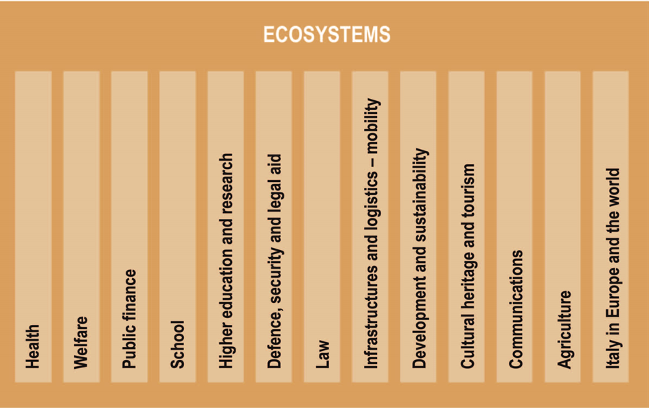

Ecosystems
==========

Ecosystems are the sectors or areas where action is taken by public
administrations, from health to agriculture, from school to cultural
heritage. The Plan identifies thirteen of them, which are listed in
Figure 7 and described Table 1 in the next page.

Each ecosystem identifies a thematic sector with characteristics of
homogeneity. It includes public bodies and bodies and may also include
private individuals, such as associations that, for various reasons,
carry out important functions within the ecosystem. For example, the
public finance ecosystem includes public entities such as the Ministry
of the Economy and Finance, the Ministry of the Interior, the Revenue
Agency, the Regions, the Guardia di Finanza, as well as private entities
as accountant, CAF, fiscal practitioners.

In order to facilitate co-ordination between the actors involved, each
ecosystem:

-  Defines the reference databases, their power rules, and implements
   the communication mechanisms with the *Data & Analytics Framework*;

-  Contributes to the definition of the specific ecosystem guidelines;

-  Defines shared and transparent rules for its operation;

-  Uses the enabling platforms;

-  Presents its services through APIs.

The application of the rules defined in the Interoperability
Model within each ecosystem represents the common language that enables
communication between ecosystems.

   Figure 7 - Ecosystems

The current situation
---------------------

In order to ensure the implementation of the 2014-2020 Digital Growth
Strategy, AgID has provided a first definition of ecosystems based on
the classification `*Missions and
Programs* <http://www.rgs.mef.gov.it/_Documenti/VERSIONE-I/e-GOVERNME1/Contabilit/Pubblicazioni/MissionieProgrammi/%20MissioniProgrammi-2015_10.pdf>`__\  [68]_
as indicated in the Law of 28 December 2015, n. 209 (Budget Law 2016).

Based on the above criteria, the ecosystems listed in the following
table have been identified, indicating the main administrations
involved:

+-------------------------------------------+----------------------------------------------------------------------------------------------------------------------------------------------------------------------------------------------------------------------------------------------------------------------------------------------------------------+---------------------------------------------------------------------------------------------------------------------------------------------------+
| Ecosystem                                 | Ecosystem Description                                                                                                                                                                                                                                                                                          | Main administrations involved                                                                                                                     |
+-------------------------------------------+----------------------------------------------------------------------------------------------------------------------------------------------------------------------------------------------------------------------------------------------------------------------------------------------------------------+---------------------------------------------------------------------------------------------------------------------------------------------------+
| Healthcare                                | The Healthcare ecosystem has been defined in accordance with the "Health Protection Mission" and the Strategy Paper for Digital Growth 2014-2020, which identifies the "Digital Healthcare" action.                                                                                                            | Ministry of Health, MEF, ISS, Regions, Health Care Companies, AgID, Zooprophylactic Institutes, AGENAS, AIFA.                                     |
+-------------------------------------------+----------------------------------------------------------------------------------------------------------------------------------------------------------------------------------------------------------------------------------------------------------------------------------------------------------------+---------------------------------------------------------------------------------------------------------------------------------------------------+
| Welfare                                   | The Welfare ecosystem includes Missions related to "Social Rights, Social Policies and Family," Social Security Policies and Labour Policies."                                                                                                                                                                 | Ministry of Labour and Social Policies, MEF, MIUR, INPS, INAIL, Regions, Provinces and other territorial entities, ANCI, Municipalities, COVIP.   |
+-------------------------------------------+----------------------------------------------------------------------------------------------------------------------------------------------------------------------------------------------------------------------------------------------------------------------------------------------------------------+---------------------------------------------------------------------------------------------------------------------------------------------------+
| Public finance                            | The Public Finance ecosystem includes the "Economic and Financial Policies and Budget Policies", "Financial Relationships with Territorial Autonomy" and "Public Debt" missions and the "Electronic Billing PA" action in the document "Strategy for Digital Growth 2014- 2020.                                | MEF, Ministry of the Interior, Revenue Agency, Customs Agency and Monopoly Agenzia del Demanio, Equitalia.                                        |
+-------------------------------------------+----------------------------------------------------------------------------------------------------------------------------------------------------------------------------------------------------------------------------------------------------------------------------------------------------------------+---------------------------------------------------------------------------------------------------------------------------------------------------+
| School                                    | The School ecosystem has been defined in accordance with the "School Education" Mission, the Strategy Paper for Digital Growth 2014-2020 and the MIUR DM in 2015, which initiates the `*National Digital School Plan* <http://www.istruzione.it/scuola_digitale>`__\  [69]_.                                   | MIUR and Public Schools (Public and Equivalent), Provinces and Other Aggregates of Local Authorities, Municipalities, ANCI.                       |
+-------------------------------------------+----------------------------------------------------------------------------------------------------------------------------------------------------------------------------------------------------------------------------------------------------------------------------------------------------------------+---------------------------------------------------------------------------------------------------------------------------------------------------+
| Higher education and research             | The Higher Education and Research ecosystem mainly comprises the "University Education and Post-graduate Education" Mission.                                                                                                                                                                                   | MIUR, University System and Higher Institute of Research.                                                                                         |
+-------------------------------------------+----------------------------------------------------------------------------------------------------------------------------------------------------------------------------------------------------------------------------------------------------------------------------------------------------------------+---------------------------------------------------------------------------------------------------------------------------------------------------+
| Defence, Security and Rescue - Legality   | The Defence, Security and Rescue Ecosystem consists mainly of the "Defence and Security of the Territory", "Public Order and Security", "Civil Emergency" and "Immigration, Reception and Guarantee of Rights" missions.                                                                                       | Ministry of Defence, Ministry of the Interior, MEF, MIT, MIPAAF                                                                                   |
+-------------------------------------------+----------------------------------------------------------------------------------------------------------------------------------------------------------------------------------------------------------------------------------------------------------------------------------------------------------------+---------------------------------------------------------------------------------------------------------------------------------------------------+
| Justice                                   | The Justice Ecosystem has been defined in accordance with the Justice Mission and the Strategy Paper for Digital Growth 2014-2020 in which the "Digital Justice" action is identified.                                                                                                                         | Ministry of Justice, MEF, INAIL State Attorney, TAR, Tribunals, Court of Auditors, State Council, Court of Cassation, CSM.                        |
+-------------------------------------------+----------------------------------------------------------------------------------------------------------------------------------------------------------------------------------------------------------------------------------------------------------------------------------------------------------------+---------------------------------------------------------------------------------------------------------------------------------------------------+
| Infrastructure and Logistics - Mobility   | The Infrastructure and Logistics ecosystem mainly comprises the missions "Right to Mobility and Transport System Development", "Public and Logistics Infrastructures" and "Home and Urban Planning" missions.                                                                                                  | MIT, MEF, Regions, Provinces and other Aggregations of Local Authorities, Municipalities, ANCI, ACI, ANSF.                                        |
+-------------------------------------------+----------------------------------------------------------------------------------------------------------------------------------------------------------------------------------------------------------------------------------------------------------------------------------------------------------------+---------------------------------------------------------------------------------------------------------------------------------------------------+
| Development and sustainability            | The Ecosystem Development and Sustainability includes primarily the Missions "Energy and Energy diversification," "Competitiveness and Business Development", "Market Regulation", "Sustainable Development and Conservation of the Territory and the Environment", "Territorial Development and Rebalance".   | MISE, MEF, Ministry of the Environment, MIUR, ENEA, ANPA, ARPA, UnionCamere, Regions, LPA.                                                        |
+-------------------------------------------+----------------------------------------------------------------------------------------------------------------------------------------------------------------------------------------------------------------------------------------------------------------------------------------------------------------+---------------------------------------------------------------------------------------------------------------------------------------------------+
| Cultural heritage and tourism             | The Cultural Heritage and Tourism ecosystem has been defined in accordance with the Missions "Protection and Enhancement of Cultural Heritage, Activities and Landscapes" and "Youth and Sports", as well as the Document for Digital Growth 2014-2020, which identifies the "Digital Tourism" action.         | MIBACT, MEF, Regions, Provinces and other Aggregations of Local Authorities, Municipalities, ANCI, ENIT, EPT.                                     |
+-------------------------------------------+----------------------------------------------------------------------------------------------------------------------------------------------------------------------------------------------------------------------------------------------------------------------------------------------------------------+---------------------------------------------------------------------------------------------------------------------------------------------------+
| Communications                            | The Communications Ecosystem includes the "Communications" Mission.                                                                                                                                                                                                                                            | MISE, AGCOM, IPZS, MIT, MEF.                                                                                                                      |
+-------------------------------------------+----------------------------------------------------------------------------------------------------------------------------------------------------------------------------------------------------------------------------------------------------------------------------------------------------------------+---------------------------------------------------------------------------------------------------------------------------------------------------+
| Agriculture                               | The Agriculture ecosystem has been defined in accordance with the "Agriculture, agri-food and fisheries policies" mission and the document "Digital Growth Strategy 2014-2020", which identifies the "Digital Agriculture" action.                                                                             | MIPAAF, MEF, Regions.                                                                                                                             |
+-------------------------------------------+----------------------------------------------------------------------------------------------------------------------------------------------------------------------------------------------------------------------------------------------------------------------------------------------------------------+---------------------------------------------------------------------------------------------------------------------------------------------------+
| Italy in Europe and the World             | The ecosystem Italy in Europe and the world includes the Mission "Italy in Europe and the World".                                                                                                                                                                                                              | MAE, MEF, MIT, MISE.                                                                                                                              |
+-------------------------------------------+----------------------------------------------------------------------------------------------------------------------------------------------------------------------------------------------------------------------------------------------------------------------------------------------------------------+---------------------------------------------------------------------------------------------------------------------------------------------------+

Table 1 - List of ecosystems

AgID made a first mapping of the major ecosystem projects currently
underway or being launched at the Central Public Administrations. This
mapping, as detailed in Annex 4, "Synoptic Framework of Central Public
Administration Projects", should be considered as a preliminary analysis
in view of the new developments linked to the very definition of the
ecosystem proposed by the Strategic Model for the Evolution of the PA
Information System.

The results, [70]_ for exemplification, observed during the mapping of
the CPA projects are given below with respect to the following four
ecosystems:

-  **Ecosystem Health:** In this ecosystem, a central role is covered by
   **Electronic Health Booklet (FSE)** which is the tool through which
   the citizen can trace, consult and share their health history. The
   standard stipulates that the FSE infrastructure manages the set of
   health and socio-medical digital data and documents generated by
   clinical events present and past regarding the patient. Other
   solutions, which are currently being launched, which will make
   computerized health services available are: **Unique Reservation
   Centre (CUP)**, the centralized computerized system for unified
   reservation of services, to facilitate accessibility of assistance
   and reduction of waiting times; the Telemedicine project to provide
   services that improve the usability of care, distance diagnosis and
   medical consultation as well as constant monitoring of vital
   parameters.

-  **Ecosystem Public Finance:** The main structure of this ecosystem is
   **the BDAP**, The Database of Accounting Transactions of Public
   Administrations, and systems supporting administrative accounting
   processes such as **SICOGE** (Integrated Management System for
   Economic and Financial Accounting) **IGRUE** (Control and monitoring
   system) and the **SIOPE** (Cash flow management).

-  **Ecosystem Development and Sustainability**: In this ecosystem,
   among other things, actions are being implemented for the
   implementation of the Agenda for Simplification 2015-2017 and,
   specifically, the consolidation at national level of the **Business
   services** (SUAP, SUE, ...), through the implementation of the ways
   in which entrepreneurs interact with the PA on administrative
   procedures affecting the economic and production activities and / or
   the activities of the plants. AgID, thanks to the involvement of
   stakeholders (Department for Public Services, Regions, LPA,
   Unioncamere, ...), will support the establishment and implementation
   of the ecosystem.

-  **Justice Ecosystem:** Such ecosystem rotates around (i) the
   **electronic civil process and** (ii) the **electronic taxation
   process**, being deployed and consolidated, (iii) the **electronic
   Criminal Procedure**, evolving also for the components involved in
   the execution of the sentence, (iv) the **electronic administrative
   process**, being activated with the related support systems (such as
   **Multivideoconference**) and (v) the constitution, considering the
   breadth and heterogeneity of the users, of the **Access Points**,
   that is, of the technological-organisational structures that provide
   the authorised entities outside the Justice System the services of
   connection to the portal of the electronic services.

-  **Ecosystem Development and Sustainability:** A collaboration
   agreement between the Agency and the Ministry of the Environment and
   the Protection of the Territory and the Sea (MATTM) is underway for
   the development of the Environment system with interventions aimed at
   rationalizing the infrastructures present on the territory and
   supporting the Strategic projects of the Ministry. Another area of
   collaboration will be to support the definition of the new system
   **SISTRI** "Waste Tracking Control System", which aims to computerize
   the entire national waste and urban waste chain for the Campania
   Region.

-  **Ecosystem Cultural Heritage and Tourism:** A collaboration
   agreement between the Agency and MiBACT is underway for the
   implementation of "Interventions for the enhancement and promotion of
   the tourism sector through the definition of digital strategies". In
   particular, specific projects aimed at the free distribution of a
   single access system to a Wi-Fi network federation will be elaborated
   made available to citizens and tourists, especially in the major
   tourist and cultural sites, accessible via SPID.

While confirming that the foregoing example does not provide an
exhaustive overview of the evidence emerging from AgID's reconnaissance
(see paragraph 1.3), reference should be made to Annex 4 for the
exhaustive list of enumerated initiatives, which as a whole will form
the first nucleus of projects to start the ecosystems.

Strategic objectives
--------------------

-  Support a citizen and business oriented vision for each ecosystem,
   leading to the creation of services that simplify interaction with
   public administrations, offering individual access points for the
   user.

-  Standardise the approach to the development of public administration
   services between different ecosystems to promote the uniformity of
   services offered to the citizen. Such services must be simple to use,
   based on security and based on data and application interoperability
   (see chap.2).

-  Stimulate interoperability - with an API-based model (see chap. 5) -
   between public administration systems as a necessary condition to
   increase the efficiency and effectiveness of public services and
   administrative procedures involving more administrations (e.g. the
   electronics Services Conference).

-  Capitalize on the experiences gained by individual Public
   administrations through the enhancement of *best practice*.

Lines of action
---------------

For each ecosystem AgID, in accordance with the priorities set out in
the 2014-2020 Digital Growth Strategy, recommends the establishment of
an *Ecosystem Working Group* (hereinafter referred to as GdL), which
deals with the management and technological development of the ecosystem
itself, defining the operational processes to be digitized and the
technological requirements that characterize the ecosystem itself. The
GdL will be responsible for:

-  Defining the actions to be implemented for the implementation of the
   ecosystem and their priorities (roadmap), also in compliance with
   regulatory constraints;

-  Identifying and interacting with, where necessary, administrations
   that may vary and influence the regulatory framework for the
   ecosystem;

-  Defining the Business Plan by identifying projects that are
   beneficial to the development of the ecosystem;

-  Ensuring the dissemination of technological issues related to the
   ecosystem through the involvement of all stakeholders;

-  Verifying the overall consistency with the three-year Plan and in
   particular the principles of interoperability, APIs, security, use of
   licensing platforms, design lines and software development as
   outlined in Chapter 2 "Strategic Model for the Evolution of the
   Public Administration Information System";

-  Involving civil society and stakeholders in defining the development
   of the ecosystem.

From a more technical point of view, the GdL will ensure the
implementation of the necessary actions to:

-  Identify, draft, and publish, as defined in the Interoperability
   Model, technical standards and technical specifications for
   applications such as standard interfaces for specific industry APIs,
   specific glossaries, interoperability profiles and *best practice*;

-  Identify or define the data model in accordance with what is already
   in section 4.1 "Public Administration Data";

-  Stimulate and monitor the use of Enabling Platforms.

+---------------+--------------------------------------------------------------------------------------------------------------------------------------------------------------------------------------------------------+
| Subject       | Ecosystem Working Groups                                                                                                                                                                               |
+---------------+--------------------------------------------------------------------------------------------------------------------------------------------------------------------------------------------------------+
| Time Frames   | From May 2017                                                                                                                                                                                          |
+---------------+--------------------------------------------------------------------------------------------------------------------------------------------------------------------------------------------------------+
| Players       | PA, AgID                                                                                                                                                                                               |
+---------------+--------------------------------------------------------------------------------------------------------------------------------------------------------------------------------------------------------+
| Description   | For each ecosystem, the GdL follows the operational activities by identifying the specific objectives of the ecosystem itself, project planning and the establishment of technical discussion sites.   |
|               |                                                                                                                                                                                                        |
|               | AgID can, upon request, support the activities of the ecosystem, particularly with regard to the finalization of GdL activities.                                                                       |
+---------------+--------------------------------------------------------------------------------------------------------------------------------------------------------------------------------------------------------+
| Result        | ---                                                                                                                                                                                                    |
+---------------+--------------------------------------------------------------------------------------------------------------------------------------------------------------------------------------------------------+

The model for management and technological development for the
above-mentioned ecosystems has found a first application in the Health
Ecosystem. In particular, the implementation, still ongoing, of the
Electronic Sanitary Paper is summarized in the following line of action.

+---------------+-----------------------------------------------------------------------------------------------------------------------------------------------------------------------------------------------------------+
| Subject       | Evolution of the Electronic Healthcare Scheme (FSE)                                                                                                                                                       |
+---------------+-----------------------------------------------------------------------------------------------------------------------------------------------------------------------------------------------------------+
| Time Frames   | In progress                                                                                                                                                                                               |
+---------------+-----------------------------------------------------------------------------------------------------------------------------------------------------------------------------------------------------------+
| Players       | Ministry of Health, MEF, AgID, Regions and Asl                                                                                                                                                            |
+---------------+-----------------------------------------------------------------------------------------------------------------------------------------------------------------------------------------------------------+
| Description   | The Ministry of Health, in agreement with the MEF and AgID, has developed the infrastructure adaptation project to the provisions of DPCM 178/2015.                                                       |
|               |                                                                                                                                                                                                           |
|               | The ministerial decree and interoperability rules governing the operation of the system are published by June 2017.                                                                                       |
|               |                                                                                                                                                                                                           |
|               | Regional administrations will have to implement their regional electronic healthcare systems, interoperable with the national infrastructure, according to the plans presented and in any case by 2018.   |
|               |                                                                                                                                                                                                           |
|               | Administrations that by June 2017 will not complete the adoption of autonomous systems will have to adopt, according to the subsidiarity principle, the solutions made available by the MEF.              |
|               |                                                                                                                                                                                                           |
|               | The Regions are responsible for completing the dissemination of the electronic health record on their territory to all their patients.                                                                    |
+---------------+-----------------------------------------------------------------------------------------------------------------------------------------------------------------------------------------------------------+
| Result        | Ministerial Decree defining the rules of interoperability *                                                                                                                                               |
|               | (Release date: June 2017)*                                                                                                                                                                                |
|               |                                                                                                                                                                                                           |
|               | | Implementation of Regional FSE Systems                                                                                                                                                                  |
|               | | (*Release date: by December 2018*)                                                                                                                                                                      |
+---------------+-----------------------------------------------------------------------------------------------------------------------------------------------------------------------------------------------------------+

.. rubric:: Notes

.. [68]
   `*http://www.rgs.mef.gov.it/\_Documenti/VERSIONE-I/e-GOVERNME1/Contabilit/Pubblicazioni/MissionieProgrammi/MissioniProgrammi-2015\_10.pdf* <http://www.rgs.mef.gov.it/_Documenti/VERSIONE-I/e-GOVERNME1/Contabilit/Pubblicazioni/MissionieProgrammi/MissioniProgrammi-2015_10.pdf>`__

.. [69]
   `*http://www.istruzione.it/scuola\_digitale* <http://www.istruzione.it/scuola_digitale>`__

.. [70]
   For details on the individual projects mentioned here, please refer
   to Annex 4 "Synoptic Framework of Central Public Administration
   Projects"
   
