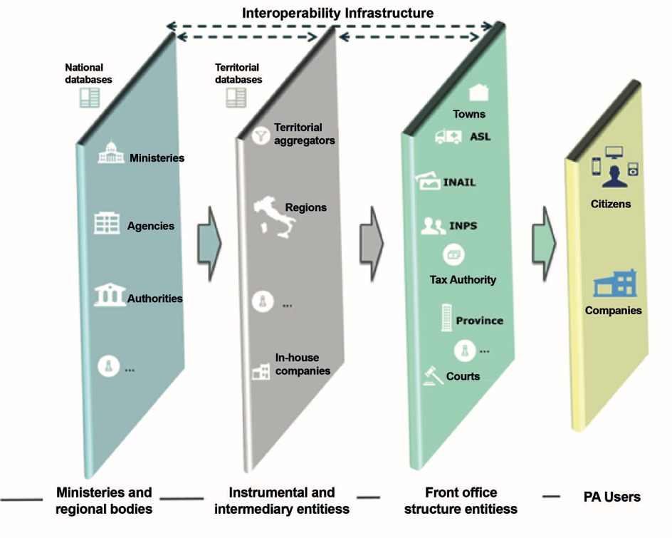

.. container:: wy-alert wy-alert-warning

   **This document was translated by a machine.**

   We want to make our country more efficient. We believe humans and machines should complement each other. Artificial Intelligence is the technology that will enable such symbiosis. This document has been translated using a mix of state-of-the-art machine translation and human-driven AI. The raw machine translation output has been edited by an automated system trained on millions of professionally corrected sentences. Finally, a human went through the document to make sure that no information had been lost.

   This means leaving behind some stylistic improvements and potential errors. However, this AI-augmented approach to translation allowed us to prepare this English version at a fraction of the cost and time of the legacy translation process (this translation was made in a few days including the human review; we didn’t publish it right away because we had to convert it to reStructuredText in order to share it on GitHub and we had a ton of things to do before that!).

   If you want to contribute with feedback and changes to the Three Year Plan for ICT in the Public Administration, visit the `Github repository <https://github.com/italia/pianotriennale-ict-doc-en>`_.
   
   If there are significant differences between the italian and the english version of the Three Year Plan, we remind you that only the italian version approved every year by the Italian Government has legal value.

Management of the change
========================

The *Management of change* defines a governance model for the
implementation of the Plan and for achieving the objectives. More
specifically, activities will be carried out to ensure:

-  The *Management of the Plan*, through planning, monitoring and
   coordination activities;

-  The *Support for the implementation of the Plan*, with initiatives
   aimed at answering questions on the Plan itself, to facilitate, raise
   awareness and train public administrations involved in the digital
   transformation process.

The need for a governance model arises from the need to coordinate a
plurality of actors who, albeit different in role, function and
organisation, are called upon to participate in the implementation of
national projects that require consistency of solutions to be adopted in
Respecting the times and rules laid down.

The current situation
----------------------

The rule attributes to AgID the role of coordinator of the planning and
monitoring activities of the strategic development of the Public
Administration Information System. This role has been reinforced by Art.
14 of the CAD, which regulates relations between the state, regions and
autonomies [85]_.

In the same context, the prediction provided for in Article 17 of the
same CAD also plays a central role, according to which each
administration, in order to ensure the implementation of the strategic
guidelines for the reorganisation and the digitization of the
administration defined by the Government, "entrusts To a single general
management office, without prejudice to the total number of such
offices, the transition to digital operating mode and the consequent
reorganisation processes aimed at the creation of a digital and open
administration, of easily usable and quality services, through greater
efficiency And economics."

In the correctional decree of the Code of the Digital Administration, it
is stated, inter alia, that where the size of the individual
administrations does not permit the identification of an office within
them, it may be possible to fulfil that obligation in a consortium.

Strategic objectives
---------------------

-  Define and implement a structured process of governance of the
   actions required to carry out the PA's digital transformation
   process, including the planning of *switch-off* logic.

-  Accompany selected PAs to play the role of aggregator - as better
   described below - in the implementation of organisational and
   instrumental activities.

-  Promote the fulfilment by the administrations of the identification
   obligation of the office responsible for the transition to digital as
   referred to in Article 17 of the CAD.

-  Monitor the transformation process for the purpose of coordinating
   the Plan and eventual European reporting through measuring the state
   of progress of the activities, including using the indicators set out
   in the "Digital Growth Strategy".

Lines of action
----------------

To achieve the objectives of the Plan, it is necessary to define a model
that, on the one hand, allows governance in compliance with the
requirements of administrations and on the other hand is sufficiently
agile to facilitate the conduct of digital transformation activities in
the times defined in the Strategy for Digital Growth.

This model must also take into account the organisational complexity of
the PA where an administrative procedure and / or a service can be
provided to the citizen through the interaction of several subjects:

-  National level administrations, such as Ministries, Agencies and
   Authorities, who set rules or manage national databases;

-  Middle-level administrations and / or bodies and instrumental
   organisations such as the Regions, Companies in House and other
   aggregators;

-  Administrations of *Front office*, i.e. PAs providing services to
   citizens and businesses such as, for example, provinces,
   municipalities, courts and ASLs.

The national strategy - elaborated in collaboration with the Conference
of Regions and Autonomous Provinces - identifies priorities,
intervention arrangements and actions to be undertaken and emphasizes
complementarity between the national and regional levels and the
integration of the same regional initiatives.

Figure 8 graphically illustrates how solutions made by individual
administrations can contribute to the realization of digital services
through collaborative logic that amplifies their value. For example,
databases of national interest, generally in charge of central level
administrations, can contribute to the provision of services provided by
other administrations, including through the involvement of intermediate
and instrumental organisations (e.g. ANPR). By the same token, even
databases made by intermediate level bodies, although not necessarily
involving national level bodies, can contribute, in a cooperative logic,
to the provision of services to citizens by other administrations (e.g.
The Electronic Health Record).

   Figure 8 - Exemplifying dependencies between the different levels to provide services to citizens and businesses

For the management of the Plan, AgID has established:

-  A program management group that assists the management of the Plan
   and coordinates data collection and information activities by the PA;

-  Technical structures that oversee the development and management of
   the individual components described in the Strategic Model;

-  A technical team for the implementation of PA actions (see Annex 2).

AgID, in its role as coordinator, will involve in these groups, all
representations of different types of public institutions or other
stakeholders in the specific lines of action.

For each digital transformation project implemented in the
implementation of the action lines, it will also be located at the
administration *owner* of the project, a **referent** with the task of
managing the phases of carrying out activities in concert with the
stakeholders involved. The referent can take advantage of AgID support
for aspects of a technological nature and reports to ***Manager for
transition to digital operating mode*** established by the CAD [86]_.
The latter is the main interlocutor of AgID for the monitoring and
coordination of digital transformation activities.

The identification and appointment of the Head of Unit for the
transition to the digital operating mode is a necessary and urgent duty,
brought to the attention of all PAs by the Parliamentary Commission of
Inquiry into the level of digitization and innovation of public
administrations, which too few administrations have so far even
partially implemented.

The governance model described above monitors the activities related to
the implementation of the three-year Public Administration Plans on two
macro-domains:

-  **Monitoring the technical aspects**, aimed at verifying the
   implementation of the planned actions through set of indicators of
   achievement and results, which should be linked wherever possible to
   the DESI indicators;

-  **Monitoring economic aspects**, linked to the systematic collection
   of government ICT spending data for the purpose of streamlining and
   re-addressing the investment part.

It should also be noted that the Plan's actions have been constructed by
referring to the monitoring indicators as set out in the Digital Growth
Strategy, in particular: i) Implementation KPIs used to monitor the
state of progress of the actions in a determined time span; (ii) Results
of the KPI defined in the 2014-2020 Partnership Agreement initialled by
Italy with the European Commission; iii) Impact KPIs, able to measure
the potential economic and social effects of individual actions and the
Digital Growth Strategy as a whole, these indicators derive directly
from DESI. Consequently, verification of achieving its "target values"
will be an integral part of the monitoring activity described in this
paragraph.

AgID will provide a monitoring system that, through automated data
collection for individual projects, will support the activities of the
Plan and will provide evidence of its progress.

The effectiveness of the Plan is also ensured by the ability to share
its goals and implementation methods and the presence of professionalism
and skills at all levels.

Activities carried out within the framework of the governance model are
complemented by the activities described below, which carry out, at
national and European level, the most important crosswise support
actions for the implementation of the Plan such as:

-  **Communication / awareness** on the objectives of the Plan with
   regard to Public Administrations and Citizens and Businesses. All
   public awareness actions are included, including the definition of
   national communication plans on individual strategic initiatives,
   which can be complemented by local initiatives;

-  Coordination, at least limited to the activities related to the
   implementation of the Plan, of the offices referred to in Article 17
   of the CAD;

-  Collaboration with the Department of Public Services - for the
   identification of the **digital skills** required by the Public
   Administration to support the processes of change and rationalisation
   induced by the Plan. In this way, administrations will be able to
   implement training initiatives for their staff with the support of
   universities, public and private subjects of professional training
   systems and administration schools.

In 2017:

-  All administrations are responsible, within their responsibilities,
   to adapt the programming to carry out the actions described in this
   Plan and to appoint the person in charge of the transition to the
   digital operating mode;

-  AgID will indicate the administrations that will have to write their
   Plan individually and those that will instead have a role in the
   aggregation of administrations [87]_, in the first instance Regions
   and Metropolitan Cities

From 2018, in compliance with Art.14a of CAD [88]_, the AgID provides
for periodic elaboration of the Plan with the following timelines:

-  By April, AgID collects from the administrations (by category or in
   single form as defined above) the data relating to the consolidated
   expenditure of the previous year and the expenditure forecasts for
   the current three-year period (for example, for the year 2018 the
   administrations Provide the consolidated expenditure for 2017 and the
   expenditure forecast for the three-year period 2018-2020)

-  By September, AgID will draw up a Plan for the next three years (for
   example, for the year 2018, the three-year Plan 2019-2021 will be
   prepared);

-  By December, administrations draw up their own plans, either by
   category or in a single form as defined above, for the next three
   years (for example, in 2018, administrations draw up their three-year
   plan 2019-2021).

+---------------+----------------------------------------------------------------------------------------------------------------------------------------------------------------------------------------------------------------------------------------+
| Subject       | Monitoring system                                                                                                                                                                                                                      |
+---------------+----------------------------------------------------------------------------------------------------------------------------------------------------------------------------------------------------------------------------------------+
| Time Frames   | In progress                                                                                                                                                                                                                            |
+---------------+----------------------------------------------------------------------------------------------------------------------------------------------------------------------------------------------------------------------------------------+
| Players       | AgID, Digital Team                                                                                                                                                                                                                     |
+---------------+----------------------------------------------------------------------------------------------------------------------------------------------------------------------------------------------------------------------------------------+
| Description   | AgID provides the PA with the minimum set of indicators to be valued for measuring the progress of the Plan.                                                                                                                           |
|               |                                                                                                                                                                                                                                        |
|               | The PAs, according to their organisational articulations and including any Instrumental Bodies, collect data for the enhancement of the above indicators and communicates them to AgID in the manner that will be indicated by AgID.   |
|               |                                                                                                                                                                                                                                        |
|               | AgID and Digital Team design and implement a tool that, also utilizing the experience of existing PA monitoring systems, assures:                                                                                                      |
|               |                                                                                                                                                                                                                                        |
|               | Automated data collection for individual projects (descriptive, economic, SAL data, etc.);                                                                                                                                             |
|               |                                                                                                                                                                                                                                        |
|               | Analysis in aggregate and timely form on a territorial and national scale, and to share progress on the implementation of the digital strategy.                                                                                        |
|               |                                                                                                                                                                                                                                        |
|               | The implementation of the monitoring system will also make use of the tools made available by DAF.                                                                                                                                     |
|               |                                                                                                                                                                                                                                        |
|               | The tool will be made available to aggregators.                                                                                                                                                                                        |
+---------------+----------------------------------------------------------------------------------------------------------------------------------------------------------------------------------------------------------------------------------------+
| Result        | Minimum set of indicators for measuring the progress of the Plan (release date: July 2017).                                                                                                                                            |
|               |                                                                                                                                                                                                                                        |
|               | First release of the monitoring system (release date: March 2018).                                                                                                                                                                     |
+---------------+----------------------------------------------------------------------------------------------------------------------------------------------------------------------------------------------------------------------------------------+

+---------------+------------------------------------------------------------------------------------------------------+
| Subject       | Communication of the Three-Year Plan                                                                 |
+---------------+------------------------------------------------------------------------------------------------------+
| Time Frames   | In progress                                                                                          |
+---------------+------------------------------------------------------------------------------------------------------+
| Players       | AgID, Digital Team                                                                                   |
+---------------+------------------------------------------------------------------------------------------------------+
| Description   | Idea of communication initiatives for the dissemination and implementation of the three-year Plan.   |
+---------------+------------------------------------------------------------------------------------------------------+
| Result        | Communication materials (release date: June 2017).                                                   |
+---------------+------------------------------------------------------------------------------------------------------+

+---------------+------------------------------------------------------------------------------------------------------------------------------------------------------+
| Subject       | Identification of the main profiles and promotional actions for the creating digital skills in the PA                                                |
+---------------+------------------------------------------------------------------------------------------------------------------------------------------------------+
| Time Frames   | From September 2017                                                                                                                                  |
+---------------+------------------------------------------------------------------------------------------------------------------------------------------------------+
| Players       | Funzione Pubblica (Civil Service), ISTAT, MIUR, AGID and other technical bodies                                                                      |
+---------------+------------------------------------------------------------------------------------------------------------------------------------------------------+
| Description   | The link between the players in the definition of the professional figures identified by the Plan with the development of specific training paths.   |
+---------------+------------------------------------------------------------------------------------------------------------------------------------------------------+
| Result        | Revision of UNINFO and ISTAT profiles for new professional figures with digital skills.                                                              |
|               |                                                                                                                                                      |
|               | Formation of course, workshop and specialisation training formats.                                                                                   |
+---------------+------------------------------------------------------------------------------------------------------------------------------------------------------+

.. rubric:: Notes

.. [85]
   Article 14 of the CAD establishes relationships between the state,
   regions and autonomies in the implementation of the provisions of the
   Constitution and assigns to the AgID "IT coordination of state,
   regional and local administration, with the purpose of designing and
   monitoring the strategic evolution of the information system of the
   Public Administration, encouraging the adoption of infrastructures
   and standards that reduce the costs incurred by administrations and
   improve the services provided." This role is reinforced in the
   following Article 14-bis. Alongside the function of planning and
   coordinating the activities of the administrations through the
   drafting and subsequent verification of the implementation of the
   three-year Plan, AgID performs the role of "monitoring the activities
   carried out by the administrations in relation to their consistency
   with the three-year Plan (...) and verifies the results achieved by
   the individual administrations, with particular reference to the
   costs and benefits of the IT systems in the manner set by the Agency
   itself".

.. [86]
   Article 17 of the CAD - Structures for organisation, innovation and
   technologies

   ((1. The Public Administrations shall ensure the implementation of
   strategic guidelines for the reorganisation and digitisation of
   government-defined management in accordance with the technical rules
   referred to in Article 71. For this purpose, each of the above
   subjects entrusts **to a single general management office**, without
   prejudice to the total number of such offices, **the transition to a
   digital operating mode** and the consequent reorganisation processes
   aimed at the creation of a digital and open administration, of easily
   usable and quality services, through greater efficiency and
   cost-effectiveness. To the aforementioned office are also assigned
   tasks related to:)) a) strategic coordination of the development of
   IT, telecommunications and telephonic systems, so as to ensure
   consistency with common technical and organisational standards; b)
   addressing and coordinating the development of services, both
   internal and external, provided by the telecommunication and
   telephony systems of the administration; c) address, plan, coordinate
   and monitor IT security related to data, systems and infrastructures,
   also in relation to the public connectivity system, in compliance
   with the technical rules referred to in Article 51, paragraph 1; d)
   access of disabled persons to computer tools and the promotion of
   accessibility also in the implementation of the provisions of Law no.
   4 of 9th January 2004; e) the (periodic) analysis of the consistency
   between the organisation of the administration and the use of
   information and communication technologies in order to improve user
   satisfaction and service quality and to reduce the time and cost of
   administrative action; f) cooperation to review the reorganisation of
   the administration for the purposes of point e); g) addressing,
   coordinating and monitoring the planning envisaged for the
   development and management of telecommunication and telephony
   information systems; h) design and coordination of relevant
   initiatives for the purpose of a more effective provision of network
   services to citizens and companies using instruments of applied
   communication between the Public Administrations, including the
   preparation and enactment of service agreements between
   administrations to implement and share the cooperative information
   systems; ((28)) i) promotion of the initiatives relating to the
   enactment of the directives imparted by the President of the Council
   of Ministers or the Minister in charge of innovation and technology;
   j) planning and coordination of the diffusion process, within the
   administration, of e-mail, IT protocol, digital signature ((or
   qualified electronic signature)) and IT mandate services, and the
   rules in terms of accessibility and usability.

   ((1-bis. For carrying out the tasks referred to in paragraph 1, the
   Agencies, the Armed Forces, including the Carabinieri Police and the
   Port Authorities, as well as the Police Force have the facility to
   identify their offices without increasing the total number of those
   already provided for in their respective organisational arrangements.

   ((1-ter. The head of the office referred to in paragraph 1 is endowed
   with appropriate technological, legal and managerial information and
   answers, with reference to the transition tasks, in the digital mode
   directly to the highest political body.))

   ((1-quater. The Public Administrations, without prejudice to the
   total number of offices, shall identify, usually from amongst the
   executives in service **, an ombudsman for digital** matters, having
   appropriate third-party, autonomy and impartiality requirements.
   Anyone may submit reports and complaints about any of the alleged
   infringements of this Code and of any other norms regarding the
   digitisation and innovation of the Public Administration to the
   Digital Ombudsman. If such allegations are grounded, the Digital
   Ombudsman invites the office responsible for the alleged violation to
   remedy it promptly and in any case within thirty days. The Ombudsman
   reports failure to the competent office for disciplinary proceedings.

   ((1-quinquies. AgID publishes on its website a summary guide to
   digital rights of the citizen under this Code.

   ((1-sexies. In compliance with their organisational autonomy, the
   Public Administrations other than State Administrations will identify
   the digital office referred to in sub-paragraphs 1 and 1-quater among
   those of a managerial level or, if not available, identify a digital
   administrator from among their senior management. In the absence of
   the senior political body, the head of the digital office referred to
   in paragraph 1 shall be directly answerable to the administrative
   body of the entity.)) -------------

   UPDATE (28) The Legislative Decree of 26th August 2016, no. 179
   (Article 61, paragraph 2, letter d)) states that the term "citizens
   and companies", wherever it occurs, means "legal entities".

.. [87]
   as described in paragraph 513 Article 1 of the 2016 Stability Law

.. [88]
   [...] The aforementioned Plan, developed by the AgID, also based on
   the data and information acquired by the Public Administrations
   referred to in Article 1, paragraph 2, of Legislative Decree no. 165
   of 2001, is approved by the President of the Council of Ministers or
   the Delegated Minister by 30th September of each year.

   
