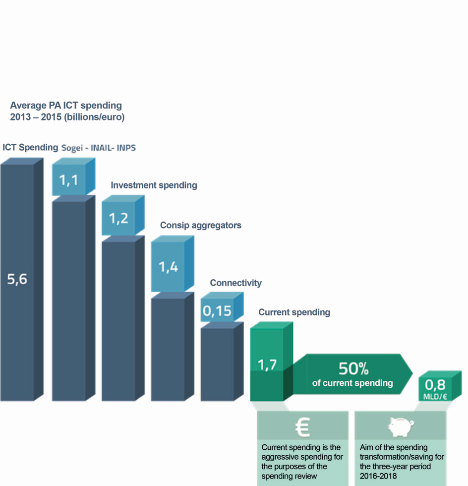
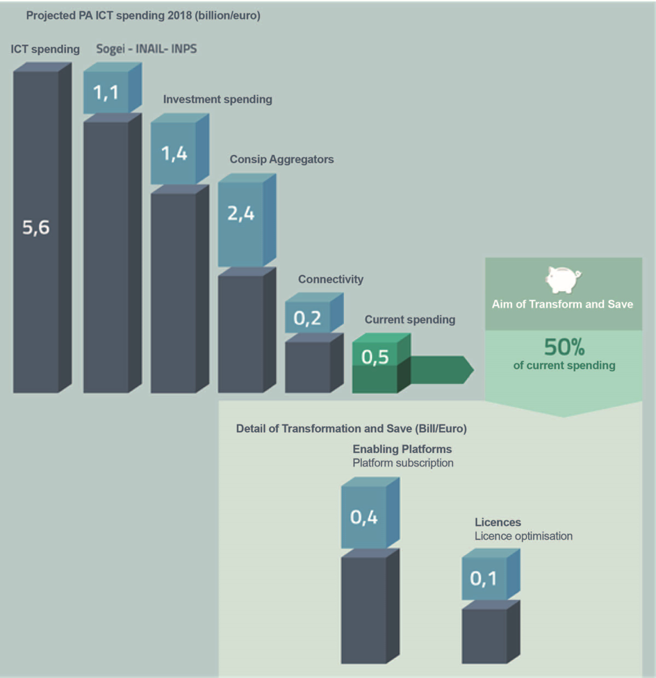

.. container:: wy-alert wy-alert-warning

   **This document was translated by a machine.**

   We want to make our country more efficient. We believe humans and machines should complement each other. Artificial Intelligence is the technology that will enable such symbiosis. This document has been translated using a mix of state-of-the-art machine translation and human-driven AI. The raw machine translation output has been edited by an automated system trained on millions of professionally corrected sentences. Finally, a human went through the document to make sure that no information had been lost.

   This means leaving behind some stylistic improvements and potential errors. However, this AI-augmented approach to translation allowed us to prepare this English version at a fraction of the cost and time of the legacy translation process (this translation was made in a few days including the human review; we didn’t publish it right away because we had to convert it to reStructuredText in order to share it on GitHub and we had a ton of things to do before that!).

   If you want to contribute with feedback and changes to the Three Year Plan for ICT in the Public Administration, visit the `Github repository <https://github.com/italia/pianotriennale-ict-doc-en>`_.

Rationalisation of costs
========================

As anticipated in Chapter 1 "Triennial Plan for IT in Public
Administration", one of the objectives of the three-year Plan is to
guide the rationalisation of Public Administration ICT spending and its
reorientation at national level as defined, in the first instance, by
the Stability Law of 2016.

In fact, the law establishes certain principles for the containment of
expenditure, where there is no conflict with the strategic objectives of
the digital Agenda and in particular:

-  a savings target for the three-year period 2016-2018, set at 50% of
   the average annual expenditure for 2013-2015 for the current
   management of the entire IT sector, net of charges for connectivity
   services;

-  the principle that the savings generated will be used primarily by
   administrations for investment in technological innovation;

-  the principle that the savings target is made exclusive of spending
   effectuated through Consip and other commissions;

-  the principle that the costs of some entities are excluded: INPS,
   INAIL, Sogei and Consip (relative to the services and services
   provided to their contracting authorities); the Department of
   Administration of Justice (in relation to the investment costs
   necessary to complete the computerisation process of civil and
   criminal prosecution in the judicial offices).

In general terms, the savings target is here referred to as a steady
reduction in spending over the three-year period. This means that at the
end of the three-year period, the annual national expenditure ("exit
rate") will be 50% lower than the average annual expenditure of the
previous three years.

However, the goal to be reached depends to a large extent on the degree
of use of the commissioning centres. In fact, in theory and for the sole
purpose of further expediting the mechanism put in place with the
Stability Law, if during the three-year period 2013-2015 all expenditure
was to be passed through the central commissioning centres, the savings
target requested for the national system would have been zero.

The law therefore is intended to encourage:

-  a path of requalification of spending by encouraging connectivity
   where there it is still lacking and in investments in innovation,
   releasing resources today devoted to financing current spending;

-  a path of optimisation and control of spending by having all the
   possible needs pass through the commissioning centres.

PA and ICT spending
--------------------

Starting from the most recent analyses (cf. Annex 3, "Synoptic Framework
of ICT Expenditure in the CPA"), including that carried out by AgID on
the data provided by the Central Public Administrations, the following
situation was summarised.

The average ICT spending of the PA in the three-year period 2013-2015
was equal to approximately € 5.6 billion. The expenses exclude from the
savings targets, as indicated in the Stability Law of 2016, are
quantifiable as:

-  ICT spending carried out by Sogei, INAIL and INPS, amounting to
   approximately € 1.1 billion;

-  investment expenditure of public administrations, amounting to
   approximately € 1.2 billion;

-  current spending through Consip and other aggregating entities,
   amounting to approximately € 1.4 billion;

-  connectivity costs, equal to about € 0.15 billion.

As a result, the current "aggravating" expenditure for spending review
purposes amounts to approximately € 1.7 billion.

   Figure 9 - AgID Processing based on internal surveys and 3rd Assinform Observatory data on ICT in Public Administration

Based on these elements, the starting point for defining the savings target to
be achieved at the end of the three-year period 2016-2018 is therefore
as represented in Figure 9, and is quantifiable at about € 0.8 billion,
corresponding to 50% of current spending. This objective is to be
understood as an overall objective and does not refer to each
administration (or its relative in-house instrumental company). The
identified savings will be achieved mainly through the reclassification
of spending as a result of the set of actions provided by law.

The savings goals deriving from the implementation of the Triennial Plan
-------------------------------------------------------------------------

Already in 2016, the administrations received indications coherent with
the provisions of the new focalisation on expenditure under the law. In
particular, the actions launched following the publication of the 2016
Stability Law concern:

-  the involvement of the PAs in sharing the approach and the main
   contents of the Strategic Model for an initial recognition on
   mappable activities, particularly as regards national platform
   adhesion plans, an important source of savings because they
   standardise solutions and technologies and prevent each
   administration from developing its own solutions;

-  the issuance of Circular AgID 2/2016 which has temporarily
   anticipated the provisions related to the implementation of the
   three-year Plan, especially as regards the costs for setting up new
   *Data centres* and for the adaptation of applications relating to
   intangible infrastructures;

-  initiation of the processing and publishing of the technical rules as
   foreseen in the CAD.

From an analysis of ICT spending trends for 2016 over the three-year
period 2013-2015, conducted by AgID on 21 central administrations, some
elements emerge which show the process of focusing of spending on the
objectives of the 2016 Stability Law is starting, and in particular:

-  compared with a 7% increase in overall spending, a 2% reduction in
   the current spending share and a 16% increase in investment spending
   are recorded;

-  there was an increase in the use of Consip's purchasing instruments,
   whose percentage contribution in 2016 ranges from 54% to 65% of the
   total (230 million).

In this context, it is now necessary to strengthen the process in the
direction indicated by the principles outlined above, focusing the
action on the following guidelines:

A. with regard to current expenditure:

-  blocking **new spending on data centres**, unless properly justified
   in terms of the *cloud* and/or the construction of national Hubs, as
   described in paragraph 3.1;

-  full **adhesion to the enabling Platforms** described in section 4.2
   and *Switch Off* of local solutions:

-  ANPR: progressive deployment of the national solution as described in
   section 4.2;

-  SPID: Disclosure of Local Authentication Systems and use of SPID
   according to the plan presented by individual administrations, which
   requires the adherence of all administrations within the times
   indicated in section 4.2;

-  PagoPA: adhesion and full use of PagoPA, with the abandonment of
   local solutions, within the times indicated in section 4.2;

-  NoiPA: decommissioning of personnel management systems and adherence
   to NoiPA services, without charges for state administrations and unit
   cost maintenance for the others.

B. with regard to the means of purchasing through Consip and other
aggregators:

-  **software licenses,** based on the data collected by AgID so far,
   evidence emerges of possible savings in this area, firstly through IT
   *asset management* interventions [89]_ for the optimisation of
   purchasing and management processes such as:

-  software purchasing in Software as a Service mode;

-  rationalisation and standardisation of applications;

-  use of open source software;

-  extensive use of existing Consip tools and of other aggregators, as
   set out in Annex 2 "Tools and Resources for the Implementation of the
   Plan".

In confirming and verifying this approach, it was possible to estimate,
on a precautionary basis, savings at the end of 2018 generated by the
adherence to the licensing platforms described in paragraph 4.2, and
licensing optimisation, amounting to approximately 480 million as
evidenced in Table 2 - Saving goals deliverable at the end of 2018.

+----------------------+------------------------+-----------------------+
| Lines of action      | Cost base [90]_ 2016   | Savings               |
|                      |                        |                       |
|                      | (Values in €/Mln)      | (Values ​​in €/Mln)   |
+----------------------+------------------------+-----------------------+
| National platforms   | 600                    | 400                   |
+----------------------+------------------------+-----------------------+
| Licences             | 380                    | 80                    |
+----------------------+------------------------+-----------------------+
| TOTAL                | 980                    | 480                   |
+----------------------+------------------------+-----------------------+

Table 2 - Saving goals deliverable at the end of 2018

It is therefore possible to assume that the combined effect of
containment and transformation of current spending on ICT can generate
the following situation by the end of 2018 (with the same scope of
intervention considered for the initial definition of the savings
target):

-  a total spending contraction of around 480 million;

-  an increase in the share of investment spending in line with the
   trend recorded in 2016 for approximately 200 mln (+15%);

-  an increase in spending through Consip and other aggregators of
   approximately 1,000 mln, assuming that the conventions and contracts
   recently stipulated by Consip for the next five years provide
   spending limits of over 6,000 mln.

   Figure 10 - AgID projection on internal data and 3rd Assinform Observatory data on ICT in Public Administration

The above set of assumptions and findings will be verified in the next
Recognition of Expenditure Data, which will track the progress of the
Plan (cf. Chapter 10, "Managing Change"). In this way, in the event that
non-converging trends are highlighted, any corrective measures can be
identified to safeguard the transformation/savings objective planned.

.. rubric:: Notes

.. [89]
   Source Gartner
   `*http://www.gartner.com/binaries/content/assets/events/keywords/symposium/esc28/esc28\_costoptimization.pdf* <http://www.gartner.com/binaries/content/assets/events/keywords/symposium/esc28/esc28_costoptimization.pdf>`__

   This document highlights 10 considerations/suggestions to use in
   order to optimise costs. In particular, the points represent
   rationalisation of purchasing operations to potentially achieve
   savings.

.. [90]
   It is noted that for the purpose of identifying the cost base on
   which the savings were calculated, a projection of the CPA sample
   data involved in the total amount of public administration
   expenditure compiled by the Assinform Observatory was performed.