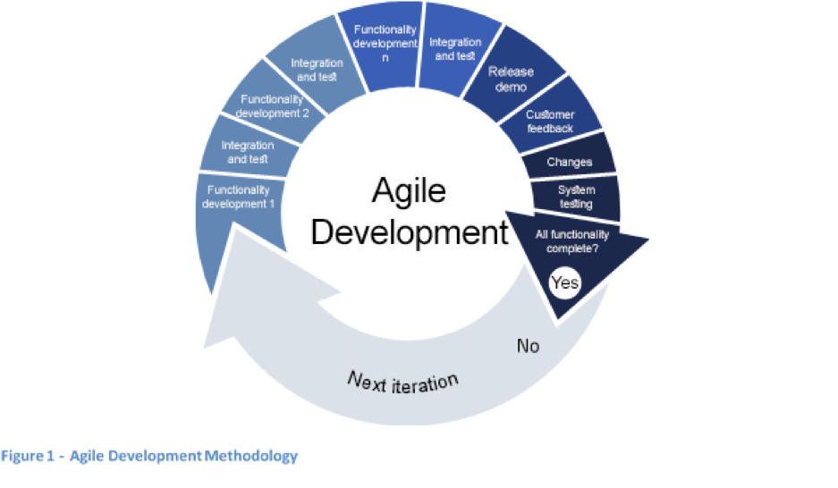

.. container:: wy-alert wy-alert-warning

   **This document was translated by a machine.**

   We want to make our country more efficient. We believe humans and machines should complement each other. Artificial Intelligence is the technology that will enable such symbiosis.
   This document has been translated using a mix of state-of-the-art machine translation and human-driven AI. The raw machine translation output has been edited by an automated system trained on millions of professionally corrected sentences. Finally, a human went through the document to make sure that no information had been lost.

   This means leaving behind some stylistic improvements and potential errors. However, this AI-augmented approach to translation allowed us to prepare this English version at a fraction of the cost and time of the legacy translation process.
   
   Thanks to a `dedicated space on GitHub <https://github.com/italia/pianotriennale-ict-doc-en>`_, translation can be improved by the community with suggestions.

Principles for the development of digital projects
==================================================

This chapter contains the principles that are mentioned here and
recommended because due to being considered fundamental to the
implementation of the projects contained in the Plan. The arrangements
are both of a practical nature - for management of the project - and of
a contractual and administrative nature for the drafting of the
contract, the definition of the objectives and the procurement of
resources.

Finally, the preparation of a digital project for the creation of a new
system or the evolution of an existing system requires:

-  a clear outline of that desired (design);

-  a plan of how to build it (implementation);

-  a strategy to lead it to being adopted by the end-user (launch);

-  **a plan to keep the system up-to-date**, secure and effective over
   time, as well as to ensure its continued operation even in the event
   of malfunctions or disasters **(evolution and maintenance)**.

The following paragraphs describe these points in greater detail.

Design of the project
----------------------

The design phase is essential for the successful outcome of the project.
In this regard, please refer to the chapter *Service Design* of the
Design Guidelines for the web services of the PA [102]_. In particular,
during the design of the services it is recommended to:

1. **Always involve the citizens, starting from understanding their
   needs (Strategy no. 1 in the Guidelines).** This means imagining how
   the citizen (or the end user) will use the system and ensure that all
   features are designed around his/her needs, enabling him/her to
   easily and quickly obtain what is needed - without unnecessary steps
   and with instructions that can be understood by anyone.

2. **Studying to understand, documenting so as not to repeat (Strategy
   no. 3 in the Guidelines).** It is necessary to know the context in
   which a project will work, define its objectives, comply with
   standards, and research on possible alternatives at national and
   international level, as well as on the availability of successful
   tools and processes that can be reused. Each phase of project
   development must be documented and made available openly, on the one
   hand to ensure its future integrity and sustainability, and on the
   other to allow possible collaborations that could add value to it.

3. **Apply the *Only Once* principle (Strategy No. 6 of the
   Guidelines).** Avoid citizens having to provide the same information
   more than once. Each process must be designed to be as simple and
   user-friendly as possible, replacing old procedures when needed.

4. **Outline the objectives and metrics.** It is therefore necessary to
   identify the objectives to be achieved in terms of functionality and
   processes, along with the metrics that can evaluate the success and
   appreciation of the project. For example, in an electronic billing
   system, a goal might be to "have a process that never requires
   printing invoices". Whenever possible, it is recommended that
   objective metrics are used rather than data obtained from
   questionnaires or surveys. For example, considering the "number of
   invoices printed traditionally" as an indicator of the inadequacy of
   the system or the "number of invoices sent electronically" as a
   success factor.

5. **Start from the data (Strategy no. 4 of the Guidelines)**. To make
   decisions based on real behaviours and data, it is necessary to
   implement services and processes that are entirely digital, not
   merely the simple transposition on-line of a process traditionally
   delivered.

6. **Nominate a *Product Owner***\ *, being* a person who - preferably
   within the PA and in any case not linked to the company that will
   produce the product - knows the expectations and needs of end-users
   of the planned service plus has a clear competence on the processes
   that are to be digitised and the desired result. For example, in an
   electronic billing project, the *Product Owner* will be a person who
   understands billing processes well and will be able to guide project
   executives by providing advice and guidance on how to send and
   process such invoices, the data they contain, and so on.

Implementation of the project
------------------------------

In addition to following the Design Guidelines for PA web services, in
producing a plan on how to implement the project, it is recommended that
the PA:

1. **Nominates a *Technical Project Manager, ***\ or a person who,
   within the body or in any case not linked to the company that will
   produce the product, has strong expertise in the technologies that
   will be used and is able to verify the quality of the work, helping
   to coordinate the activities. This individual can be identified as
   the director of the execution of the work stipulated in the
   Procurement Code [103]_ or one of his or her delegates.

2. **Define a minimum viable product (MVP)** **and subsequent
   incremental steps** that will deliver the required features one by
   one up to the completion of the work, possibly using agile
   methodologies such as Figure 11 fees due to suppliers that will only
   be paid out on the completion and verification of each of these
   steps. It is also recommended that the product be made available to
   experimental users without waiting for all steps to be completed in
   order to identify any problems, critical factors or risks as soon as
   possible.

Finally, it is suggested that, at a contractual level, to achieve the
completion of the product, these steps may be subject to changes
throughout the course of the work, based on the results obtained and the
measures of success identified.

   Figure 11 - Agile Development Methodology

From a technical point of view, it is also necessary:

1. **To make the data open, share processes and tools (Strategy no. 8 of
   the Guidelines).** To share all the data, every process, every code,
   every idea, every failure and all the information, it is necessary
   and vital for all the services to promote transparency and quality in
   development. The code and documentation of each service provided by
   the Public Administration should be issued in open format with an
   appropriate licence to save time and costs; where this is not
   possible, the impediment should be adequately justified.

2. **Favour free or *Open source*** components, namely software
   components whose source codes are available and, if possible, freely
   editable and adaptable to PA requirements, as specified in Article 68
   of the CAD. The use of commercial products or sources whose sources
   are closed must be carefully justified and only allowed if the cost
   and functionality needed for the project make them more appropriate
   than the *Open Source* alternatives.

3. **Choose hardware solutions based on cost-effectiveness and
   efficiency estimates**, in particular by assessing the cost of
   migration to alternative solutions (exit from a *lock-in*) and
   ensuring technological neutrality.

4. **Make use of the *Cloud* of the PA**. Except for demonstrated
   technical reasons, the software and the project must be designed for
   use on the *Cloud* of the PA as defined in paragraph 3.1 "Data Centre
   and *Cloud*".

Finally, the software that is being developed must:

1. **Be structured in micro-services,** or components that perform a few
   well-defined features (e.g., tax code verification, user existence in
   the database), controlled through APIs and easily reusable, so that
   they can be made available to other PAs via the *Developer Community*
   (cf. Chapter 7 "Tools for Generating and Delivering Digital
   Services").

2. **Expose the APIs,** namely create interfaces that allow systems to
   communicate and interact with each other easily and automatically.
   The interface exposed to the user and all the features of the product
   must be constructed using these APIs (cf. Chapter 5
   "Inter-operability Model").

3. **Use databases** designed according to the rules outlined in section
   4.1 "PA Data" and, in particular, insert into the *Data & Analytics
   Framework* (DAF) [104]_ the information on the nature of the
   transactions and their mutations over time.

4. **Maintain the inter-operability** of data, services, and processes
   according to AgID's inter-operability and co-operation rules, subject
   to the criteria required to ensure the privacy of users. The data
   must be made available as *Open Data* and is to be accompanied by an
   exhaustive description of the fields and their meaning (metadata).

5. **Utilise solid testing and qualification strategies,** being with
   the use of unit tests, functional tests, and *fuzz tests* to verify
   the code and conduct *stress tests* to check the load that the
   product will be able to support. It is also advisable to use static
   code analysis strategies, and to audit results to address security
   issues.

6. **Use *Best* Safety** Practices such as encrypting passwords and
   networking.

7. **Include all necessary documentation,** meaning the inclusion of
   documentation on the structure of the data used (fields, tables,
   etc.), how the software works and is used, as well as documentation
   about how the product works, how to maintain it, update it and
   monitor it.

8. **Be part of the PA,** that is the contract must specify that all
   product rights, from code to documentation, domain names to licences,
   third-party libraries or patents registered on the product belong to
   the PA. In this way, the PA can continue the evolution of the
   product, even by using suppliers other than those who originally
   developed it.

9. **Be made available to other PAs** that are registered in the *Market
   Place* of Consip and, whenever possible, be freely available with
   sources and documentation, with open licences that allow the use,
   modification or evolution by third parties.

When it is important to integrate the project with third-party software
or pre-existing systems, it is advisable to:

1. **Provide testing tools and infrastructures**, requiring the
   provision of facilities where own software, test accounts, or
   simulators can be tried that can be freely used by third parties to
   test component integration.

2. **Use and** document processes to coordinate software updates that
   include mechanisms to announce the upcoming release of new versions
   (newsletters, forums...), release in testing environments and release
   into production only after functional verification with system users
   and third-party software in testing environments.

1. **Make libraries and development kits available**, being code samples
   and software components ready for use by third parties in their
   products to integrate with your systems. This facilitates reuse,
   improves code quality, decreases maintenance and upgrading costs,
   significantly reduces the risk of incompatibility and implementation
   that does not meet specifications, and decreases development costs
   for each third party.

Launch of the project
---------------------

In establishing a route for the adoption of the project, the PA must:

1. **Identify the adoption strategy of least resistance,** namely
   determining the way that is easiest, fastest, and has minimum impact
   in starting to have the product be adopted, even in limited or
   incomplete form. Rather than introducing great changes in one step,
   it is preferable to take small incremental steps - individually
   simpler and less risky - towards achieving the ultimate goal.

2. **Identify an incremental use strategy,** namely being to find the
   mechanisms that enable the adoption of the product, first by a small
   number of users, then by a wider number and ultimately by all users.
   It is important to highlight how launching a service for the totality
   of users does not stop the development activities or the completion
   of the product. Conversely, when possible, it is advisable to
   identify strategies that will allow you to use the product even
   before it is completed in order to identify problems, rearrange
   priorities and begin to provide the benefits of innovation, even with
   a partial product.

3. **Outline a plan to launch the product completely,** or to disable
   the previous product. For large-scale projects, it is important to
   point out that a launch strategy may require not only product
   realisation, but promotion campaigns with users, mailing mechanisms
   (mailing lists, Twitter, showcase websites) and everything that is
   considered important to lead to the adoption of the product itself.

4. **Communicate effectively, often, anywhere (Strategy no. 5 of the
   Guidelines).** The Public Administrations must clearly communicate
   the usefulness and prerequisites of the service, as well as all the
   information regarding personal data protection, privacy protection
   and computer security, reaching citizens through the most used and
   widespread communication channels, giving them access to their data
   plus the possibility to check and correct it, maintaining a
   continuous dialogue, even beyond and after launching the service.

Evolution and maintenance of the project
-----------------------------------------

When defining the strategies for evolution and maintenance of the
project, the PA is advised to:

1. **Ensure regular maintenance and upgrading** of all software and
   systems in order to prevent security issues, and ensure software
   compatibility with new technologies and compliance with regulatory
   evolution.

2. **Ensure a plan for the continuous evolution of the product,** being
   to establish or have a strategy to improve the product after launch,
   add functionality, correct issues and, more generally, allow it to be
   upgraded.

3. **Ensure a *Disaster Recovery* and *Business Continuity* strategy,**
   that is, ensure that in the case of malfunction or disaster, critical
   data is not lost and it is possible to continue to deliver services
   even if in reduced mode.

4. **Ensure continuous verification of operating parameters,** such as
   software monitoring (errors, requests, latency), periodic audits to
   ensure its security, and so on.

5. **Prepare all the necessary procedures to avoid *lock-in***, while
   keeping open the possibility of switching from one supplier to
   another. The use of several suppliers for the creation, maintenance
   and launch of the product generally guarantees a better migration
   capacity to another supplier.

Existing projects
------------------

For pre-existing projects, or for digital solutions that are being
implemented or already in operation, it will be necessary to migrate
gradually to an approach that complies with the guidelines set out in
the Plan, within the limits imposed by the adjustment costs and the
reduction in operating costs.

.. rubric:: Notes
.. [102]
   http://design.italia.it/linee-guida/service-design/

.. [103]
   Cf. Article 101 of the Code of Contracts Legislative Decree no. 50 of
   18th April 2016.

.. [104]
   Cf. Chapter 9 "Data & Analytics Framework".